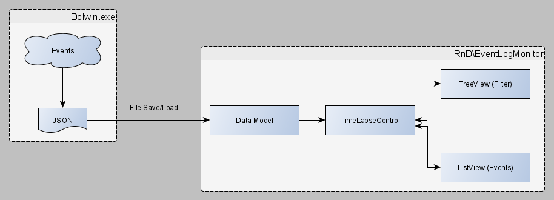

# Event Log

The Event Log component is used to collect events and trace log during host emulation (GameCube).

More: https://docs.google.com/document/d/1CvAClvFfyA5R-PhYUmn5OOQtYMH4h6I0nSsKchNAySU

TODO: Experiment with LLVM and custom prolog/epilog for generated code ("free" TraceBegin / TraceEnd).
