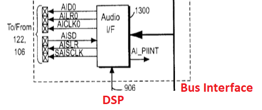
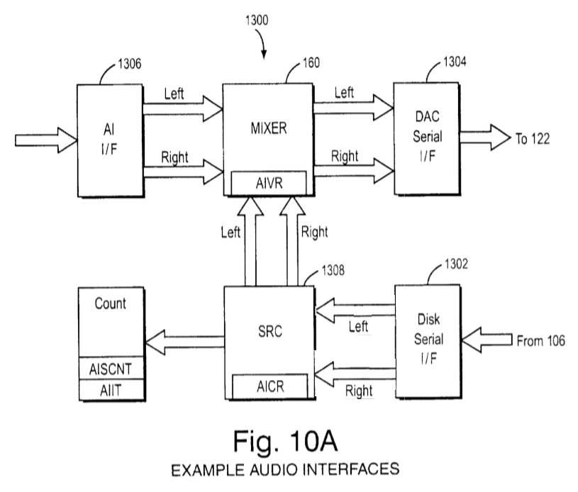
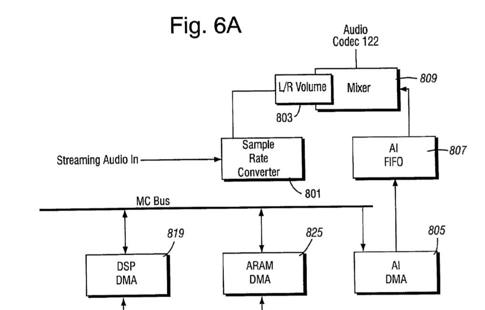
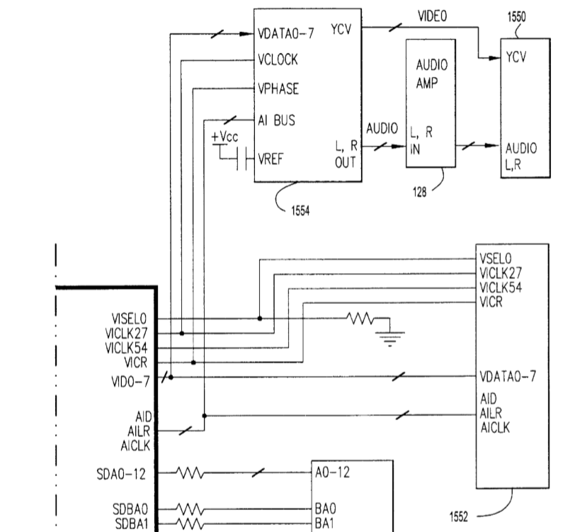

# Flipper Audio Interface (AI)

## Overview

Based on US patents 6,609,977, 7,369,665.

## Flipper AudioOut

## Signals

|Name|Dir|Type|Description|
|---|---|---|---|
|AID|O|LVCMOS|Audio Interface Data Out: AID is an output signal. AID drives the serial bit stream of the Left/Right Audio data driven out to the stereo audio DAC, synchronized by the rising edge of the bit clock AICLK and AILR signal which determines if the current word is a left sample or a right sample.|
|AILR|O|LVCMOS|Audio Interface Left Right Out: AILR is an output signal. AILR is a frame signal for the serial bit stream and determines the left/right channel of the current word. An edge of AILR also acts as a sample conversion signal to the DAC. AILR toggles at the sample rate frequency (48 kHz).|
|AICLK|O|LVCMOS|Audio Interface Clock Out: AICLK is an output signal. AICLK is the bit clock for the AID serial bit stream.|
|AISD|I|LVCMOS|Audio Interface Streaming Data: AISD is an input signal AISD is the serial bit stream of the Left Right audio data driven in from the Disk drive, synchronized by the rising edge of the bit clock.|
|AISLR|O|LVCMOS|Audio Interface Streaming Left Right: AISLR is an output signal. AISLR is a frame signal for the serial bit stream and determines the left/right channel of the current word. AISLR toggles at the sample rate frequency (32 kHz/48 kHz). This signal also controls the flow of the audio data. After this current stereo sample is received, if AISLR does not toggle, the Disk assumes that the stream is stopped/paused and sends 0’ as data. The Disk does not begin sending data until it has received a high-low-high sequence.|
|AISCLK|O|LCMOS|Audio Interface Streaming Clock: AISCLK is an output signal. AISCLK is the bit clock for the AISD serial bit stream. The AISCLK is a free running clock.|

## Audio DMA Registers

|Mnemonic|Offset|Type|Size|Description|
|---|---|---|---|---|
|AID_MADRH|0x0C005030|RW|16 bits|DMA start address (High)|
|AID_MADRL|0x0C005032|RW|16 bits|DMA start address (Low)|
|AID_LEN|0x0C005036|RW|16 bits|Bit15: DMA control (1: start DMA, 0: stop DMA), Bits14-0: DMA length (length of audio data in 32 Byte blocks)|
|AID_CNT|0x0C00503A|R|16 bits|Counts down to zero showing how many 32 Byte blocks are left|

DMA is performed in blocks of 32 bytes.

When the DMA Counter reaches 0, an AID_INT interrupt is generated, and if the AID_EN bit is set (bit 15 of the AID_LEN register), then the DMA restarts:
- The starting address is set in accordance with the registers AID_MADRH and AID_MADRL
- Register AID_CNT is set to the initial value (from register AID_LEN)

The current DMA address is also stored in some registers, but it has not yet been investigated exactly where.

Thus, the game logic for playing Audio DMA is as follows:
- Once configured DMA Sample buffer (registers AID_MADRH / AID_MADRL), filled with zeros and DMA is turned on (AID_EN = 1)
- DMA never stops (if you want to play sound)
- In the AID_INT interrupt handler, the sound buffer is "refreshed" by new samples received from DSP or from somewhere else.

## Audio Streaming Interface Registers

### AICR: Audio Interface Control Register

- Mnemonic: AICR 
- Offset: 0x0C006C00
- Size 32 bits

|Bits|Mnemonic|Type|Reset|Description|
|---|---|---|---|---|
|31:7| |R|0|Reserved|
|6|DFR|RW|0|Not mentioned in patent. AI DMA Sample Rate. 0: 48000 Hz, 1: 32000 Hz (different from AFR) |
|5|SCRESET|RW|0|Sample Counter Reset: When a `1` is written to this bit the AISCNT register is rest to 0. Read: always 0. Write: 0 = No effect, 1 = Reset AISCNT register|
|4|AIINTVLD|RW|0|Audio Interface Interrupt Valid. This bit controls whether AIINT is affected by the AIIT register matching AISCNT. Once set, AIINT will hold its last value. 0 = Match affects AIINT. 1 = AIINT hold last value.|
|3|AIINT|RWC|0|Audio Interface Interrupt Status and clear. On read this bit indicates the current status of the audio interface interrupt. When a `1` is written to this register, the interrupt is cleared. This interrupt indicates that the AIIT register matches the AISLRCNT. This bit asserts regardless of the setting of AICR[AIMSK]. Write: 0 = No effect, 1 = Clear Audio Interface interrupt. Read: 0 = Audio Interface Interrupt has not been requested, 1 = Audio Interface Interrupt has been requested.|
|2|AIINTMSK|RW|0|Audio interface Interrupt Mask: 0 = interrupt masked, 1 = Interrupt enabled|
|1|AFR|RW|0|Auxiliary Frequency Register: Controls the sample rate of the streaming audio data. When set to 32 kHz sample rate, the SRC will convert the streaming audio data to 48 kHz. This bit should only be changed when Streaming Audio is stopped (AICR[PSTAT] set to 0). 0 = 32 kHz sample rate, 1 = 48 kHz sample rate
|0|PSTAT|RW|0|Playing Status: This bit enables the AISLR clock which controls the playing/stopping of audio streaming. When this bit is AISCNT register will increment for every stereo pair of samples output. 0 = Stop or Pause streaming audio (AISLR clock disabled), 1 = Play streaming audio (AISLR clock enabled)|

### AIVR: Audio Interface Volume Register

- Mnemonic: AIVR 
- Offset: 0x0C006C04
- Size 32 bits

|Bits|Mnemonic|Type|Reset|Description|
|---|---|---|---|---|
|31:16|  |R|0x0|Reserved|
|15:8|AVRR|RW|0x0|Auxiliary Volume Register: Controls the volume of the auxiliary sound (right channel) 0xFF is maximum volume, 0x00 is muted.|
|7:0|AVRL|RW|0x0|Auxiliary Volume Register: Controls the volume of the auxiliary sound (left channel) 0xFF is maximum volume, 0x00 is muted.|

### AISCNT: Audio Interface Sample Counter

- Mnemonic: AISCNT
- Offset: 0x0C006C08
- Size 32 bits

|Bits|Mnemonic|Type|Reset|Description|
|---|---|---|---|---|
|31:0|AISCNT|R|0x0|Audio interface Sample Counter: This register counts the number of AIS stereo samples that have been output. It is enabled by AICR[PSTAT]. It can be cleared by the AICR[SCRESET] register.|

### AIIT: Audio Interface Interrupt Timing

- Mnemonic: AIIT 
- Offset: 0x0C006C0C
- Size 32 bits

|Bits|Mnemonic|Type|Reset|Description|
|---|---|---|---|---|
|31:0|AIIT|RW|0x0|Audio Interface Interrupt Timing: This register indicates the stereo sample count to issue an audio interface interrupt to the main processor. The interrupt is issued when the value of the AISLRCNT register matches the content of this register.|
