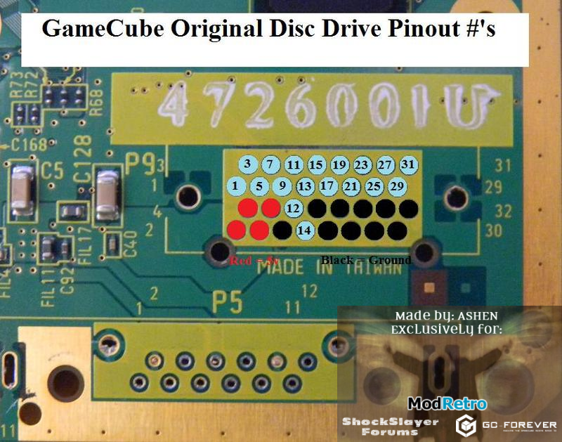

# Flipper DiskInterface (DI)

This section contains a description of DI. Based on US patent 6,609,977.

## Overview

DI is used to control Disk Drive Unit (DDU). From the application side, you can interact in two ways:
- Immediate commands
- Via DI DMA

Immediate commands are used for quick control (stop the motor, start DVD Audio Stream, etc.).

DI DMA is mainly used to transfer data from DVD (but there is also a hidden debugging functionality).

DVD Audio is streamed, sample-by-sample (The received PCM sample is transferred directly to AI).

## DI Signals

|Name|Dir|Type|Description|
|---|---|---|---|
|DIDD[7:0]|I/O|LVCMOS|DI Data: DI Data bus. Depending upon the DIDR (Direction) signal, the data bus is driven by main processor or mass storage access device. When main processor is writing data the signals are outputs and the data should be latched by the mass storage access device on the rising edge of the DIHSTRB signal. When main processor is reading data from the mass storage access device, the DIDD[7:0] signals are inputs and the data should be latched on the rising edge of the DIDSTRB signal. During reset, this bus can be used for latching in the configuration. It is implemented as 8 bit transparent latches controlled by sync reset and they sample the reset state of the DIDD bus and hold the state on the rising edge of the sync resetb. Currently, bit 0 is used for ROM scramble disable, bits 1-7 are reserved.|
|DIDIR|O|LVCMOS|DI Direction: This signal controls the current direction of the DIDD[7:0] data bus. DIDR=0: DI -> mass storage access device (DIDD[7:0] are outputs). DIDR=1: mass access storage device -> DI (DIDD[7:0] are inputs).|
|DIHSTRB|O|LVCMOS|DI Host Strobe: DIHSTRB is an output and has two different modes of operation, depending on whether the main processor DI is writing data or reading data. When the DI is writing data, the DIHSTRB signal is used to qualify the data output on the DIDD[7:0] bus, DIDD[7:0] is valid on the rising edge of DIHSTRB. When the DI is reading data, the DIHSTRB is used as a ready signal, the assertion of DIHSTRB indicates that the DI is ready to complete the next data read from the mass storage access device.|
|DIDSTRB|I|LCVMOS|DI Device Strobe: DIDSTRB is an input and has two different modes of operation, depending on whether the main processor DI is writing data or reading data. When the DI is reading data, the DIDSTRB signal is used to qualify the data input on the DIDD[7:0] bus, DIDD[7:0] is valid on the rising edge of DIDSTRB. When the DI is writing data, the DIDSTRB is used as a ready signal, the assertion of DIDSTRB indicates that the mass storage access device is ready to complete the next data write.|
|DIERR|I|LVCMOS|DI Error: DIERR is an input. The assertion of DIERR by the mass access storage device indicates that an error has occurred on the mass storage access device. The DI interface will immediately halt the current command. Depending upon the setting of the DIS[DEINT] bit, an interrupt will also be generated on the assertion of DIERR. After the DIERR is asserted, the mass access storage device will deassert DIERR after the next command is received from the host. Typically, the next command is request sense to check the error status. DIERR is an edge-triggered signal. The assertion of DIERR by the mass storage access device should only occur at the end of the command transfer or at the end of the data transfer, in the case of DMA data, it can occur in between any 32Bytes transfer. After DIERR is asserted, DICR[TSTART] will be cleared and DISR[TCINT] will not be generated for the current transaction.|
|DIBRK|I/O|LVCMOS OD|DI Break: DIBRK is an input/output signal and is an open drain output, externally a pull-up resistor is required. Normally this signal is driven low by the DI, in preparation for a Break cycle. This signal is driven both by the DI and the mass storage access device. When the DI sends a break, it releases control of the DIBRK signal and the signal rises to active level due to an external pull-up. The mass access storage device is now the master of the signal. To acknowledge the break signal, the mass access storage device pulses the signal low. The DI recognizes the rising edge of DIBRK as a break acknowledge. After break acknowledge, the DI drives DIBRK low again, in preparation for the next break cycle. The DI controller will delay sending the break signal until the whole command packet has been transferred.|
|DICOVER|I|LVCMOS|DI Cover: DICOVER is an input signal. This signal is connected to the Disk cover switch. This signal high indicates the cover is open, this signal low indicates the cover is closed.|
|DIRST|O|LVCMOS|DI Reset: DIRST is an output signal. When DIRST is asserted the mass storage access device will be reset. This signal is not controlled by the DI. This signal is controlled by the main processor General Reset Register in the PI.|

DVD Audio related signals:

|Name|Dir|Type|Description|
|---|---|---|---|
|AISD|I|LVCMOS|Audio Interface Streaming Data: AISD is an input signal AISD is the serial bit stream of the Left Right audio data driven in from the Disk drive, synchronized by the rising edge of the bit clock.|
|AISLR|O|LVCMOS|Audio Interface Streaming Left Right: AISLR is an output signal. AISLR is a frame signal for the serial bit stream and determines the left/right channel of the current word. AISLR toggles at the sample rate frequency (32 kHz/48 kHz). This signal also controls the flow of the audio data. After this current stereo sample is received, if AISLR does not toggle, the Disk assumes that the stream is stopped/paused and sends 0’ as data. The Disk does not begin sending data until it has received a high-low-high sequence.|
|AISCLK|O|LCMOS|Audio Interface Streaming Clock: AISCLK is an output signal. AISCLK is the bit clock for the AISD serial bit stream. The AISCLK is a free running clock.|

## DDU Connector (P9)

(Source: http://forums.modretro.com/index.php?threads/the-definitive-gc-motherboard-trimming-guide.6476/)

|Pad|Signal|
|---|---|
|1|AISLR|
|2|5V
|3|AISD|
|4|5V|
|5|AISCLK|
|6|5V|
|7|DIHSTRB|
|8|5V|
|9|DIERR|
|10|Ground|
|11|DIBRK|
|12|DICOVER|
|13|DIDSTRB|
|14|DIRST|
|15|DIDIR|
|16|Ground|
|17|DID7|
|18|Ground|
|19|DID6|
|20|Ground|
|21|DID5|
|22|Ground|
|23|DID4|
|24|Ground|
|25|DID3|
|26|Ground|
|27|DID2|
|28|MONI|
|29|DID1|
|30|MONOUT|
|31|DID0|
|32|Ground|

(Source: YAGCD)

## DI Registers

DI Registers base is 0x0C006000 (physical addressing).

### DISR: DI Status Register

- Mnemonic: DISR
- Offset: 0x00
- Size 32 bits

|Bits|Mnemonic|Type|Reset|Description|
|---|---|---|---|---|
|31:7| |R|0|Reserved|
|6|BRKINT|RWC|0|Break Complete Interrupt Status and clear. On read this bit indicates the current status of the break complete interrupt. This interrupt is asserted when a Break cycle has completed (break acknowledge received from mass storage access device). When a `1` is written to this bit, the interrupt is cleared. Write: 0 = No effect 1 = Clear Break Complete Interrupt. Read: 0 = Break Complete Interrupt has not been requested, 1 = Break Complete Interrupt has been requested|
|5|BRKINTMSK|RW|0|Break Complete Interrupt Mask: Interrupt masking prevents the interrupt from being sent to the main processor, but does not affect the assertion of DISR[BRKINT]. 0 = Interrupt masked, 1 = Interrupt enabled|
|4|TCINT|RWC|0|Transfer Complete Interrupt Status and clear. On read this bit indicates the current status of the transfer complete interrupt. The Transfer Complete interrupt is asserted under the following conditions: a DMA mode transfer has completed (DMA finished) or an Immediate mode transfer has completed (transfer to/from DIIMMBUF has completed). When a `1` is written to this bit, the interrupt is cleared. The assertion of TCINT is delayed until the DIDSTRBb (low) in order to guarantee the error interrupt occurs before transfer complete interrupt. If DIERRb is asserted during the current transaction, the transaction will be halted and TCINT will not be asserted. Write: 0 = No effect, 1 = Clear Transfer Complete Interrupt. Read: 0 = Transfer Complete Interrupt has not been request, 1 = Transfer Complete Interrupt has been request|
|3|TCINTMSK|RW|0|Transfer Complete Interrupt Mask: Interrupt masking prevents the interrupt from being sent to the main processor, but does not affect the assertion of DISR[TCINT]. 0 = Interrupt masked, 1 = Interrupt enabled|
|2|DEINT|RWC|0|Mass Storage Access Device Error Interrupt Status: On read this bit indicates the current status of the mass storage access device error interrupt. To clear this interrupt, two actions must occur. When a `1` is written to this bit, the internal interrupt is cleared. To reset the DIERRb signal, a command must be issued to the external DI device. If error occurs during the command packet, the drive has to delay the error assertion until the completion of the 12 bytes command transfer. In immediate mode, if error occurs during the data packet, the error assertion has to be delayed until the completion of the 4 bytes data transfer. In DMA mode, it has to be delayed until the completion of any 32 bytes data transfer. Write: 0 = No effect, 1 = Clear Mass Storage Access Device Error. Interrupt Read: 0 = Mass Storage Access Device Error Interrupt has not been requested, 1 = Mass Storage Access Device Error Interrupt has been requested
|1|DEINTMSK|RW|0|Mass Storage Access Device Error Interrupt Mask: Interrupt masking prevents the interrupt from being sent to the main processor, but does not affect the assertion of DISR[DEINT]. 0 = Interrupt masked, 1 = Interrupt enabled|
|0|BRK|RWC|0|DI Break: When a `1` is written to this bit, the DI controller interrupts the current command and sends a break signal to the mass storage access device. The break signal interrupts the current command on the mass storage access device. After the break sequence is complete (see TCINT), a new command may be sent to the mass storage access device. This bit is cleared after the break command is complete. Note that DI controller will delay the break signal assertion if it is in the middle of the command transfer. Hence break can only occur during the data transfer or when it is idle. Write: 0 = No effect, 1 = Request Break. Read: 0 = Break not requested or break complete, 1 = Break requested and pending|

### DICVR: DI Cover Register

- Mnemonic: DICVR
- Offset: 0x04
- Size 32 bits

|Bits|Mnemonic|Type|Reset|Description|
|---|---|---|---|---|
|31:3| |R|0|Reserved|
|2|CVRINT|RWC|0|Mass Storage Device Cover Interrupt Status: On read this bit indicates the current status of the Mass Storage Device Cover interrupt. When a `1` is written to this bit, the internal interrupt is cleared. The Mass Storage Device Cover Interrupt is asserted when the status of the DICOVER signal changes (e.g., when the cover is opened or closed). Write: 0 = No effect, 1 = Clear Cover Interrupt. Read: 0 = Cover Interrupt has not been requested, 1 = Cover Event Interrupt has been requested|
|1|CVRINTMSK|RW|0|Cover Interrupt Mask: Interrupt masking prevents the interrupt from being sent to the main processor, but does not affect the assertion of DISR[DEINT]. 0 = Interrupt masked, 1 = Interrupt enabled|
|0|CVR|R|\*|Cover Status: This bit reflects the current state of the DICOVER signal. 0 = Cover is closed, 1 = Cover is open (\*)The reset state of DICVR[CVR] reflects the state of the DICOVER signal.|

### DICMDBUF0: DI Command Buffer 0

- Mnemonic: DICMDBUF0
- Offset: 0x08
- Size 32 bits

|Bits|Mnemonic|Type|Reset|Description|
|---|---|---|---|---|
|31:24|CMDBYTE0|RW|0|Command Byte 0: This is byte 0 of the command packet that will be sent to the mass storage access device when the command is initiated. (The DI command is initiated when DICSR[CMDSTART] is written with `1`.)|
|23:16|CMDBYTE1|RW|0|Command Byte 1: See DPCMDBUF0[CMDBYTE0] description.|
|15:8|CMDBYTE2|RW|0|Command Byte 2: See DPCMDBUF0[CMDBYTE0] description.|
|7:0|CMDBYTE3|RW|0|Command Byte 3: See DPCMDBUF0[CMDBYTE0] description.|

### DICMDBUF1: DI Command Buffer 1

- Mnemonic: DICMDBUF 1
- Offset: 0x0C
- Size 32 bits

|Bits|Mnemonic|Type|Reset|Description|
|---|---|---|---|---|
|31:24|CMDBYTE4|RW|0|Command Byte 4: See DPCMDBUF0[CMDBYTE0] description.|
|23:16|CMDBYTE5|RW|0|Command Byte 5: See DPCMDBUF0[CMDBYTE0] description.|
|15:8|CMDBYTE6|RW|0|Command Byte 6: See DPCMDBUF0[CMDBYTE0] description.|
|7:0|CMDBYTE7|RW|0|Command Byte 7: See DPCMDBUF0[CMDBYTE0] description.|

### DICMDBUF2: DI Command Buffer 2

- Mnemonic: DICMDBUF2
- Offset: 0x10
- Size 32 bits

|Bits|Mnemonic|Type|Reset|Description|
|---|---|---|---|---|
|31:24|CMDBYTE8|RW|0|Command Byte 8: See DPCMDBUF0[CMDBYTE0] description.|
|23:16|CMDBYTE9|RW|0|Command Byte 9: See DPCMDBUF0[CMDBYTE0] description.|
|15:8|CMDBYTE10|RW|0|Command Byte 10: See DPCMDBUF0[CMDBYTE0] description.|
|7:0|CMDBYTE11|RW|0|Command Byte 11: See DPCMDBUF0[CMDBYTE0] description.|

### DI DMA Memory Address Register

- Mnemonic: DIMAR
- Offset: 0x14
- Size 32 bits

|Bits|Mnemonic|Type|Reset|Description|
|---|---|---|---|---|
|31:26| |R|0|Reserved.|
|25:5|DIMAR|RW|0|DI DMA Memory Address Register: This register indicates the starting main memory address used for the current DMA command. The memory address is the destination address when DICR[RW] is set to `read` and is the source address when set to `write`.|
|4:0| |R|0|These low address bits read back zero since all DMA transfers are 32 byte aligned. Always write `0`.|

### DILENGTH: DI DMA Transfer Length Register

- Mnemonic: DILENGTH
- Offset: 0x18
- Size 32 bits

|Bits|Mnemonic|Type|Reset|Description|
|---|---|---|---|---|
|31:26| |R|0|Reserved.|
|25:5|DILENGTH|RW|0|DI DMA Length Register: This register indicates the length of the data transfer in bytes for the current DMA command. If a DMA command is interrupted by a break cycle, this register indicates the amount of data that was left to transfer before the DMA command was interrupted. If the length equals zero, it is a special case with command transfer only.|
|4:0| |R|0|These low length bits read back zero since all DMA transfers are multiples of 32 bytes long. Always write `0`.|

### DICR: DI Control Register

- Mnemonic: DICR
- Offset: 0x1C
- Size 32 bits

|Bits|Mnemonic|Type|Reset|Description|
|---|---|---|---|---|
|31:3| |R|0|Reserved|
|2|RW|RW|0|Transfer Read/Write: controls the transfer direction, read or write to DI. Read indicates data flows from the mass storage access device to the main processor. Write indicates data flows from main processor to the mass storage access device. 0 = Read Command, 1 = Write Command|
|1|DMA|RW|0|DMA Mode: controls whether the packet data is transferred by using DMA mode to/from main memory or if packet data is transferred directly to/from the Immediate Data Buffer. The only mass storage device packet command which can use immediate mode is the `Register Access` command. When in immediate mode, the DIMAR and DILENGTH registers are ignored. 0 = Immediate Mode, 1 = DMA Mode|
|0|TSTART|RW|0|Transfer Start: When a `1` is written to this bit, the current command is executed (e.g., DMA command or immediate command). When read this bit represents the current command status. This bit is also cleared after the break completion and after DIERRb is asserted. Write: 0 = No Effect, 1 = Start Command. Read: 0 = Transfer Complete, 1 = Transfer Pending|

### DIIMMBUF DI Immediate Data Buffer

- Mnemonic: DIIMMBUF
- Offset: 0x20
- Size 32 bits

|Bits|Mnemonic|Type|Reset|Description|
|---|---|---|---|---|
|31:24|REGVAL0|RW|0|Register Value 0: This is the data read/written when an immediate mode command packet is sent. REGVAL0 is the data of the register address + 0. When the command is a read command the mass storage access device transfers the data from the mass storage device register to the DIIMMBUF. When the command is a write command, the data is transferred from the DIIMMBUF to the mass storage device register.|
|23:16|REGVAL1|RW|0|Register Value 1: register address + 1. See DIIMMBUF[REGVAL0] description.|
|15:8|REGVAL2|RW|0|Register Value 2: register address + 2. See DIIMMBUF[REGVAL0] description.|
|7:0|REGVAL3|RW|0|Register Value 3: register address + 3. See DIIMMBUF[REGVAL0] description.|

### DICFG: DI Configuration Register

- Mnemonic: DICFG
- Offset: 0x24
- Size 32 bits

|Bits|Mnemonic|Type|Reset|Description|
|---|---|---|---|---|
|31:8| |R|0|Reserved|
|7:0|CONFIG|R|DIDD|During reset, this register latches in DIDD bus. This is a read only register containing the configuration value. Currently, only bit 0 is used. Refer to DIDD bus.|
