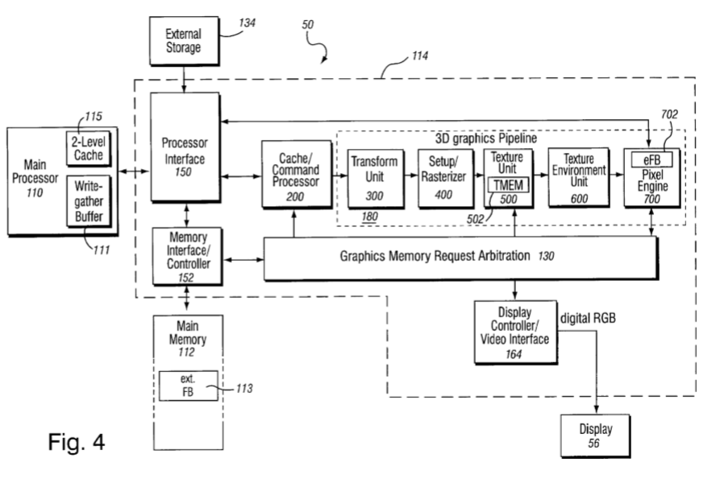
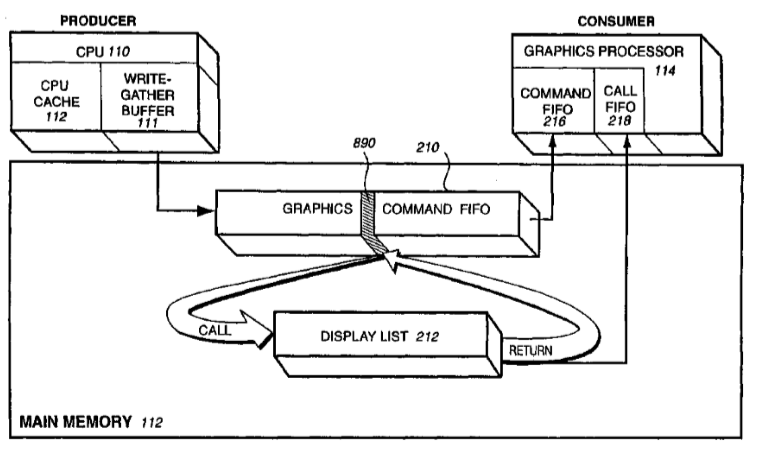
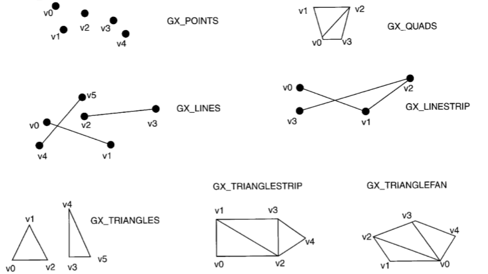

# Flipper GPU (GX)

Flipper GPU (hereinafter GX) is a graphics processor with a fixed pipeline.

GX connection with other Flipper components:

Internal GX architecture:

So that you can estimate the complexity of each GX component, here is a picture with the layout of the main areas of the Flipper chip:

Information in this document may be inaccurate and will be updated in the process.

## Gekko Write Gather Buffer

Write Gather Buffer is a small FIFO inside the Gekko processor that collects single-beat writes at the specified physical address, and when 32 bytes are collected, it passes them to Flipper as a single burst transaction.

Write Gather Buffer can be configured to any physical address. But if it is configured to the address 0x0C008000 - the burst transaction is performed using the PI FIFO mechanism: Write to the PI FIFO physical address Wrptr performed, which is then increased to 32 and PI FIFO is checked for overflow (if Wrptr becomes equal to Endptr, it is initialized with the Top value and Wrap bit is set).

### Write Pipe Address Register (WPAR)

WPAR is mapped as Gekko SPR 921.

|Bits|Name|Meaning|
|----|----|-------|
|0-26|GB_ADDR|High order address bits of the data to be gathered. The low order address bits are zero, forcing the address to be cache line aligned. Note that only these 27 bits are compared to determine if a non-cacheable store will be gathered. If the address of the non-cacheable store has a non-zero value in the low order five bits, incorrect data will be gathered.|
|27-30|-|Reserved|
|31|BNE|Buffer not empty (read only)|

Write Gather Buffer is enabled by setting a bit in the Gekko HID2 register.

## GX FIFOs

There are two FIFOs: PI FIFO and CP FIFO. PI FIFO belongs to the Gekko processor and is accessible through PI registers. CP FIFO refers to the GX and is configured with its own CP registers.

Processor-GX interaction diagram using the FIFOs mechanism:

Call FIFO is processed separately and does not depend on PI/CP FIFOs.

## Processor Interface FIFO

PI FIFO is used to generate a command list. It acts as a producer.

### PI FIFO Registers

### PI FIFO Base (0x0C00300C)

|Bits|Name|Meaning|
|----|----|-------|
|31:26| |Reserved(?)|
|25:5|BASE|The value to write Wrptr after the PI FIFO overflow (when Wrptr becomes Top).|
|4:0|0|Zeroes|

### PI FIFO Top (0x0C003010)

|Bits|Name|Meaning|
|----|----|-------|
|31:26| |Reserved(?)|
|25:5|TOP|Monitors PI FIFO overflow. When Wrptr becomes Top, Wrptr is reset to Base.|
|4:0|0|Zeroes|

### PI FIFO Write Pointer (0x0C003014)

|Bits|Name|Meaning|
|----|----|-------|
|31:27| |Reserved(?)|
|26|WRAP|Set to `1` after Wrptr becomes equal to the value of Top. When is it reset? It looks like a subsequent write to FIFO automatically clears the bit.|
|25:5|WRPTR|The current address for writing the next 32 bytes of FIFO data. Writing is made when the processor performs a burst transaction at the address 0x0C008000. After write, the value is increased by 32. When the value becomes equal to Top, Wrptr is set to Base and the Wrap bit is set.|
|4:0|0|Zeroes|

As you can see, PI FIFO knows nothing about the mode in which it works: linked or multi-buffer. This logic is implemented entirely in the GX command processor.

## Vertex Cache/Command Processor FIFO

The command processor fetches:
- Command streams from main memory via an on-chip FIFO memory buffer that receives and buffers the graphics commands for synchronization/flow control and load balancing.
- Display lists from main memory via an on-chip call FIFO memory buffer.
- Vertex attributes from the command stream and/or from vertex arrays in memory via a vertex cache.

Reading FIFOs from the GX side are always set to 32 byte chunks.

### Command Processor FIFO

|Register Name|Bit Fields|Description|
|-------------|----------|-----------|
|CP_STATUS Register |0:|FIFO overflow (fifo_count > FIFO_HICNT)|
| 					|1:|FIFO underflow (fifo_count < FIFO_LOCNT)|
|					|2:|FIFO read unit idle|
| 					|3:|CP idle|
|                   |4:|FIFO reach break point (cleared by disable FIFO break point)|
|CP_ENABLE Register |0:|Enable FIFO reads, reset value is `0` disable|
|                   |1:|FIFO break point enable bit, reset value is `0` disable|
|                   |2:|FIFO overflow interrupt enable, reset value is `0` disable|
|                   |3:|FIFO underflow interrupt enable, reset value is `0` disable|
|                   |4:|FIFO write pointer increment enable, reset value is `1` enable|
|                   |5:|FIFO break point interrupt enable, reset value is `0` disable|
|CP_CLEAR Register|0:|clear FIFO overflow interrupt|
|                 |1:|clear FIFO underflow interrupt|
|CP_STM_LOW Register|7:0|bits 7:0 of the Streaming Buffer low water mark in 32 bytes increment, default (reset) value is `0x0000`|
|CP_FIFO_BASEL|15:5|bits 15:5 of the FIFO base address in memory|
|CP_FIFO_BASE|9:0|bits 25:16 of the FIFO base address in memory|
|CP_FIFO_TOPL|15:5|bits 15:5 of the FIFO top address in memory|
|CP_FIFO_TOPH|9:0|bits 25:16 of the FIFO top address in memory|
|CP_FIFO_HICNTL|15:5|bits 15:5 of the FIFO high water count|
|CP_FIFO_HICNTH|9:0|bits 25:16 of the FIFO high water count|
|CP_FIFO_LOCNTL|15:5|bits 15:5 of the FIFO low water count|
|CP_FIFO_LOCNTH|9:0|bits 25:16 of the FIFO low water count|
|CP_FIFO_COUNTL|15:5|bits 15:5 of the FIFO_COUNT (entries currently in FIFO)|
|CP_FIFO_COUNTH|9:0|bits 25:16 of the FIFO_COUNT (entries currently in FIFO)|
|CP_FIFO_WPTRL|15:5|bits 15:5 of the FIFO write pointer|
|CP_FIFO_WPTRH|9:0|bits 25:15 of the FIFO write pointer|
|CP_FIFO_RPTRL|15:5|bits 15:5 of the FIFO read pointer|
|CP_FIFO_RPTRH|9:0|bits 25:15 of the FIFO read pointer|
|CP_FIFO_BRKL|15:5|bits 15:5 of the FIFO read address break point|
|CP_FIFO_BRKH|9:0|bits 9:0 if the FIFO read address break point|

CP FIFO operates in two modes: linked mode and multi-buffer mode.

Linked mode is turned on by bit 4 in the CP_ENABLE register. In this mode, writing another portion of data to FIFO 0x0C008000 causes CP Wrptr to increase its value by 32. At the same time, writing to 0x0C008000 is processed by the PI FIFO mechanism (see above). This interaction causes the CP to start processing FIFOs whenever possible, as the distance between CP Rdptr and CP Wrptr has changed.

In Linked mode, Watermark logic is activated. If the FIFO size (FIFO_COUNT) becomes smaller than FIFO_LOCNT, a FIFO underflow is generated. If the FIFO size becomes larger than FIFO_HICNT, a FIFO overflow interrupt is generated. When underflow/overflow interrupts are active CP stops reading new data.

Breakpoint logic is mode-independent (?). When FIFO_RPTR becomes equal to FIFO_BRK, a Breakpoint interrupt is generated.

In multi-buffer mode, the CP processes FIFO until the FIFO size (FIFO_COUNT) is greater than 0. FIFO_COUNT is the distance between CP Wrptr and CP Rdptr.

### FIFO Command Format

|Opcode|Opcode(7:0)|Next|Followed by|
|------|-----------|----|-----------|
|NOP|00000000|none|none|
|Draw_Quads|10000vat(2:0)|VertexCount(15:0)|Vertex attribute stream|
|Draw_Triangles|10010vat(2:0)|VertexCount(15:0)|Vertex attribute stream|
|Draw_Triangle_strip|10011vat(2:0)|VertexCount(15:0)|Vertex attribute stream|
|Draw_Triangle_fan|10100vat(2:0)|VertexCount(15:0)|Vertex attribute stream|
|Draw_Lines|10101vat(2:0)|VertexCount(15:0)|Vertex attribute stream|
|Draw_Line_strip|10110vat(2:0)|VertexCount(15:0)|Vertex attribute stream|
|Draw_Points|10111vat(2:0)|VertexCount(15:0)|Vertex attribute stream|
|CP_LoadRegs (for CP only registers)|00001xxx|Address[7:0]|32 bits data|
|XF_LoadRegs (This is used for loading all XF registers, including matrices. It can be used to load matrices with immediate data)|00010xxx|none|(N+2)*32 bits. First 32 bit: 15:00 register address in XF; 19:16 number of 32 bit registers to be loaded (N+1, 0 means 1. 0xff means 16); 31:20 unused. Next N+1 32 bits: 31:00 register data|
|XF_IndexLoadRegA (registers are in the first 4K address space of the XF. It can be used to block load matrix and light registers)|00100xxx|none|32 bits. 11:0 register address in XF. 15:12 number of 32 bit data, (0 means 1, 0xff means 16). 31:16 Index to the register Array A|
|XF_IndexLoadRegB (registers are in the first 4K address space of the XF. It can be used to block load matrix and light registers)|00101xxx|none|32 bits. 11:0 register address in XF. 15:12 number of 32 bit data, (0 means 1, 0xff means 16). 31:16 Index to the register Array B|
|XF_IndexLoadRegC (registers are in the first 4K address space of the XF. It can be used to block load matrix and light resisters)|00110xxx|none|32 bits. 11:0 register address in XF. 15:12 number of 32 bit data, (0 means 1, 0xff means 16). 31:16 Index to the register Array C|
|XF_IndexLoadRegD (registers are in the first 4K address space of the XF. It can be used to block load matrix and light registers)|00111xxx|none|32 bits. 11:0 register address in XF. 15:12 number of 32 bit data, (0 means 1, 0xff means 16). 31:16 Index to the register Array D|
|Call_Object|01000xxx|none|2x32. 25:5 address (need to be 32 byte align). 25:5 count (32 byte count). Call FIFO cannot be nested.|
|V$\_Invalidate|01001xxx|none|none|
|SU_ByPassCmd (This includes all the register load below XF and all setup unit commands, which bypass XF)|0110,SUattr(3:0)|none|32 bit data|

### Vertex Cache

Vertex cache is used to cache those attributes of graphic primitives that are not obtained from the command list, but indexed from the main memory.

The vertex cache is an 8K, 8-way set-associative cache. It is possible to invalidate the cache with a special command from the command list (V$\_Invalidate).

More description can be found in US6717577 "VERTEX CACHE FOR 3D COMPUTER GRAPHICS".

## Internal State Registers

GX state stored in 3 sets of registers:
- CP Regs
- XF Regs
- SU Regs

Writing to registers is performed by special FIFO commands. Partially registers are mapped to physical memory.

### CP Regs

TBD.

### XF Regs

TBD.

### SU Regs

TBD.

## Setup/Rasterizer (SU/RAS)

Terminology:
- The primitive is what the GX can draw. Triangle, point, etc.
- Primitives consist of vertices;
- Each vertex contains a set of attributes (position, color etc.). At least position attribute must be present;
- Attributes can be Direct and Indexed. Direct attributes are contained in the command list itself. For indexed attributes, the command list contains only the index. A buffer with attributes is located in the main memory and is additionally cached in Vertex cache.

The rasterizer(s) is able to draw the following graphic primitives:

## Transform Unit (XF)

TBD.

## Texture Unit

TBD.

## Texture Cache (TMEM)

TBD.

## Texture Environment Unit (TEV)

TBD.

## Pixel Engine

### Embedded Frame Buffer (EFB)

TBD.

### Color/Z Compare (C/Z)

TBD.

### Pixel Engine Copy (PEC)

TBD.

## GP Metrics

TBD.
