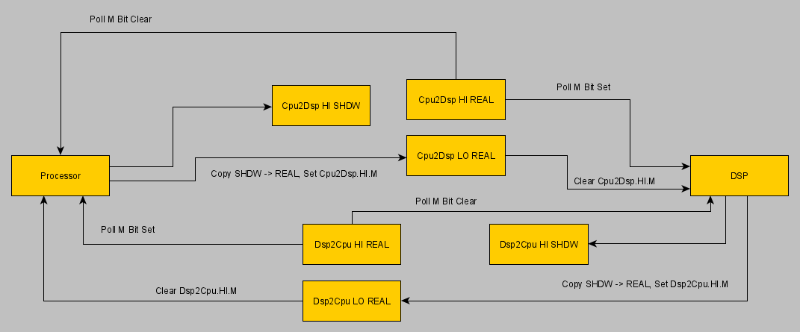

# GAMECUBE DSP

## Preface

This is collection of knowledge about working of GAMECUBE DSP. As you can see later, DSP is another small computer inside. This text is not pretending on full DSP description, I just gathered all my software reverse engineering of DSP library and some info from patents.

Corrections and additions are welcome.

DSP is integrated within Flipper ASIC. It was developed by Macronix and licensed by Nintendo. It is using to produce advanced sound effects, like surround multi-channel sound, reverb and chorus, and else.

Official GC SDK dont have any valuable information regardless DSP inner working. It is all proprietary.

## DSP Architecture

- 81 mhz instruction clock (1/6 of main CPU clock)
- 40-bit add-and-multiply-result registers for calculations
- 16-bit data addressing
- 16-bit address space, including:
	- 8 KBytes Data RAM (DRAM)     (8192 bytes)
	- 4 KBytes Data ROM (DROM)     (4096 bytes)
	- 8 KBytes Instruction RAM (IRAM)      (8192 bytes)
	- 8 KBytes Instruction ROM (IROM)      (8192 bytes)
	- and some hardware registers, to control internal hardware (see below)
- additional DSP internal hardware:
	- custom ADPCM decoder
	- cached memory interface to ARAM (also referred as "accelerator")
	- DMA interface to main memory (to boot microcode)
	- "mailbox" registers for communication with the CPU

IRAM and IROM are collectively called IMEM. DRAM and DROM are collectively called DMEM. Therefore, a DSP has two address spaces.

IMEM access is available through the Fetch operation (by program counter), as well as special instruction (ILRR).

DRAM/DROM is accessible from the DSP by instructions such as Load/Store.

DSP also uses half-word indexing, instead addressing. That is, for example, an address offset of 0x10 bytes is actually addressed as an halfword index (0x10/2) = 0x8.

Well, that's not all Alien features...

## Memory mapping

IMEM (addressed by halfword indexing):

```
0x0000      IRAM (8 Kbytes)
...
0x8000      IROM (8 Kbytes)
...
```

DMEM (addressed by halfword indexing):

```
0x0000      DRAM (8 Kbytes)
...
0x8000      DROM (4 Kbytes)    (Coefficient tables)
...
0xFF00      Mapped hardware IO
```

Now word to United States Patent 6,643,744 "Method and apparatus for pre-fetching audio data":

DSP core has a 100 MHz (* 81 Mhz on production GC) instruction clock and uses 16-bit data words and addressing. DSP core uses a word (16-bit)
addressable instruction memory that includes a RAM area (8 kbyte) and a ROM area (8 kbyte) and a word addressable data memory that includes a RAM area
(8 kbyte) and a ROM area (4 kbyte). A DSP DMA is provided to transfer data from/to main memory, to/from the DSP data/instruction RAM areas or from the
DSP data/instruction ROM areas to main memory. There are two requestors of access to instruction memory: DSP DMA and DSP. The instruction RAM area can
be read/write by DSP DMA and can only be read by DSP. The instruction ROM area can only be read by DSP. There are three requestors of access to data
memory: DSP DMA, data bus 1 and data bus 2. Mail box registers are provided for communication with the main processor. Mail box registers may include a
first mail box register for communications from main processor to DSP core and a second mail box register for communications from DSP core to main
processor. Each register is, for example, 32-bits wide. An accelerator is usable instead of DSP core to read from and write to audio memory. A memory
controller is provided for audio memory and is operative, among other things, to arbitrate requests for audio memory access between DSP core and a
dedicated DMA channel controlled by main processor, for data transactions between audio memory and main memory. Generally, data transactions between
audio memory and DSP data memory have priority over DMA channel. A decoder decodes audio samples supplied thereto. Audio memory is intended primarily
for the storage of audio-related data and may comprise 16 MB of RAM, expandable up to a total of 128 MB (* for developer boards).

## Interrupts

There are some *DSP* interrupts (not Flipper), which I guessed:
- Reset interrupt: RES bit is set in DSPCR
- Halt interrupt: HALT bit is set in DSPCR. The exact effect of HALT remains unexplored. Maybe the DSP doesn't just fall asleep forever, maybe some bus access also wakes it up. More research is required.
- DSP interrupt: INT bit is set in DSPCR.

## Mailbox Registers

```
0x0C005000      DSP Output Mailbox Register High Part (CPU->DSP)
0x0C005002      DSP Output Mailbox Register Low Part (CPU->DSP)
0x0C005004      DSP Input Mailbox Register High Part (DSP->CPU)
0x0C005006      DSP Input Mailbox Register Low Part (DSP->CPU)
```

Although patent is said mailbox are 32-bit wide, Nintendo DSP library accessing them by 16-bit halfs. Most likely because the DSP can only access memory in 16-bit words.

Thats how CPU and DSP are "talking". Typically, some informative number is placed in mailbox register. It can be interpreted as command, or some DSP task status. It is fully depended on DSP microcode.

If mailbox regs are accessing by half parts, there are probably some "shadow" registers, which are used to copy in real registers, when both halfs are written. As example:

```
CPU writing some message to DSP: 0xBADADD1E (some number).
Thats how DSP library will write it in DSP out mailbox:

*(u16 *)0xCC005000 = 0xBADA;
*(u16 *)0xCC005002 = 0xDD1E;

When CPU write the upper part of the message, DSP can already read the upper half of the message, although the lower half is not yet filled (will get only partial 0xBADA???? message).

With shadow registers, it will looks like this:

*(u16 *)0xCC005000 = 0xBADA;  // shadow hi part = 0xBADA
*(u16 *)0xCC005002 = 0xDD1E;  // shadow lo part = 0xDD1E
// copy 0xBADADD1E into real mailbox, when both shadows are filled.
// and "invalidate" shadow registers for new mail message.
```        

Mailbox reading is also performed under shadow registers.

I dont have other explanation, why Nintendo accessing mailboxes by 16-bit halfs, except maybe if hardware designed to wait writes first into hi part and then to low part.

Another questionable thing is high-order bit of mailbox registers. DSP library is checking this bit all the time, after writing/reading mailboxes:

```c++
        // mail delivered to DSP ?
        u32 DSPCheckMailToDSP(void)
        {
            return ( *(u16 *)0xCC005000 & 0x8000 );
        }

        // new mail from DSP ?
        u32 DSPCheckMailFromDSP(void)
        {
            return ( *(u16 *)0xCC005004 & 0x8000 );
        }
```

It is definitely a hardware-driven bit.



## DSP Control Register

```
    0x0C00500A      DSP Control Register (DSPCR)

    This register is messy, because it has not only DSP state, but also some
    bits for ARAM and audio DMA..

        0 0 0 0  0 0 0 0  0 0 0 0  0 0 0 0 
                 | | | |  | | | |  | | | |
                 | | | |  | | | |  | | |  -- 0: RES
                 | | | |  | | | |  | |  ---- 1: INT
                 | | | |  | | | |  |  ------ 2: HALT
                 | | | |  | | | |   -------- 3: AI_INT
                 | | | |  | | |  ----------- 4: AI_INT_MSK
                 | | | |  | |  ------------- 5: AR_INT
                 | | | |  |  --------------- 6: AR_INT_MSK
                 | | | |   ----------------- 7: DSP_INT
                 | | |  -------------------- 8: DSP_INT_MSK 
                 | |  ---------------------- 9: DSPDMA 					// DSP dma in progress
                 |  ------------------------ 10: ?
                  -------------------------- 11: ?

        RES - DSP reset interrupt status
             write 1: to reset DSP
                   0: no meaning?
             read  1: DSP still resetting
                   0: DSP reseted

        INT - DSP interrupt status
             write 1: to generate DSP interrupt
                   0: no meaning?
             read  no meaning?

        HALT - DSP halt interrupt status
             write 1: to halt DSP
                   0: to unhalt DSP
             read  1: DSP halted
                   0: DSP not halted

        AI_INT - audio DMA interrupt status
             write 1: clear AI interrupt pending
                   0: no meaning
             read  1: AI interrupt pending
                   0: no AI interrupt pending

        AI_INT_MSK - audio DMA interrupt mask
                   1: AI interrupt assertion for CPU allowed
                   0: AI interrupt assertion for CPU not allowed

        AR_INT - ARAM DMA interrupt status
        AR_INT_MSK - ARAM DMA interrupt mask
                   see AI_INT and AI_INT_MSK

        DSP_INT - DSP interrupt status
        DSP_INT_MSK - DSP interrupt mask
                   see AI_INT and AI_INT_MSK

        DSPDMA - DSP dma in progress
             read  1: DSP DMA in progress
                   0: DSP DMA completed
```

Bits 10 and 11 are used during DSP initialization, in DSPInit and OSInitAudioSystem SDK functions. Meaning is unknown, but such code may be important:

```c++
        DSPCR &= ~0x0800            // clear bit11
        while(DSPCR & 0x0400);      // wait bit10 clear
```

## Mailboxes and interrupts

Some UCode (in particular, AX UCode) signal an interrupt to the processor, after writing to DSP->CPU Mailbox:

```
003A 16 FC DC D1    si      $(DMBH), #0xDCD1
003C 16 FD 00 01    si      $(DMBL), #0x0000
003E 16 FB 00 01    si      $(DIRQ), #0x0001
```

There used to be an assumption that writing to Mailbox registers generates an interrupt. Actually, this is done as shown above (UCode writes the value to the Mailbox, then makes DIRQ = 1)

## Internal DSP Hardware

Some description of DSP accelerator in US Patent 6,643,744:

```
    ACSAH: Accelerator ARAM Starting Address High: 0xFFD4
    Bits    Type    Reset   Description
    15..11  R       0x0     Reserved
    10..0   R/W     0x0     Starting address bits 26-16 of ARAM high-word
                            starting address
                  
    ACSAL: Accelerator ARAM Starting Address Low: 0xFFD5
    Bits    Type    Reset   Description
    15..0   R/W     0x0     Starting address bits 15-0 of ARAM low-word
                            starting address

    ACEAH: Accelerator ARAM Ending Address High: 0xFFD6
    Bits    Type    Reset   Description
    15..11  R       0x0     Reserved
    10..0   R/W     0x0     Ending address bits 26-16 of ARAM high-word
                            ending address

    ACEAL: Accelerator ARAM Ending Address Low: 0xFFD7
    Bits    Type    Reset   Description
    15..0   R/W     0x0     Ending address bits 15-0 of ARAM low-word
                            ending address

    ACCAH: Accelerator ARAM Current Address High: 0xFFD8 (DSP Address)
    Bits    Type    Reset   Description
    15      R/W     0x0     Direction, 0: accelerator read ARAM
                                       1: accelerator write ARAM
    14..11  R       0x0     Reserved
    10..0   R/W     0x0     Current address bits 26-16 of ARAM high-word
                            current address

    ACCAL: Accelerator ARAM Current Address Low: 0xFFD9
    Bits    Type    Reset   Description
    15..0   R/W     0x0     Current address bits 15-0 of ARAM low-word
                            current address

    AMDM: ARAM DMA request Mask: 0xFFEF
    Bits    Type    Reset   Description
    15..1   R       0x0     Reserved
    0       R/W     0x0     DMA request mask,
                                0: DMA request ARAM is unmasked
                                1: DMA request ARAM is masked
```

In fact, these are not all registers (I may make a more detailed description).

Accelerator operates in two modes: RAW and Decoder. In RAW mode, the ACDAT2 register can read and write raw values ​​that go unchanged from/to ARAM. In Decoder mode, you can only read the another ACDAT register, but the DSP "on the fly" decodes the read value (PCM8, PCM16 or ADPCM).

The format of the values ​​is set by the ACFMT register:
|ACFMT|Description|
|---|---|
|0x0005|RawByte|
|0x0006|RawUInt16|
|0x000A|Pcm16|
|0x0019|Pcm8|
|0x0000|Adpcm|

The ACYN1, ACYN2, ACGAN, ACPDS, and 16 coefficient registers are also involved in the ADPCM decoding process.

## Known DSP Microcodes

Patent mentions microcode:

```
During system initialization, a runtime audio library is downloaded to audio DSP. This audio library is used by audio DSP to process and mix voices
in accordance with commands in a command list generated by main processor. The command list is stored in main memory. Audio DSP retrieves the commands
from main memory and executes them in accordance with the runtime audio library downloaded thereto.
```    

OSInitAudioSystem loads small piece (128 bytes) through DMA, which contains exception vectors and small stub.

I have seen following audio DSP libs:
- AX library. Shipped with official SDK from Nintendo.
- JAudio library. This library is used in Bootrom IPL, Zelda and some other games from Nintendo. It is not using the same DSP library, as AX.

The description of the operation of the microcodes is located somewhere nearby in the RE (Reversing) folder.

SDK CARD library also has microcode, to "unlock" memory card.

Games interacting with GameBoy via Link Cable also contain some microcode (need research).

## DSP Instructions

Cleaned version from Duddie's document. Packed Group LDAX opcodes found in Dolphin-emu source code. And also my corrections after microcode analysis (TSET, TCLR, ADDPAXZ).

### Group 0

```
NOP         0000 0000 0000 0000 
DAR         0000 0000 0000 01dd         // DAR $arD 
IAR         0000 0000 0000 10dd         // IAR $arD  
???         0000 0000 0000 11xx 
ADDARN      0000 0000 0001 ssdd         // ADDARN $arD, $ixS  
HALT        0000 0000 0010 0001 
LOOP        0000 0000 010r rrrr 
BLOOP       0000 0000 011r rrrr aaaa aaaa aaaa aaaa
LRI         0000 0000 100r rrrr iiii iiii iiii iiii 
???         0000 0000 101x xxxx 
LR          0000 0000 110r rrrr mmmm mmmm mmmm mmmm 
SR          0000 0000 111r rrrr mmmm mmmm mmmm mmmm 
IF cc       0000 0010 0111 cccc 
JMP cc      0000 0010 1001 cccc aaaa aaaa aaaa aaaa
CALL cc     0000 0010 1011 cccc aaaa aaaa aaaa aaaa
RET cc      0000 0010 1101 cccc 
RTI         0000 0010 1111 1111
ADDI        0000 001r 0000 0000 iiii iiii iiii iiii 
XORI        0000 001r 0010 0000 iiii iiii iiii iiii 
ANDI        0000 001r 0100 0000 iiii iiii iiii iiii 
ORI         0000 001r 0110 0000 iiii iiii iiii iiii 
CMPI        0000 001r 1000 0000 iiii iiii iiii iiii 
TCLR        0000 001r 1010 0000 mmmm mmmm mmmm mmmm                 // Test all bits clear. Set ok=1 if (acR.m & m) == 0, ok=0 otherwise
TSET        0000 001r 1100 0000 mmmm mmmm mmmm mmmm                 // Test all bits set. Set ok=1 if (acR.m & m) == m, ok=0 otherwise

LSN         0000 0010 1100 1010         // LSN     ac0, ac1.m
ASN         0000 0010 1100 1011         // ASN     ac0, ac1.m

ILRR        0000 00[1]d [0001] 00ss
ILRRD       0000 00[1]d [0001] 01ss
ILRRI       0000 00[1]d [0001] 10ss
ILRRN       0000 00[1]d [0001] 11ss

ADDIS       0000 010d iiii iiii 
CMPIS       0000 011d iiii iiii 
LRIS        0000 1rrr iiii iiii 
```

### Group 1

```
LOOPI       0001 [00]00 iiii iiii
BLOOPI      0001 [00]01 iiii iiii aaaa aaaa aaaa aaaa 
SBSET       0001 [00]10 0000 0iii 
SBCLR       0001 [00]11 0000 0iii 

LSL         0001 [01]0r 00ii iiii
LSR         0001 [01]0r 01ii iiii
ASL         0001 [01]0r 10ii iiii
ASR         0001 [01]0r 11ii iiii
SI          0001 [01]10 mmmm mmmm iiii iiii iiii iiii
CALLR       0001 [01]11 rrr1 1111 
JMPR        0001 [01]11 rrr0 1111 

LRR         0001 [10]00 0ssd dddd 
LRRD        0001 [10]00 1ssd dddd 
LRRI        0001 [10]01 0ssd dddd 
LRRN        0001 [10]01 1ssd dddd 
SRR         0001 [10]10 0ssd dddd 
SRRD        0001 [10]10 1ssd dddd 
SRRI        0001 [10]11 0ssd dddd 
SRRN        0001 [10]11 1ssd dddd 

MRR         0001 [11]dd ddds ssss       // MRR $D, $S 
```

### Group 2

```
LRS         0010 0ddd mmmm mmmm         // LRS $(0x18+D), @M 
SRS         0010 1sss mmmm mmmm         // SRS @M, $(0x18+S)
```

### Group 3

```
XORR        0011 00sd xxxx xxxx         // XORR $acD.m, $axS.h 
ANDR        0011 01sd xxxx xxxx         // ANDR $acD.m, $axS.h 
ORR         0011 10sd xxxx xxxx         // ORR $acD.m, $axS.h 
ANDC        0011 110d xxxx xxxx         // ANDC $acD.m, $ac(1-D).m 
ORC         0011 111d xxxx xxxx         // ORC $acD.m, $ac(1-D).m 
```

### Group 4

```
ADDR        0100 0ssd xxxx xxxx         // ADDR $acD, $(0x18+S) 
ADDAX       0100 10sd xxxx xxxx         // ADDAX $acD, $axS 
ADD         0100 110d xxxx xxxx         // ADD $acD, $ac(1-D) 
ADDP        0100 111d xxxx xxxx         // ADDP $acD 
```

### Group 5

```
SUBR        0101 0ssd xxxx xxxx         // SUBR $acD, $(0x18+S) 
SUBAX       0101 10sd xxxx xxxx         // SUBAX $acD, $axS 
SUB         0101 110d xxxx xxxx         // SUB $acD, $ac(1-D) 
SUBP        0101 111d xxxx xxxx         // SUBP $acD 
```

### Group 6

```
MOVR        0110 0ssd xxxx xxxx         // MOVR $acD, $(0x18+S) 
MOVAX       0110 10sd xxxx xxxx         // MOVAX $acD, $axS 
MOV         0110 110d xxxx xxxx         // MOV $acD, $ac(1-D) 
MOVP        0110 111d xxxx xxxx         // MOVP $acD 
```

### Group 7

```
ADDAXL      0111 00sd xxxx xxxx         // ADDAXL $acD, $axS.l 
INCM        0111 010d xxxx xxxx         // INCM $acsD  (mid accum)
INC         0111 011d xxxx xxxx         // INC $acD 
DECM        0111 100d xxxx xxxx         // DECM $acsD  (mid)
DEC         0111 101d xxxx xxxx         // DEC $acD 
NEG         0111 110d xxxx xxxx         // NEG $acD 
MOVNP       0111 111d xxxx xxxx         // MOVNP $acD 
```

### Group 8

```
NX          1000 r000 xxxx xxxx         (possibly mov r, r)
CLR         1000 r001 xxxx xxxx 
CMP         1000 0010 xxxx xxxx 
UNUSED      1000 0011 xxxx xxxx 
CLRP        1000 0100 xxxx xxxx 
TSTAXH      1000 011r xxxx xxxx 
M2/M0       1000 101x xxxx xxxx 
CLR15/SET15 1000 110x xxxx xxxx 
CLR40/SET40 1000 111x xxxx xxxx 
```

### Group 9

```
MUL         1001 s000 xxxx xxxx         // MUL $axS.l, $axS.h 
ASR16       1001 s001 xxxx xxxx         // ASR16 $acS 
MULMVZ      1001 s01r xxxx xxxx         // MULMVZ $axS.l, $axS.h, $acR 
MULAC       1001 s10r xxxx xxxx         // MULAC $axS.l, $axS.h, $acR 
MULMV       1001 s11r xxxx xxxx         // MULMV $axS.l, $axS.h, $acR 
```

### Group AB

```
MULX        101s t000 xxxx xxxx         // MULX $ax0.S, $ax1.T 
ABS         1010 t001 xxxx xxxx         // ABS $acT
TST         1011 t001 xxxx xxxx         // TST $acT
MULXMVZ     101s t01r xxxx xxxx         // MULXMVZ $ax0.S, $ax1.T, $acR 
MULXAC      101s t10r xxxx xxxx         // MULXAC $ax0.S, $ax1.T, $acR 
MULXMV      101s t11r xxxx xxxx         // MULXMV $ax0.S, $ax1.T, $acR    
```

### Group CD

```
MULC        110s t000 xxxx xxxx         // MULC $acS.m, $axT.h 
CMPAR       110r s001 xxxx xxxx         // CMPAR $acS.m, $axR.h
MULCMVZ     110s t01r xxxx xxxx         // MULCMVZ $acS.m, $axT.h, $acR 
MULCAC      110s t10r xxxx xxxx         // MULCAC $acS.m, $axT.h, $acR 
MULCMV      110s t11r xxxx xxxx         // MULCMV $acS.m, $axT.h, $acR 
```

### Group E

```
MADDX       1110 00st xxxx xxxx         // MADDX $(0x18+S*2), $(0x19+T*2) 
MSUBX       1110 01st xxxx xxxx         // MSUBX $(0x18+S*2), $(0x19+T*2) 
MADDC       1110 10st xxxx xxxx         // MADDC $acS.m, $axT.h 
MSUBC       1110 11st xxxx xxxx         // MSUBC $acS.m, $axT.h 
```

### Group F

```
LSL16       1111 000d xxxx xxxx         // LSL16 $acD
MADD        1111 001d xxxx xxxx         // MADD $axD.l, $axD.h 
LSR16       1111 010d xxxx xxxx         // LSR16 $acD
MSUB        1111 011d xxxx xxxx         // MSUB $axD.l, $axD.h 
ADDPAXZ     1111 10sd xxxx xxxx         // ADDPAXZ $acD, $axS.h 
CLRL        1111 110d xxxx xxxx         // CLRL $acD.l 
MOVPZ       1111 111d xxxx xxxx         // MOVPZ $acD 
```

### Packed Group

```
??          xxxx xxxx 0000 00rr     // NOP2
DR          xxxx xxxx 0000 01rr     // DR $arR 
IR          xxxx xxxx 0000 10rr     // IR $arR 
NR          xxxx xxxx 0000 11rr     // NR $arR, ixR
MV          xxxx xxxx 0001 ddss     // MV $(0x18+D), $(0x1c+S) 
S           xxxx xxxx 001s s0dd     // S @$D, $(0x1c+D)  
SN          xxxx xxxx 001s s1dd     // SN @$D, $(0x1c+D)  
L           xxxx xxxx 01dd d0ss     // L $(0x18+D), @$S 
LN          xxxx xxxx 01dd d1ss     // LN $(0x18+D), @$S 

LS          xxxx xxxx 10dd 000s     // LS $(0x18+D), $acS.m 
SL          xxxx xxxx 10dd 001s     // SL $acS.m, $(0x18+D)  
LSN         xxxx xxxx 10dd 010s     // LSN $(0x18+D), $acS.m 
SLN         xxxx xxxx 10dd 011s     // SLN $acS.m, $(0x18+D)
LSM         xxxx xxxx 10dd 100s     // LSM $(0x18+D), $acS.m 
SLM         xxxx xxxx 10dd 101s     // SLM $acS.m, $(0x18+D)
LSNM        xxxx xxxx 10dd 110s     // LSNM $(0x18+D), $acS.m 
SLNM        xxxx xxxx 10dd 111s     // SLNM $acS.m, $(0x18+D)

LD          xxxx xxxx 11dr 00ss     // LD $ax0.d, $ax1.r, @$arS 
LDN         xxxx xxxx 11dr 01ss     // LDN $ax0.d, $ax1.r, @$arS
LDM         xxxx xxxx 11dr 10ss     // LDM $ax0.d, $ax1.r, @$arS
LDNM        xxxx xxxx 11dr 11ss     // LDNM $ax0.d, $ax1.r, @$arS

LDAX        xxxx xxxx 11sr 0011     // LDAX $axR, @$arS
LDAXN       xxxx xxxx 11sr 0111     // LDAXN $axR, @$arS
LDAXM       xxxx xxxx 11sr 1011     // LDAXM $axR, @$arS
LDAXNM      xxxx xxxx 11sr 1111     // LDAXNM $axR, @$arS
```

## Dispatching packed instructions

DSP instructions are in a hybrid format: some instructions occupy a full 16-bit word, and some can be packed as two 8-bit instructions per word.
Extended opcodes mentioned in Duddie's document are represents lower-part of instruction pair.

First, the "left" instruction (high-order bits of the opcode) is executed, then the "right" instruction (low-order bits). 

As is commonly implemented in VLIW-like DSPs, if you use the same registers in both halves of the instruction, then most likely you will meet Unpredictable Behavior. 

After analyzing the existing microcodes, mutual use of the same registers in one hybrid instruction has not yet been noticed.

## Further reading

Thanks to Duddie, more information about DSP is now known. Check gdsp_infos, GameCube_DSP_Users_Manual.pdf compiled by Dolphin-emu guys and GC IDA plugin by Pierre Bourdon.

- https://github.com/dolphin-emu/dolphin/tree/master/docs/DSP/GameCube_DSP_Users_Manual
- https://github.com/dolphin-emu/gcdsp-ida
