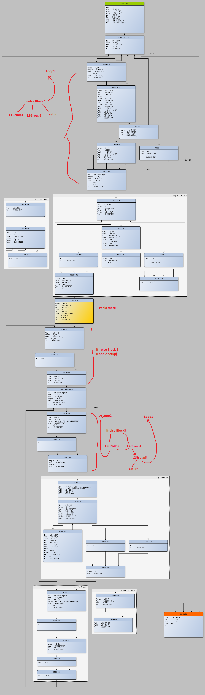

# DVDConvertPathToEntrynum

## Disassembly

```
8000F09C  7C0802A6  mflr        r0
8000F0A0  90010004  stw         r0, 4 (r1)
8000F0A4  9421FFB8  stwu        r1, -72 (r1)
8000F0A8  BE810018  stmw        r20, 24 (r1)
8000F0AC  7C771B78  mr          r23, r3
8000F0B0  3C608003  lis         r3, 0x8003
8000F0B4  3B370000  addi        r25, r23, 0
8000F0B8  3BE39958  subi        r31, r3, 0x66A8
8000F0BC  834D8328  lwz         r26, -0x7CD8 (r13)

8000F0C0  88770000  lbz         r3, 0 (r23)
8000F0C4  7C600775  extsb.      r0, r3
8000F0C8  4082000C  bne-        0x8000F0D4 
8000F0CC  7F43D378  mr          r3, r26
8000F0D0  480002AC  b           0x8000F37C 

8000F0D4  7C600774  extsb       r0, r3
8000F0D8  2C00002F  cmpwi       r0, 47                  // '/'
8000F0DC  40820010  bne-        0x8000F0EC 
8000F0E0  3B400000  li          r26, 0
8000F0E4  3AF70001  addi        r23, r23, 1
8000F0E8  4BFFFFD8  b           0x8000F0C0 
8000F0EC  2C00002E  cmpwi       r0, 46                  // '.'
8000F0F0  40820074  bne-        0x8000F164 
8000F0F4  88770001  lbz         r3, 1 (r23)
8000F0F8  7C600774  extsb       r0, r3
8000F0FC  2C00002E  cmpwi       r0, 46                  // '.'
8000F100  40820044  bne-        0x8000F144 
8000F104  88770002  lbz         r3, 2 (r23)
8000F108  2C03002F  cmpwi       r3, 47                  // '/'
8000F10C  4082001C  bne-        0x8000F128 
8000F110  1C7A000C  mulli       r3, r26, 12
8000F114  808D831C  lwz         r4, -0x7CE4 (r13)
8000F118  38030004  addi        r0, r3, 4
8000F11C  7F44002E  lwzx        r26, r4, r0
8000F120  3AF70003  addi        r23, r23, 3
8000F124  4BFFFF9C  b           0x8000F0C0 
8000F128  7C600775  extsb.      r0, r3
8000F12C  40820038  bne-        0x8000F164 
8000F130  1C1A000C  mulli       r0, r26, 12
8000F134  806D831C  lwz         r3, -0x7CE4 (r13)
8000F138  7C630214  add         r3, r3, r0
8000F13C  80630004  lwz         r3, 4 (r3)
8000F140  4800023C  b           0x8000F37C 
8000F144  2C00002F  cmpwi       r0, 47                  // '/'
8000F148  4082000C  bne-        0x8000F154 
8000F14C  3AF70002  addi        r23, r23, 2
8000F150  4BFFFF70  b           0x8000F0C0 
8000F154  7C600775  extsb.      r0, r3
8000F158  4082000C  bne-        0x8000F164 
8000F15C  7F43D378  mr          r3, r26
8000F160  4800021C  b           0x8000F37C 
8000F164  800D832C  lwz         r0, -0x7CD4 (r13)
8000F168  28000000  cmplwi      r0, 0
8000F16C  408200AC  bne-        0x8000F218 
8000F170  3B970000  addi        r28, r23, 0
8000F174  38A00000  li          r5, 0
8000F178  38800000  li          r4, 0
8000F17C  48000048  b           0x8000F1C4 
8000F180  7C600774  extsb       r0, r3
8000F184  2C00002E  cmpwi       r0, 46
8000F188  4082002C  bne-        0x8000F1B4 
8000F18C  7C17E050  subf        r0, r23, r28
8000F190  2C000008  cmpwi       r0, 8
8000F194  4181000C  bgt-        0x8000F1A0 
8000F198  2C050001  cmpwi       r5, 1
8000F19C  4082000C  bne-        0x8000F1A8 
8000F1A0  38800001  li          r4, 1
8000F1A4  48000038  b           0x8000F1DC 
8000F1A8  3B1C0001  addi        r24, r28, 1
8000F1AC  38A00001  li          r5, 1
8000F1B0  48000010  b           0x8000F1C0 
8000F1B4  2C000020  cmpwi       r0, 32                  // ' '
8000F1B8  40820008  bne-        0x8000F1C0 
8000F1BC  38800001  li          r4, 1
8000F1C0  3B9C0001  addi        r28, r28, 1
8000F1C4  887C0000  lbz         r3, 0 (r28)
8000F1C8  7C600775  extsb.      r0, r3
8000F1CC  41820010  beq-        0x8000F1DC 
8000F1D0  7C600774  extsb       r0, r3
8000F1D4  2C00002F  cmpwi       r0, 47                  // '/'
8000F1D8  4082FFA8  bne+        0x8000F180 
8000F1DC  2C050001  cmpwi       r5, 1
8000F1E0  40820014  bne-        0x8000F1F4 
8000F1E4  7C18E050  subf        r0, r24, r28
8000F1E8  2C000003  cmpwi       r0, 3
8000F1EC  40810008  ble-        0x8000F1F4 
8000F1F0  38800001  li          r4, 1
8000F1F4  2C040000  cmpwi       r4, 0
8000F1F8  41820044  beq-        0x8000F23C 
8000F1FC  38BF0000  addi        r5, r31, 0
8000F200  4CC63182  crclr       6
8000F204  38D90000  addi        r6, r25, 0
8000F208  386D8120  subi        r3, r13, 0x7EE0
8000F20C  38800178  li          r4, 0x0178
8000F210  4BFF93ED  bl          OSPanic 
8000F214  48000028  b           0x8000F23C 
8000F218  7EFCBB78  mr          r28, r23
8000F21C  48000008  b           0x8000F224 
8000F220  3B9C0001  addi        r28, r28, 1
8000F224  887C0000  lbz         r3, 0 (r28)
8000F228  7C600775  extsb.      r0, r3
8000F22C  41820010  beq-        0x8000F23C 
8000F230  7C600774  extsb       r0, r3
8000F234  2C00002F  cmpwi       r0, 47
8000F238  4082FFE8  bne+        0x8000F220 
8000F23C  881C0000  lbz         r0, 0 (r28)
8000F240  7C000775  extsb.      r0, r0
8000F244  4082000C  bne-        0x8000F250 
8000F248  3BC00000  li          r30, 0
8000F24C  48000008  b           0x8000F254 
8000F250  3BC00001  li          r30, 1
8000F254  1FBA000C  mulli       r29, r26, 12
8000F258  7F77E050  subf        r27, r23, r28
8000F25C  3B5A0001  addi        r26, r26, 1
8000F260  480000E4  b           0x8000F344 
8000F264  1F9A000C  mulli       r28, r26, 12
8000F268  7C83E02E  lwzx        r4, r3, r28
8000F26C  5480000F  rlwinm.     r0, r4, 0, 0, 7         // mask:0xFF000000
8000F270  4082000C  bne-        0x8000F27C 
8000F274  38000000  li          r0, 0
8000F278  48000008  b           0x8000F280 
8000F27C  38000001  li          r0, 1
8000F280  2C000000  cmpwi       r0, 0
8000F284  4082000C  bne-        0x8000F290 
8000F288  2C1E0001  cmpwi       r30, 1
8000F28C  41820080  beq-        0x8000F30C 
8000F290  806D8320  lwz         r3, -0x7CE0 (r13)
8000F294  5480023E  rlwinm      r0, r4, 0, 8, 31            // mask:0x00FFFFFF
8000F298  3AB70000  addi        r21, r23, 0
8000F29C  7E830214  add         r20, r3, r0
8000F2A0  48000038  b           0x8000F2D8 
8000F2A4  88140000  lbz         r0, 0 (r20)
8000F2A8  3A940001  addi        r20, r20, 1
8000F2AC  7C030774  extsb       r3, r0
8000F2B0  480109C1  bl          tolower 
8000F2B4  88150000  lbz         r0, 0 (r21)
8000F2B8  3AC30000  addi        r22, r3, 0
8000F2BC  3AB50001  addi        r21, r21, 1
8000F2C0  7C030774  extsb       r3, r0
8000F2C4  480109AD  bl          tolower 
8000F2C8  7C03B000  cmpw        r3, r22
8000F2CC  4182000C  beq-        0x8000F2D8 
8000F2D0  38000000  li          r0, 0
8000F2D4  48000030  b           0x8000F304 
8000F2D8  88140000  lbz         r0, 0 (r20)
8000F2DC  7C000775  extsb.      r0, r0
8000F2E0  4082FFC4  bne+        0x8000F2A4 
8000F2E4  88750000  lbz         r3, 0 (r21)
8000F2E8  2C03002F  cmpwi       r3, 47                      // '/'
8000F2EC  4182000C  beq-        0x8000F2F8 
8000F2F0  7C600775  extsb.      r0, r3
8000F2F4  4082000C  bne-        0x8000F300 
8000F2F8  38000001  li          r0, 1
8000F2FC  48000008  b           0x8000F304 
8000F300  38000000  li          r0, 0
8000F304  2C000001  cmpwi       r0, 1
8000F308  41820058  beq-        0x8000F360 
8000F30C  800D831C  lwz         r0, -0x7CE4 (r13)
8000F310  7C60E214  add         r3, r0, r28
8000F314  80030000  lwz         r0, 0 (r3)
8000F318  5400000F  rlwinm.     r0, r0, 0, 0, 7         // mask:0xFF000000
8000F31C  4082000C  bne-        0x8000F328 
8000F320  38000000  li          r0, 0
8000F324  48000008  b           0x8000F32C 
8000F328  38000001  li          r0, 1
8000F32C  2C000000  cmpwi       r0, 0
8000F330  4182000C  beq-        0x8000F33C 
8000F334  80030008  lwz         r0, 8 (r3)
8000F338  48000008  b           0x8000F340 
8000F33C  381A0001  addi        r0, r26, 1
8000F340  7C1A0378  mr          r26, r0
8000F344  806D831C  lwz         r3, -0x7CE4 (r13)
8000F348  38030008  addi        r0, r3, 8
8000F34C  7C1D002E  lwzx        r0, r29, r0
8000F350  7C1A0040  cmplw       r26, r0
8000F354  4180FF10  blt+        0x8000F264 
8000F358  3860FFFF  li          r3, -1                      // Bad path
8000F35C  48000020  b           0x8000F37C 
8000F360  2C1E0000  cmpwi       r30, 0
8000F364  4082000C  bne-        0x8000F370 
8000F368  7F43D378  mr          r3, r26
8000F36C  48000010  b           0x8000F37C 
8000F370  7EFBBA14  add         r23, r27, r23
8000F374  3AF70001  addi        r23, r23, 1
8000F378  4BFFFD48  b           0x8000F0C0 

8000F37C  BA810018  lmw         r20, 24 (r1)
8000F380  8001004C  lwz         r0, 76 (r1)
8000F384  38210048  addi        r1, r1, 72
8000F388  7C0803A6  mtlr        r0
8000F38C  4E800020  blr
```

## Call Graph



## C++

```c++
int currentDirectory = 0;
bool __DVDLongFileNameFlag = true;
DVDFileEntry* FstStart;
char* FstStringStart;

int DVDConvertPathToEntrynum (char * path /* r3 */ )
{
    // 8000F09C
    r23 = r3;               // r23 - pathPtr
    //r31
    //"DVDConvertEntrynumToPath(possibly DVDOpen or DVDChangeDir or DVDOpenDir): specified directory or file (%s) doesn't match standard 8.3 format. "
    //"This is a temporary restriction and will be removed soon\n"
    r25 = r3;       // r25 - backup path parameter (for OSPanic)
    r26 = currentDirectory;         // r26 -- dirEntry  (currentDirectory assigned by DVDChangeDir)

    // 8000F0C0 - Loop1
    while (true)
    {
        r3 = r23[0];
        if (r3 == 0)
            return r26;

        // if-else Block 1 -- Current/parent directory walk

        // 8000F0D4
        if (r3 == '/')
        {
            r26 = 0;
            r23++;
            continue;   // Loop1
        }

        // 8000F0EC
        if (r3 == '.')
        {
            r3 = r23[1];

            if (r3 == '.')
            {
                r3 = r23[2];
                if (r3 == '/')
                {
                    r26 = FstStart[r26].parentOffset;
                    r23 += 3;
                    continue;   // Loop1
                }
                // 8000F128
                if (r3 == 0)
                {
                    return FstStart[r26].parentOffset;
                }           
            }
            else
            {
                // 8000F144
                if (r3 == '/')
                {
                    r23 += 2;
                    continue;   // Loop1
                }
                // 8000F154
                if (r3 == 0)
                {
                    return r26;
                }           
            }
        }

        // 8000F164 -- __DVDLongFileNameFlag
        // r28 -- Get a pointer to the end of a file or directory name (the end is 0 or /)

        if (__DVDLongFileNameFlag)
        {
            r28 = r23;
            while ( !(r28[0] == 0 || r28[0] == '/') )
            {
                r28++;
            }
        }
        else
        {
            // Loop 1 - Group 2  -- 8.3 Format. Omitted

            //r31- "DVDConvertEntrynumToPath(possibly DVDOpen or DVDChangeDir or DVDOpenDir): specified directory or file (%s) doesn't match standard 8.3 format. "
            //"This is a temporary restriction and will be removed soon\n"
            //r25- path
        }

        // if-else Block 2

        r30 = r28[0] != 0;      // r30 - after-name character != 0
        //8000F254
        r29 = r26;          // Save previous dirEntry
        r27 = r28 - r23;        // r27 -- nameSize
        r26++;              // Increment dirEntry

        // Loop2
        while (true)
        {
            //8000F344
            r0 = FstStart[r29].nextOffset;
            if (r0 <= r26)
                return -1;      // Bad FST

            // if-else Block3
            // 8000F264
            r28 = r26 * 12;             // Pre-calculus
            r0 = FstStart[r26].isDir;

            // Loop2 - Group 1  -- Compare names
            if (FstStart[r26].isDir || r30 == false /* after-name is 0 */)
            {
                // 8000F290
                r21 = r23;      // r21 -- current pathPtr to inner loop
                r20 = &FstStringStart[FstStart[r26].nameOffsetDirFlag & 0xFFFFFF];     // r20 -- ptr to current entry name

                bool same;
                while (true)
                {
                    // 8000F2D8
                    if (*r20 == 0)
                    {
                        same = (*r21 == '/' || *r21 == 0);
                        break;
                    }

                    // 8000F2A4
                    if ( tolower (*r20++) != tolower (*r21++) )
                    {
                        same = false;
                        break;
                    }
                }

                // Loop 2 - Group 3
                if (same)
                {
                    if (r30 == false)
                        return r26;
                    // 8000F370
                    r23 += r27 + 1;
                    break;      // break Loop2
                }
            }

            // Loop 2 - Group 2 - Walk next directory/file at same level
            // 8000F30C
            r26 = FstStart[r26].isDir ? FstStart[r26].nextOffset : (r26 + 1);
        }

    }

}

```
