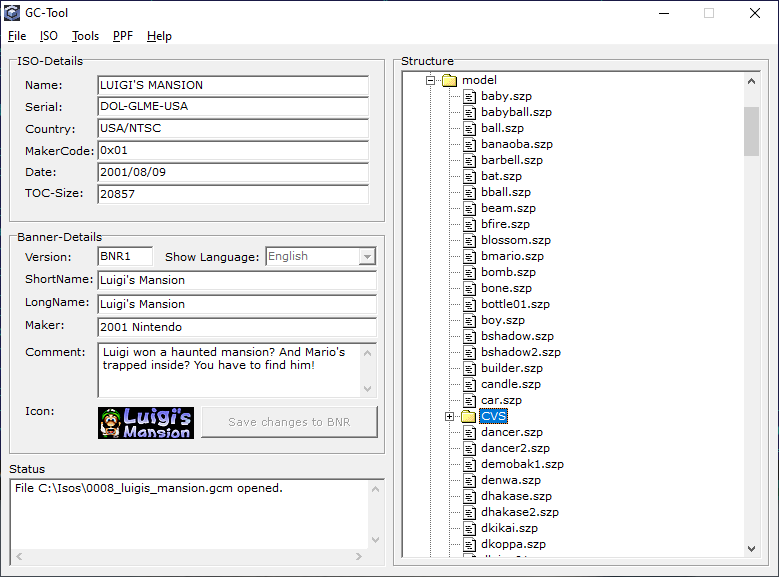

# FST Notes

## Location of directories and files

The algorithm for obtaining the index of an FST entry by its path is designed in such a way that it is important for it that all directories and files of the same level be sorted in ascending order of name (a-z).

The case of letters does not matter (translated to lower case before the comparison).

Therefore, we have such a curiosity: in the middle of the files is a folder of the next level, and then the files continues. The usual layout for the rest of the OS is when directories are located first, and then the files do not work here.

[DVDConvertPathToEntrynum](./DVDConvertPathToEntrynum.md)

## Directory Prev and Next

The **prev** property of a directory entry indicates the index of the parent folder.

Root always has an index of 0. Parent for Root also has a value of 0.

The **next** property contains the index of the next record of the same level (directory or file). The **next** property of the last record of a lower level contains the index of the next record of a higher level.

Relatively speaking, the next property is equal to the number of children of this record plus 1.

Thus, the **next** property of Root naturally takes the number of all FST entries (including Root itself).
