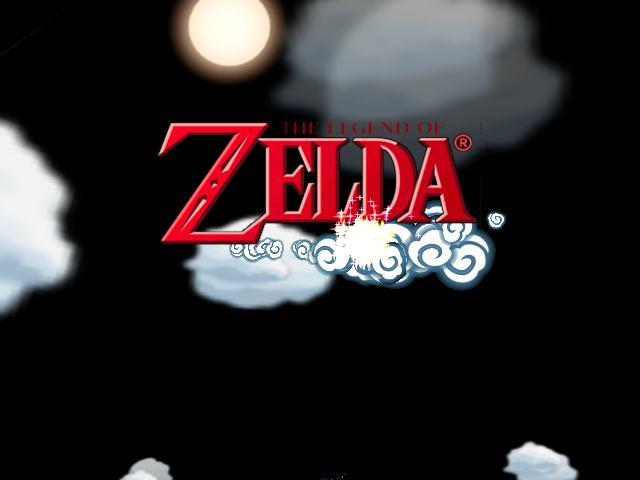
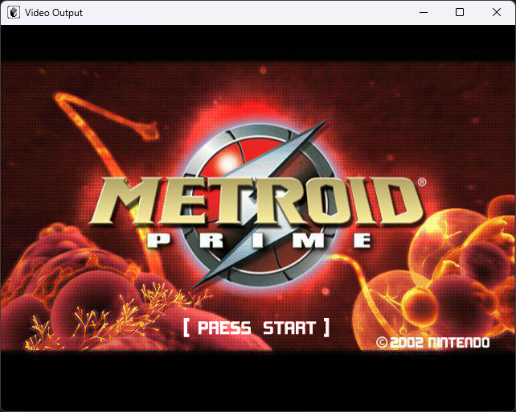
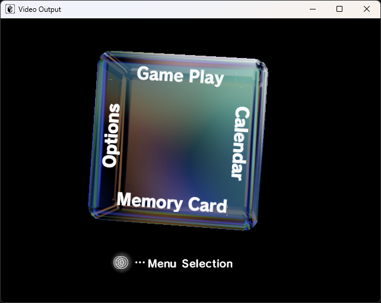
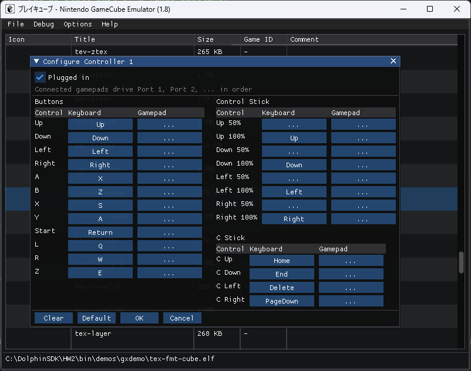
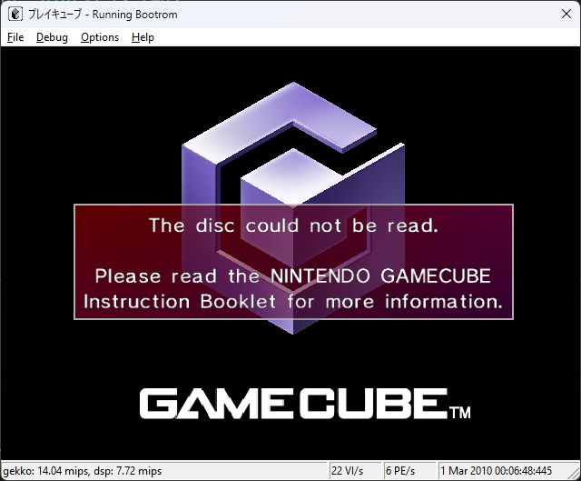
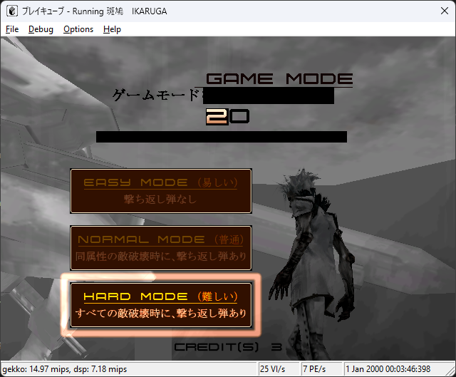
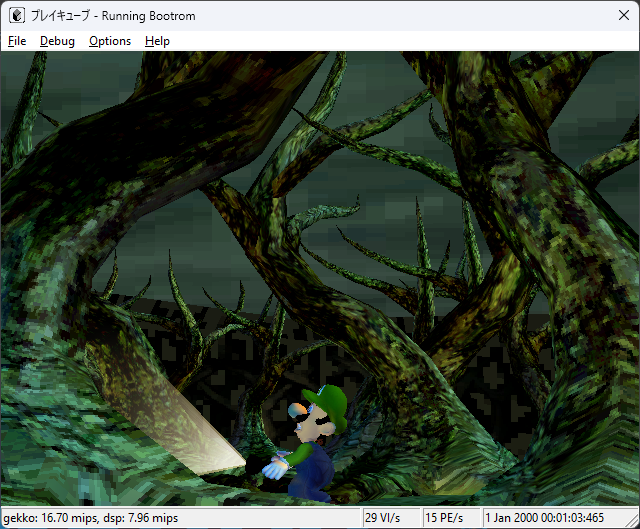

<div align="center">

# プレイキューブ


**A work-in-progress emulator of the Nintendo GameCube**

[](#progress)
[](docs/RELEASE_NOTES_1.8.md)
[](#build)
[](LICENSE)
[](https://discord.gg/Ehz8PYA)

</div>

pureikyubu is a work-in-progress emulator of the Nintendo GameCube console.

The goal of the emulator is to research the hardware features of GameCube and reverse engineer the
technologies used to develop games for this platform. GameCube is the hardware masterpiece of
Nintendo/ArtX engineers, and it's a pleasure to explore this device and discover something new for
yourself.

## Contents

- [What's new](#whats-new)
- [Features](#features)
- [Progress](#progress)
- [Build](#build)
- [Command line](#command-line)
- [Documentation](#documentation)
- [AI usage policy](#ai-usage-policy)
- [Credits](#credits)
- [Contacts](#contacts)

## What's new

The latest release is **1.8** — the performance release. See the full
[release notes](docs/RELEASE_NOTES_1.8.md) ([1.7](docs/RELEASE_NOTES_1.7.md)).

- **Gekko recompiler.** An x86-64 basic-block compiler (`src/gekkojit.*`) lifts the emulated CPU
  from 39.7 to 155.9 MIPS on the differential harness; Paired-Single instructions go through
  SSE/SSE2. `jit 0` / `jit 1` switches engines at run time.
- **No more busy-waiting.** The VI scan-out and the serial poll run on the CPU thread, and the CP,
  AI DMA and DSP threads block on events instead of spinning on the time base.
- **Interrupts follow the hardware again.** The DSP and disk-interface aggregate interrupt lines,
  the serial poll schedule and the DSP microcode vectors were corrected, so Zelda: The Wind Waker
  boots to its title screen and Animal Crossing gets past its audio handshake.
- **RVZ disc images.** Compressed GameCube images in Dolphin's container (Zstandard) can be mounted
  read-only, next to DOL / ELF / GCM / ISO.
- **Controller settings for the SDL build**, and a recoloured application icon
  (`src/res/pureikyubu_icon.svg`).

## Features

| Area | State |
|---|---|
| **CPU** | Gekko interpreter with a decode cache and a 2048-entry TLB, plus an x86-64 basic-block recompiler (`GEKKO_JIT_DISABLED` and non-x86 hosts fall back to the interpreter) |
| **Graphics** | Flipper: Command Processor, Transform Unit, TEV, texture decoder, PE/EFB, VI scan-out and XFB decoding, OpenGL backend |
| **Audio** | DSP core with disassembler and debugger UI, ARAM DMA, AI streaming, SDL audio backend (the Linux build has no sound yet) |
| **Input** | Four emulated controller ports; keyboard and game controller bindings with a full "Configure Controller N" dialog |
| **Storage** | Bootrom (IPL), DOL, ELF, GCM/ISO, read-only RVZ, memory cards, EXI |
| **Debugging** | Built-in debugger UI (debug log, reports, memory and hardware inspection) and the JSON debug interface (`src/jdiserver.*`) for external tools |
| **Front ends** | Win32 and SDL; the Linux port is built from the SDL front end |

Screenshots from the current development build:

|||
|---|---|
|||

## Progress

The emulator boots and runs more titles with every release — the per-title throughput of the current
release is listed in the [1.8 release notes](docs/RELEASE_NOTES_1.8.md). The screenshots below are
captures from earlier builds; the status bar shows the emulated MIPS, VI and PE rates. Some titles
still fail to render or hang — compatibility is a work in progress.

||||
|---|---|---|

## Build

All platforms:

```
git clone https://github.com/emu-russia/pureikyubu.git
cd pureikyubu
git submodule update --init
```

### Windows

Build using Visual Studio 2026. Open `scripts/VS2026/pureikyubu.sln` and click Build. Both the SDL
and the Win32 front ends have Debug and Release configurations. A legacy Visual Studio 2022 project
is kept in `scripts/VS2022` for reference.

### Generic Linux (Ubuntu)

The Linux build does not yet have support for sound and input.

```
# Install required packages
sudo apt install libglew-dev
# Choose a suitable folder to store a clone of the repository, cd there and then
git clone https://github.com/emu-russia/pureikyubu.git
cd pureikyubu
git submodule init
git submodule update
cd build
cmake ..
make
./pureikyubu pong.dol
```

Requirements: CMake, pthread, OpenGL, GLEW, imgui, SDL2. If cmake says that some components cannot
be built, you should look for solutions on the Internet (`apt get install xxx`) as usual.

You can test your Linux build on Windows using WSL2. Recently, you can also run graphical
applications (SDL2) there.

### Tests

```
MSBuild scripts/VS2026/pureikyubu_test.slnx -p:Configuration=Release -p:Platform=x64
vstest.console.exe scripts/VS2026/x64/Release/pureikyubu_test.dll /Platform:x64
```

A single test can be selected with a filter, e.g. `/Tests:...`. The harness, the DSP spec tests and
the differential Gekko benchmark are described in [`testing/Readme.md`](testing/Readme.md).

## Command line

| Option | Meaning |
|---|---|
| `<file>` / `--image <file>` | Load and run the image right away instead of stopping in the game selector |
| `--ipl` | Start the Bootrom (IPL) without going through the UI |
| `--no-disc` | Start with the DVD lid open, so that the IPL takes its "no disc" path |
| `--bench <file> [seconds]` | Run the file unattended for the given number of seconds (30 by default) and print the measured throughput and CPU statistics to the debug log (`EMU_LOG=<file>`) |
| `--help` | Print the accepted options to the console and to the report log |

`BENCH_PROFILE=1` adds the host cycle breakdown, `BENCH_STATS=1` the guest instruction histogram.

## Documentation

| Document | Contents |
|---|---|
| [`wiki/`](wiki/Readme.md) | Emulator internals: [main](wiki/main.md), [Gekko](wiki/gekko.md), [Flipper](wiki/flipper.md), [graphics](wiki/gfx.md), [debug UI](wiki/debugui.md) |
| [`docs/RELEASE_NOTES_1.8.md`](docs/RELEASE_NOTES_1.8.md) | The current release, in full detail ([1.7](docs/RELEASE_NOTES_1.7.md)) |
| [`testing/Readme.md`](testing/Readme.md) | Unit and spec tests, the DSP test machine, the differential harness |
| [`testing/DspIrom.md`](testing/DspIrom.md) | Disassembly and analysis of the DSP boot ROM |

## AI usage policy


Because of the categorical reception AI gets in some communities, I decided to write a few words
about this project's policy on the use of AI (agentic coding).

The industry has already developed a mature attitude towards AI: it is a tool, and using it well is
a skill of its own.

On this project, agentic programming is applied both to improve functionality (new features) and to
find and fix bugs. A few points I would like to make:

- **Modern agentic systems are far from the neural-slop generators they are made out to be.** They
  are a solid senior-level partner you share an understanding, a code style and a pattern-mind with.
  The Luddites who brand everything as slop will simply be filtered out over time.
- **Is the emulator's source code unique?** Yes, it is. In the technical specifications I
  deliberately write prompts so that the agent does not peek at other emulators. This is a hard
  rule. Besides, those who have been with us for a while know that the emulator has a large code
  base that is self-sufficient for holding context (developed debugging facilities, an auxiliary
  GameCube specification).
- **The agent does not work autonomously.** Development is not done in a loop at the moment. The
  meatbag assists the agent at every stage (the share of rejected incorrect agent trajectories is
  currently around 30%). The results are reviewed, and in places finished by hand.

<br clear="right">

## Credits

We would like to say Thanks to people, who helped us to make Dolwin/pureikyubu:

- Costis: gcdev.com and some valuable information
- Titanik: made GC development possible
- tmbinc: details of GC bootrom and first working GX demos
- DesktopMan: nice GC demos
- groepaz: YAGCD and many other
- FiRES and ector for Dolphin-emulator, nice chats and information
- Masken: some ideas from WhineCube
- monk: some ideas from gcube
- Alex Raider: basic Windows Console code
- segher: Bootrom descrambler
- Duddie: For DSP reversing and docs

And also to people, we have forgot or who wanted to stay anonymous :)

Many thanks to our Beta-testers, for bug and compatibility reports.
Dolwin Beta-team: Chrono, darkreign, Jeil, Knuckles, MasterPhW and Posty.

Thanks to Martin for web-hosting on Emulation64.com

Dolwin 0.10 Team:

- hotquik (http://www.hotsoft.com.ve/about/), responsible for memory cards emulation, Bootrom fonts and UI.
- org (ogamespec), responsible for the rest

## Contacts

- Official Discord channel: https://discord.gg/Ehz8PYA
- Source code: https://github.com/emu-russia/pureikyubu
- Issues and compatibility reports: https://github.com/emu-russia/pureikyubu/issues

## License

The emulator source code is released under [CC0 1.0 Universal](LICENSE).

*Nintendo GameCube is a trademark of Nintendo. This emulator is not affiliated with Nintendo.*
