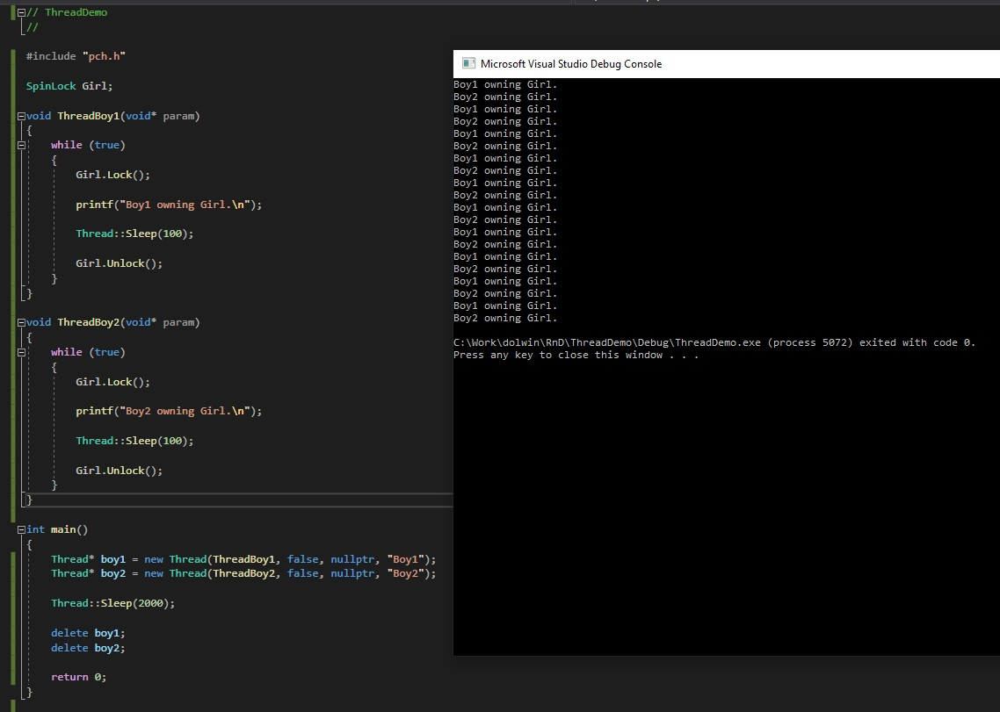

# ThreadDemo

Demonstration of working with threads.

## Mutual-exclusive syncronization

Two threads (Boy1, Boy2) take turns occupying the spinlock (Girl) and use it for 100 ms.

The main thread waits 2000ms and exits both threads.

## Suspend/Resume 

One thread is periodically resumed (once per 1/2 second) for spam messages. After 10 seconds thread is destroyed.
