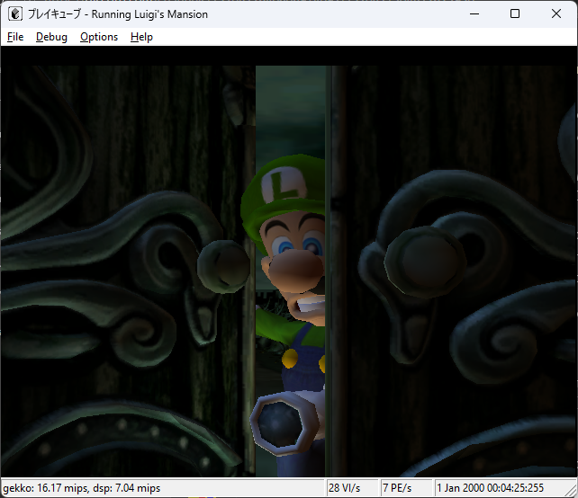

# pureikyubu 1.7

**Release date:** September 2026
**Previous release:** 1.6 (17 August 2023)

Version 1.7 is the largest update since the project started. The graphics backend was rebuilt around
the two programmable stages of Flipper, the emulator finally has automated tests for its two most
complex subsystems, the SDL build became a first-class front end with sound and a game selector, and
a set of CPU and memory bugs was cleared that lets a Linux kernel boot on the emulated console.

> The long-form version of these notes, with a timeline and screenshots, is in the
> [digest of the work after release 1.6](digest.html).

## Highlights

- **Shader-based graphics.** The Flipper Transform Unit and Texture Environment Unit are emulated by
  GLSL 3.30 vertex and fragment shaders on the OpenGL 3.3 core profile; the fixed-function pipeline is
  gone. The Command Processor now feeds the XF instead of reaching into the graphics blocks.
- **The GFX pipeline is tested.** 340 unit tests run the real CP → XF → SU → RAS → TX → TEV → PE
  pipeline against an OpenGL context and publish an HTML report with 262 rendered reference pictures.
  The suite found and fixed a large batch of long-standing rendering bugs.
- **The DSP core is tested against the hardware.** 177 tests, 1822 golden ALU vectors and 435
  circular-buffer vectors; the DSP IROM is fully disassembled and analysed.
- **GC-Linux boots.** Fixed GQR/paired-single decoding, the cache-coherent MMU hash-table walk, the
  decrementer model, `mtcrf`, `lswi`/`lswx` and the SI registers. A 2004 kernel reaches the `gcnfb`
  console with the Broadband Adapter driver loaded.
- **Games.** The Metroid Prime intro movie plays and the game reaches its title screen; Zelda: The
  Wind Waker gets past its boot; Ikaruga's THP title movie has correct colours; PONG runs again.
- **SDL front end.** Sound, an integrated file browser, message boxes and the full game selector
  (banners, Game IDs, sorting, filters, jump-to-letter) are available in the cross-platform build.




## Added

### Graphics

- GLSL 3.30 vertex shader emulating the XF: geometry and texture matrix multiplies, the projection
  combine, per-vertex lighting for both colour channels and all texture coordinate generation modes.
- GLSL 3.30 fragment shader emulating the TEV: up to 16 combine stages, the full
  operand/bias/sub/clamp/shift datapath, Rev-B K constants, fog and the final alpha function. Both
  shaders are static and receive the register state as uniforms.
- Independent decoding and binding of all eight texture maps, mip-level generation and the corrected
  sampler wrap/filter modes.
- Full XF register read-back over `CP_XF_ADDR` / `CP_XF_DATAL` / `CP_XF_DATAH`, and the
  CP → XF → SU → RAS command path.
- `GFX_DUMP` dumps every n-th rendered frame to a BMP; `EMU_LOG=<file>` writes `Debug::Report` output
  to a file.

### Audio

- SDL audio backend (`audiosdl.cpp`) for the cross-platform build.
- ARAM and AI behaviour brought in line with the hardware documentation (ACRS/ACWE register names,
  the 32-byte block transfer, address masks, CDCR, the AIVR streaming volume, the ARAM DMA performed
  to completion inside the AMBL write).

### CPU and memory

- GQR and paired-single extensions decoded with the ISA-manual bit numbering, with the conversion math
  factored into `src/gqr.h`.
- Cache-coherent MMU hash-table access (`ReadHashPte` / `WriteHashPte`).
- Hardware-accurate decrementer: one exception per underflow, the request latched across `MSR[EE]`, a
  positive value clearing a pending request, a negative value at reset.
- Command-line options `--ipl` (boot the IPL menu without a disc) and `--no-disc` (start with the DVD
  lid open).
- Typed register views for every Flipper block; the Command Processor is a standalone Flipper entity;
  memory reset (`MemRst`).

### User interface and debugger

- Game selector in the SDL build: DOL/ELF/ISO discovery from `PATH`, banner decoding (RGB5A3 with
  alpha, SJIS titles), Game IDs, the Icon/Title/Size/Game ID/Comment columns, all Win32 sort rules,
  small icons, file filters and Add Directory.
- Jump-to-letter navigation in the selector (issue #92).
- Independent video-output window with filtered events so that a covered selector ignores clicks meant
  for the game.
- JDI (JSON Debugger Interface) server, its UI view and the Flipper instance passed through the debug
  tree.
- ImGui file browser and message boxes in the SDL UI.

### Testing and tooling

- GFX unit-test rig with a real OpenGL context, transform-feedback probing and an HTML report
  (`gfx_report.html`) with rendered pictures; 340 tests.
- DSP unit tests: instruction coverage, an independent flag reference model, 1822 golden ALU vectors,
  435 circular-buffer vectors, the mailbox protocol and the IROM boot path; 177 tests.
- GQR tests (17 cases) and the published IROM disassembly in `testing/DspIrom.md`.
- Visual Studio 2026 projects (MSVC v145); the test project references the emulator sources instead of
  copying them.
- JSON tables embedded into the source, so no external data files are required (PR #332).

## Changed

- The graphics backend no longer uses the fixed-function OpenGL pipeline; the immediate-mode draw
  paths were removed and quads are expanded into triangles.
- Vertices are accumulated into a VBO and drawn with `glDrawArrays` / `glDrawElements`.
- The CP pushes command words into the XF and polls it for readiness instead of driving the rasterizers
  itself; register loads are word-wise, so a partial load no longer halts.
- The Flipper register access was refactored so every block owns a typed register view; the PI FIFO
  moved into `pi.cpp`; 8-bit hardware access was removed.
- `VI_DISP_POS` is read-only; the PI CONFIG register reflects the memory and DVD reset state
  correctly.
- XF matrix and colour registers start from the state `GXInit` establishes (verified against a real
  bootrom run).
- A whole-frame display copy is a frame boundary of its own; partial copies and texture copies are
  not.
- The `imgstore` folder moved into `wiki`; the wiki was extended and reorganised.
- The project adopted Karpathy-style behavioural guidelines in `.clinerules`.

## Fixed

### Graphics

- Black bootrom screen: the copy-engine clear erased the frame that was still to be displayed.
- Metroid Prime: the intro FMV stayed black because movie frames were never presented (the display
  copy is now a frame boundary); whole frames stayed black because the frame-begin clear used the live
  `PE_COPY_CLEAR_*` registers (now captured when the copy command is issued) and because
  `GX_IDENTITY` / `GX_DTTIDENTITY` were never initialised.
- Ikaruga THP movie: garbled colours from the wrong GQR field numbering, the shared
  K-constant/colour register storage and the swapped channel/register fields of the single-channel
  K selectors.
- CMPR decoding (uninitialised colour table, endpoint alpha, the transparent fourth colour of the
  3-colour mode).
- Texture maps 4–7 could never be programmed (the I4–I7 register block was decoded as I0–I3), and
  multi-texture applied each map to the previous texture unit.
- The SU scissor was compiled out; `TexMode0.lodbias`, `TexMode1.minlod/maxlod`, `SU_LPSIZE`,
  `SU_SSIZE/SU_TSIZE`, `RAS1_SS0/SS1` and `GEN_MODE.flat_en` are now applied; TEV fog F-select 1 and 3
  gained their law; the PE colour/alpha update bits are applied as documented.
- R and B are swapped correctly when dumping a frame to BMP.
- A draw command is no longer stalled by a partial register load.

### CPU

- `mtcrf` used the RS field as the CR mask and the CRM field as the register number (out-of-bounds
  `gpr[128]` access), which crashed the Linux kernel in `ip_auto_config_setup`.
- The MMU hash-table walk was incoherent with the write-back data cache, so freshly created PTEs were
  invisible and the kernel looped on the same DSI fault.
- The decrementer request was edge-triggered and lost with interrupts disabled; a fully
  level-sensitive variant livelocked the Bootrom. It is now a latched per-underflow request.
- `lswi` / `lswx` dropped the last accumulated word when the byte count was a multiple of four,
  corrupting GCC struct copies.
- Every non-zero GQR was decoded with the wrong bit numbering; the paired-single conversion rules and
  the HID2 gating were corrected.

### Audio / DSP

- The sliced ARAM DMA dropped Metroid Prime's audio DMA requests and hung the game right after the
  intro movie; the block is now performed to completion inside the AMBL low-word write.
- `div` lost the low quotient bit; `norm` and `div` were stubs.
- `lsf` / `asf` shifted in the wrong direction in every register form.
- `ModifyFlags` did not mask to 40 bits; `neg p`, unsigned multiplies, the logic-family flags,
  accumulator/immediate rules, `clr`, `neg`/`negc`, `addp`, `lsl16`, `tst p` and the
  multiply/accumulate family were corrected.
- `trap` did not advance the PC (`reti` re-trapped forever) and the interrupt vectors ignored the
  program base.
- Circular addressing wrapped at the modifier length instead of the 2^n aligned block; the decoder
  accepted reserved words; the mailbox could tear a message pair; packed memory accesses latched the
  wrong operand.

### Interface and platform

- Writes to the SI input buffer registers no longer halt the emulation (the Linux `gcn-si` driver
  resets them during initialisation).
- The DOL/ELF loader was fixed; PONG runs again.
- The PI FIFO wrap bit, the pad stick, the DVD banner loading on Linux and the Linux build were
  fixed.
- Project files migrated to Visual Studio 2026; warnings cleaned up; a conflicting copy of `fmt`
  removed.

## Known issues

- Bump mapping, indirect texturing, the Z-texture environment and Cpu2Efb are not emulated yet.
- PE dither and a few `SU` flag fields are deliberately unimplemented and documented in
  `wiki/gfx.md`.
- Full JAudio microcode support (issue #71) is still in progress; the remaining DSP divergences from
  the hardware are recorded in `testing/Readme.md`.
- The Linux build has no sound and no input yet.
- Some titles still fail to render or hang; compatibility is a work in progress.

## Building

**Windows.** Open `scripts/VS2022/pureikyubu.sln` in Visual Studio 2022 or 2026 and build. SDL and
Win32 front ends both have Debug and Release configurations.

**Linux.**

```sh
sudo apt install libglew-dev
git clone https://github.com/emu-russia/pureikyubu.git
cd pureikyubu
git submodule update --init
cd build && cmake .. && make
./pureikyubu pong.dol
```

**Tests.**

```
MSBuild scripts/VS2026/pureikyubu_test.slnx -p:Configuration=Release -p:Platform=x64
vstest.console.exe scripts/VS2026/x64/Release/pureikyubu_test.dll /Platform:x64
```

---

*Nintendo GameCube is a trademark of Nintendo. This emulator is not affiliated with Nintendo.*
