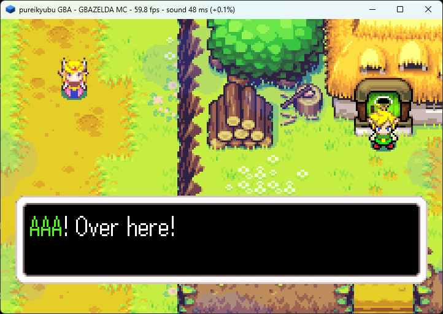

# pureikyubu 1.9.1

**Release date:** September 2026
**Previous release:** 1.9 (September 2026)

Version 1.9.1 is the maintenance release that finishes what 1.9 started. The integrated Game Boy
Advance and Game Boy now **sound** and **time** the way the hardware does: the Game Boy's LCD runs
on its own 4.194304 MHz clock, the Game Boy APU was rewritten against the manuals and has tests for
the first time, the GBA's sound controller and its host-side BIOS sound driver match the official
IPL, and the aging cartridge's timing checks pass. On the GameCube side the release is about the
interface and the build: the legacy debug console and the Win32 front end are gone in favour of the
single SDL2 one, the SDL port gains the settings and memory-card dialogs it was missing, the TEV
gets its swap tables, and the recompilers run on 32-bit hosts and Windows 7. The portable suite
closes at **362 of 362 tests**.




## Highlights

- **The portable machines sound right.** The Game Boy's APU was wrong in almost every clock it has
  — the frame sequencer ran sixteen times too fast, the length counters counted backwards, the pulse
  and wave dividers were half their rate (every note an octave high), the duty phases were wrong and
  NR51 was swapped, which mirrored the whole stereo image. The suite that now pins it down
  (`GbApu`, fifteen tests) is new; the module had no tests at all. On the GBA, channel 3 was clocked
  by a timer, the mixer's levels were half of what the hardware gives the direct-sound FIFOs, the
  waveform RAM lost its second bank, and a decreasing sweep that underflowed stopped the channel.
- **The portable machines time right.** The Game Boy's LCD advanced one dot per *four* clocks — a
  GBA rule — so a frame was 280896 clocks instead of 70224 and every device that counts clocks got
  four times its rate per frame of picture. The dot clock is now the machine's own 4.194304 MHz
  clock, one clock per dot. The GBA's memory model caught up with GBATEK: the internal memories
  charge their documented access cycles (including the undocumented `4000800h` waitstate register),
  the Game Pak uses the first/second access times of `WAITCNT` with the 128 KByte non-sequential
  rule, a DMA transfer spends its cycles *while* it runs, and a transfer no longer rewrites the
  `SAD`/`DAD` registers.
- **The HLE BIOS is the official BIOS.** The host-side BIOS calls have the official SWI numbers now
  (the sound driver is `1Ah..1Fh`/`28h`/`29h`, not `28h..2Fh`), the four decompressors were read out
  of the official image and fixed (`HuffUnComp`'s bitstream starts at
  `source + 4 + (treeSize + 1) * 2` and is read as a rotated word; `RL`'s flag byte is one token,
  not eight), the sound driver mixes its twelve virtual channels, and the IRQ contract is the
  hardware's: acknowledging `IF` is the handler's job. Metroid Fusion on the high-level BIOS now
  draws the same frames as on the real image.
- **Nintendo's own aging cartridge runs.** The AGB aging cartridge (`AGB_CHECKER_TCHK10`) is the
  release's oracle, exactly as the real BIOS image is for the HLE. Eleven of its checks were
  answered by the timing work — five MEMORY sub-tests, the H-Blank status and interrupt flags, the
  video capture window, `KEY INTR`, the DMA priority preemption and the address-control registers.
- **One front end and one debugger.** The Win32 front end (`ui.cpp`, 4940 lines, with its
  DirectSound, GDI and `GetAsyncKeyState` back ends) and the legacy debug console are gone; the SDL2
  front end is the only build, and the Debug menu has one item that opens the new debugger. The SDL
  port gains the two dialogs it was missing — **Options → Settings…** and **Options → Memcards**.
- **32-bit and Windows 7.** The recompilers exist as x86 modules next to the x86-64 ones: the
  32-bit host no longer falls back to the interpreter, and the same sources build a 32-bit emulator.
  The Windows projects target Windows 7 (`_WIN32_WINNT=0x0601`), the oldest Windows SDL2 2.28 and
  the emulator run on.
- **The Flipper's TEV gets its swap tables.** The two 2-bit fields of `TEV_ALPHA_ENV` are the raster
  and texel swap-table selects, not a mode and a fixed component pick; the four tables are the low
  four bits of `TEV_KSEL_2k`. The CP's BP write mask (`0xFE`) limits the very next register write,
  which is what keeps the library's shared payloads from clobbering each other. The demo
  `tev-swap`'s doughnuts come out grey (0.0% saturated pixels, was 69%).

## Added

### The Game Boy side of the portable core

- A `GbApu` suite (fifteen tests) and a `GbPpu` suite for the Game Boy machine, which had none: the
  divider rates of the four channels against the manuals' frequency formulas, the duty waveform
  phases, the length timer, the 512 Hz frame sequencer with the envelope at 64 Hz and the sweep at
  128 Hz, the wave RAM access order and volume shifts, the noise LFSR sequence, NR50/NR51 mixing,
  the exact sample clock, PCM12/PCM34 (the CGB's view of the four generation circuits), the CGB's
  own high pass filter and the setting that turns it off. On the LCD side: the mode timings in the
  machine's own clocks (one clock to a dot, 456 to a line), the STAT/LYC interrupts, the CGB
  attribute map, the DMG compatibility rules and OPRI, the HDMA destination bank, and the LCD-off
  blank.
- **The two Acid2 pictures are pixel for pixel identical to Matt Currie's reference images** —
  `dmg-acid2` on the DMG, `dmg-acid2` on a CGB in DMG mode (shade for shade through the emulator's
  own grey ramp) and `cgb-acid2` on the CGB. They are what found the lost line-start STAT
  interrupts, and they are the end-to-end check of the one-line-at-a-time renderer.
- A way to listen and to compare: `--wav <file>` records the mix in both harnesses, `--rate N`
  changes the sample rate and `--no-hpf` turns the DMG/CGB high pass filter off
  (`audio.highPassFilter`), which is what a recording that will be filtered later wants. The GBA
  harness also got `--log` (the core's own warnings, e.g. an unimplemented SWI, used to be thrown
  away) and `--bios`.
- The Game Boy frontend blends each shown frame with the one before it — dmgemu's `lcd_effect`, the
  trail an LCD leaves while the picture moves. It lives in `Host::Present`, so a `.gba` and a
  `.gb`/`.gbc` run get it from the same code, and `video.lcdEffect` turns it off (on by default).
  The cores are not touched: the frame the screenshots and the debug interface read stays clean.
- `--keys` is pushed through to the Game Boy machine, which is how the Metroid II run below was
  checked.

### Build and tooling

- **The recompilers on 32-bit hosts (issue #417).** `gekkojit_x64.cpp`, `gekkojit_ps_x64.cpp`,
  `dspjit_x64.cpp` and `gekkojit_layout_x64.h` are marked x86-64-only and each got a 32-bit sibling
  (`jit_x86.h`, `gekkojit_layout_x86.h`, `gekkojit_x86.cpp`, `gekkojit_ps_x86.cpp`,
  `dspjit_x86.cpp`). The translator is the x86-64 one adapted to eight general purpose registers,
  four of them callee-saved, with the layout written down in `gekkojit_layout_x86.h`, and the state
  hash of a workload is identical on all four JIT builds — MSVC and GCC, x86-64 and i386.
- **Windows 7.** The Visual Studio projects and `CMakeLists.txt` carry both module sets and let the
  preprocessor pick; the emulator projects define `_WIN32_WINNT=0x0601` and `WINVER=0x0601`, and no
  emulator source calls an API newer than that, so the Windows 7 target of SDL2 2.28 is the oldest
  the emulator runs on.
- SDL2 is linked as a static library from the bundled tree.
- `testing/gba_bench` grew the `Bus`, `HleBios`, `GbBus`, `GbApu`, `GbPpu`, `Audio` and `Settings`
  suites; the Visual Studio project and the Readme follow, so the Windows build of the harness
  compiles the tests that compare the host BIOS with the official image.

## Changed

### The SDL front end is the only one (issues #421, #422, #420)

- The Win32 front end and its back ends are deleted: `ui.cpp` (the main window, the menu, the game
  selector, the settings property sheet, the controller and memory-card dialogs),
  `audio.cpp`/`audio.h` (DirectSound), `video.cpp` (GDI) and `pad.cpp` (`GetAsyncKeyState`),
  together with the dialog, menu, accelerator and bitmap templates only they used. The interfaces
  the rest of the emulator speaks stay where they were; the application icon stays in the resource
  script.
- The settings of the two ports are one pair of files again (`Data/DefaultSettings.json` and
  `Data/Settings.json`); the Windows/SDL split is gone, and the `DOLDEBUG` key, unread since the
  debug console was removed, is gone with it.
- The legacy debug console is gone (`cui.*`, `cuinull.cpp`, `cuisdl.cpp`, `debugui.*`). The Debug
  menu of both ports carries a single item, **Open Debugger…**, which opens or closes a DebugUI2
  session; the crash report reaches the front end with the same `UIReport` command it used when no
  console was open.
- The SDL port can mount a DolphinSDK folder again — **File → Mount DolphinSDK as DVD…** was a stub
  there and now opens the directory browser and calls `DvdMountSDK`.
- **The settings dialog and the memory cards (issue #420).** **Options → Settings…** is one window
  with a tab per Win32 property-sheet page: the directories the selector scans and the file filter
  (**GUI/Selector**), and the emulated console version plus the three firmware images (**GCN
  Hardware**). The version combo carries a "User defined" entry so a hand-edited configuration is
  shown as it is; Apply writes the configuration the way `SaveSettings` does, with the paths going
  back through `AddSelectorPath`, and Cancel drops the copy. **Options → Memcards** is a window per
  slot: the connection flag, the save policy (`SyncSave`) and the card file, with **Create New…**
  asking for one of the six sizes the hardware has. Unlike the Win32 dialog, which left the running
  card alone until the next boot, OK re-points (flushing the card it replaces) or connects a card
  that is already open.

### The GBA/Game Boy core

- **The sound controller against GBATEK and the AGB manual.** Channel 3 is clocked by `NR33` and
  not by a timer — `SOUND3CNT_X` bit 14 is the length flag and nothing else, and only the two
  direct-sound FIFOs are timer driven; the waveform RAM is two banks of 16 bytes with the CPU
  reaching the one that is not playing; the mixer follows GBATEK's "Max Output Levels" (a PSG
  channel spans a quarter of the output range, a FIFO the whole of it, and `SOUNDCNT_L`'s level has
  "no effect on direct sound"); a decreasing sweep that would underflow keeps the frequency instead
  of stopping the channel; and the sum is clipped by the 10-bit output stage as the hardware clips
  it.
- **The device is the clock of the machine.** The machine pushes every sample it mixes into the
  mixer buffer and the device plays it from its own audio callback. The buffer keeps a cushion of
  three video frames, throws away what does not fit, fills a period it cannot fill with silence
  instead of stale samples, and reports its delay, gaps and drops in the window title. The frame
  loop holds the machine back only when the buffer is genuinely ahead, and fast forward throws its
  sound away. The rate correction is a slow PI controller on a *filtered* level, gains worked out
  from the loop: the old one-liner answered a sawtooth with an undamped integrator whose period
  worked out at half a frame, which swung the full ±1% between neighbouring frames and threw away
  9450 frames a minute.
- **A repeating DMA streams its source.** GBATEK reloads `CNT_L` and optionally `DAD` on a repeat —
  not `SAD`, so the source pointer carries on. A sound DMA is always repeating (the FIFO asks for 16
  bytes at a time), so the old code restarted the stream at the same address on every refill and the
  FIFO played one 16-byte block over and over — a high buzzy squeak that vaguely followed the tune.
  A transfer also does not change the `SAD`/`DAD` registers, which hold the values the CPU wrote;
  the running pointers live in the engine.
- **The video capture runs on the lines GBATEK gives it** — started at `VCOUNT=2`, repeated each
  scanline, stopped at `VCOUNT=162` with the channel's enable bit self-cleared — and a
  higher-priority DMA request that arrives while a transfer is running is serviced at the next unit
  boundary instead of being lost until the channel's next trigger.
- **The EEPROM answers only in its own window.** GBATEK puts the chip at `D000000h-DFFFFFFh` on a
  cartridge of 16 MByte or less (or in the last 256 bytes of a full 32 MByte image); everywhere else
  the ROM still drives the bus. That is what lets a game run its own EEPROM routine *from the
  cartridge* — Minish Cap fetches instructions between the read request and the data transfer. The
  chip's idle read also drives bit 0, the ready line the games poll after a write, instead of
  returning the mirrored ROM.
- The host-side sound driver's channel array is **twelve entries of 40h bytes** at
  `50h + n * 40h` (GBATEK: 1-12 channels), not sixteen of 30h; a DMA's unit size follows `CNT_H`
  bit 10 on every channel, not just DMA3; the DMA's per-unit cost follows the bus width of the
  source and destination; and the internal memories charge their documented cycles, with the
  on-board 256K WRAM's waitstates taken from the undocumented `4000800h`.
- An idle `WAITCNT` bit 15 (the read-only Game Pak Type Flag) can no longer be set by a write, and
  `DISPCNT` bit 5 — the "H-Blank Interval Free" flag — no longer silently means something else to
  the renderer.

### The GBA HLE BIOS

- The SWI numbers are the official ones: the sound driver at `1Ah..1Fh`, with
  `VSyncOff`/`VSyncOn` at `28h`/`29h`. Before, the whole block was at `28h..2Fh` and `1Ah` was
  called `DivArm2`, so a game's `SoundDriverInit` was answered with a *division* and its music never
  started.
- `HuffUnComp`, `BitUnPack`, `LZ77` (both write variants), `RL` and the two delta filters were
  re-read out of the official image's own code and are now covered by a differential test that
  encodes random data into valid streams and compares the bytes both implementations wrote.
  `MidiKey2Freq` uses the BIOS's own fixed point — a 16.16 semitone table, the octave as a shift,
  the product truncated, the fine value as a slope — instead of a double-precision guess.
- The sound driver's entry points are implemented from what a probe can measure out of the real
  BIOS: the work area's identifier `68736D53h` and its `0FB0h` size, the `pcmbuf` layout (two
  `0630h` byte halves at `+0350h` and `+0980h`), the two FIFO DMAs (`B600h`: repeating, 32-bit, with
  an incrementing source), `SOUNDCNT_H` `210Eh`, the timer 0 reload for every playback frequency
  index, and `SoundDriverMain`, which mixes the twelve virtual channels with the driver's own
  envelope state machine and fixed-point levels. The reverb is not modelled, and the sample stepping
  is a 16.16 accumulator rather than the driver's exact arithmetic.
- The IRQ contract is the hardware's: the custom boot ROM no longer acknowledges `IF` before
  dispatching, because the official BIOS does not either. Metroid Fusion's handler reads `IF` to see
  what happened, so a pre-acknowledged IF left it doing nothing every frame and the game froze on
  its title screen. The SIO link driver now installs its own acknowledge-and-return handler, which
  is what a program enabling that interrupt has to do.

### Gekko, the TEV and the build

- **TEV swap tables and the compare operation.** The two 2-bit fields of `TEV_ALPHA_ENV` are the
  swap-table selects (`GXSetTevSwapMode`'s raster and texel selects) and the four tables are the low
  four bits of `TEV_KSEL_2k`/`2k+1`; `TEV_KSEL` resets to the tables GX initialisation programs
  (RGBA/RRRA/GGGA/BBBA). The compare operation shares the same bits, so it is decoded the way the
  driver encodes it — the bias field's fourth value marks it, the sub bit picks the comparison — and
  the mask tests the pre-shift stage value.
- **The CP's BP write mask (0xFE).** A write to it limits which bits of the very next BP register
  write are updated and then clears itself. The library uses it for the registers whose payload two
  features share — the K constant selects and the swap tables of `TEV_KSEL`, the cull mode of
  `GEN_MODE`, the blend mode of `PE_CMODE1` — so without it the swap tables would be clobbered by
  the first `GXSetTevKColorSel`. The mask travels down the CP chain with the write and each block
  merges it into its own register value.
- **Two TEV arithmetic details.** The interpolated blend factor is a u0.8 fraction normalised over
  256, so 255 is exactly 1.0 and 128 is 129/256 (all three copies of the model divided by 255, half
  an LSB away), and `DIVIDE_2` truncates without rounding. A bit-exact model of the design's stage
  then matches the demo on all 64 argument-sweep states, all 24 arithmetic states and the 11 states
  that used to separate the two models.
- **The disassembler.** The halfword transfer's bit 22 selects the offset form and was inverted, so
  every immediate offset printed as a register and every register offset as an immediate — the
  official BIOS's own decompressors were unreadable. A register offset's shift is printed now, and a
  pre-indexed writeback is outside the bracket (`[r1, #4]!`, not `[r1, #4!]`). Both are what made
  the HLE BIOS work above possible.
- **The GBA module uses the stdint types** (issue #419) instead of the project's `u8`/`s8` aliases;
  `json.cpp` is self-contained (the standard library, `verify.h` and its own UTF-8 codec), so the
  portable core compiles it next to its own sources without SDL, OpenGL or ImGui, and the GBA
  settings reader uses the shared Json engine (issue #423) instead of its hand-written parser.
- **The debugger window is opt-in** in `--gba`/`--gb`: `emulation.debugger` (false by default)
  decides whether it opens with the machine; the JDI node and the MCP transport come up either way,
  and `F2` opens and closes the window as before.

## Fixed

### The portable machines

- **The Game Boy's clock (found by capturing `zelda.gb` and comparing it with another emulator).**
  The LCD advanced one dot per four clocks, so a frame was 280896 clocks instead of 70224: the APU
  mixed 2940 samples a frame where the device plays 738.35, so three quarters of the music was
  thrown away in bursts (the rattle that would not go away no matter how the buffer was steered);
  DIV ran at 64 kHz instead of 16384 Hz and the serial port at four times its baud rate; and the CPU
  had four frames of work to get through in one. The emitter now runs on one clock per dot.
- **The Game Boy APU's every rate.** The frame sequencer stepped every 512 system clocks instead of
  8192, so the length, the envelope and the sweep all ran sixteen times too fast, and it clocked the
  length on step 7 as well (320 Hz with jitter instead of 256). The length counters loaded
  `64 - NRx1` and counted *up* to 64 — backwards. The pulse and wave dividers ran at
  `(2048 - x) * 2` and `(2048 - x)` instead of `* 4` and `* 2`. The four duty waveforms had the
  right ratios but the wrong phases. NR50's master volume was never applied to the mix, and NR51's
  halves
  were swapped, which mirrored the whole stereo image. The sample clock now keeps the fraction of a
  clock it used to round away.
- **The line-start STAT interrupts.** `BeginVisibleLine` called `EnterMode(2)` and threw its return
  value away, so the STAT request a line start produces — the mode 2 source turning on, and an LYC
  that matches the new `LY` — never reached `IF`. Every visible line's mode 2 and LYC interrupt was
  lost (the ones inside VBlank still worked, which is why it hid), and the raster effects driven by
  `LY=LYC` that draw the Acid2 hair, eye, mouth and footer never ran. A register write can raise the
  STAT line now (enabling a source whose condition is already true, or a `LYC` write that makes it
  match "constantly"), and STAT bit 2 stays live while the LCD is off.
- **A CGB running a monochrome cartridge (the frontend's default for a DMG game)** ignored the
  DMG's own display rules: `LCDC` bit 0 was the CGB's master priority instead of blanking the
  background and the window, the window bit was not overridden by it, objects were prioritised by
  OAM position instead of X (`OPRI` was stored but never reached the PPU), the bank 1 attribute map
  was read although the manual says that bank "is not present in this mode", and
  `BGP`/`OBP0`/`OBP1` were ignored instead of indexing the CGB palettes.
- **The CGB's VRAM DMA** always wrote bank 0, while the manual is explicit that the destination is
  `VBK`, and reading `HDMA5` during an active HBlank transfer returned bit 7 set, which Pan Docs
  defines as "Not Active". The mode 3 OBJ penalty `11 - (X mod 8)` dropped to 4 or 5 on the last two
  columns of a tile where Pan Docs floors it at 6. Turning the LCD off left the last picture in the
  frame buffer instead of the blank white of the disabled screen.
- **The GBA LCD audited against the manuals.** BG2 is affine in mode 1 (Final Fantasy V Advance's
  "SQUARE ENIX PRESENTS" screen was a field of noise); the bitmap modes sample through the BG2
  matrix (the boot ROM and the no-BIOS start leave the identity matrix, as the real BIOS programs
  it); mode 5's bitmap line is 320 bytes and not mode 3's 480; a window's garbage dimensions reach
  the screen edge; the OBJ window needs `DISPCNT` bits 12 *and* 15; the Green Swap exchanges the
  green of each pair of dots instead of byte-swapping every pixel; a semi-transparent OBJ needs a
  2nd target selected in `BLDCNT` and the window's effect bit gates the alpha blend as well as the
  brightness; an OBJ whose 8-bit Y range runs past line 255 wraps to the top; and the 28-bit affine
  reference point is kept sign-extended.
- **The text layers' scroll offsets.** `BGxHOFS`/`BGxVOFS` hold a nine-bit offset (0-511) but were
  sampled through the register's readable form, which the PPU trimmed to eight bits. Castlevania:
  Circle of the Moon's attract demo scrolled a room to dot 296, the renderer used 40, and the top of
  the screen showed whatever the map's other half happens to hold — a band of green "corrupt
  background" — while the camera appeared frozen relative to the player.
- **A double-sized affine OBJ is anchored in the middle of its doubled area.** The X/Y attributes
  are the upper-left corner of the display area and the rotation/scaling centre is the middle of
  that area — half a base size right and below the reference point normally, a whole one when the
  double-size flag is set. Every doubled OBJ sat half a base size too high and too far left; the
  real BIOS's boot animation is what pinned it (the 64x64 letters snapped down by 32 pixels on their
  landing frame). Final Fantasy V Advance's letterbox also pins the OBJ Y wrap: its rows of 16x16
  OBJs at `Y=240..243` fill the gaps the wrapped lines leave.
- **The V-Counter match interrupt is an edge, not a level.** `UpdateVCountMatch` requested it
  whenever the match condition was true on an evaluation, and a `DISPSTAT` write evaluates it too,
  so a program that wrote the register back while `VCOUNT` still equalled its setting took two match
  interrupts for one line. Minish Cap writes `DISPSTAT` at line 80 of every frame — in the handler
  of the match it has just taken — and its own copy of the BIOS sound driver advances its sequencer
  once per match, so the intro music ticked twice per frame: the notes came twice as fast and the
  track ran out of sequence at 11 s. It is now the edge of the gated (match AND enable) condition,
  which is what GBATEK's "requested when the flag becomes set" means; a program that enables the
  interrupt while the counter already matches still gets it.
- **The Save file of a fresh Minish Cap cartridge came up corrupted.** The EEPROM's ready line
  (bit 0 of the ROM bus in the chip's window) was never driven, so the save library's poll after a
  write always saw a busy chip, every write timed out, and after three attempts the library stamped
  its `DAMEDAME` failure marker over the block it was writing — file headers included. With the
  ready line on the bus every write is verified on the first attempt.
- **The HLE sound driver's channel array was misaligned.** Sixteen entries of 30h bytes spans the
  same 300h bytes as the real twelve of 40h, which hid the mistake: only channel 0 landed where the
  official driver looks, so channels 1..11 were mixed from the next channel's envelope and volume
  bytes — heard as wrong notes, crackle and an apparent speed change.
- **The halfword transfer offset form** in the disassembler (see Changed), which is what made the
  decompressors readable.

### The core, the harness and the shell

- **Thumb `LDMIA`/`STMIA` skipped an instruction.** `ThumbMultipleTransfer` treated bit 7 of the
  register list as "r15 in the list", but a Thumb register list is eight bits wide (r0-r7) and can
  never name r15. The BIOS loads its `BitUnPack` parameter block with `LDMIA r1!,{r5,r7}`, so the
  instruction that followed was skipped, the block stayed zero, `BitUnPack` read a zero item count
  and bailed out: the seven letter sprites had no glyph data and the boot animation was invisible.
  This is why the emulator's own boot ROM did not draw.
- **`SVBK` maps a written 0 to WRAM bank 1.** A DMG-only cartridge runs on the emulated CGB in
  compatibility mode, and the register mapped a written 0 to bank 0. With the power-up value `0xF8`
  that aliased `0xC000-0xCFFF` and `0xD000-0xDFFF` onto one 4 KByte page, so a game whose variables
  or stack live in the upper bank had its own low-RAM scratch overwrite them: Metroid II kept a
  return address at `0xDFFB`, read back `0x0000` and restarted from the reset vector for ever.
- **Json's one-byte UTF-8 sequences.** The local decoder's shortest-form table had entries for two,
  three and four bytes only, so every ASCII character came out as U+FFFD. Since `AddUtf8String` is
  how the whole debug interface builds its Json, the regression corrupted every answer made that way
  — the Markdown panels of the debugger, the disassembly and the symbol names, the reports, the MCP
  tool answers and the OS time of the status bar (which showed a row of question marks). Of the 16
  unit-test failures at the parent commit, 15 were this.
- **The `Apu::ReadSamples` call site in the tests** handed a `maxFrames` count to an
  `int16_t buffer[128]` while the call writes two samples per frame: the 256-byte stack buffer was
  overflowed and the run died later, in the middle of another suite. Found with AddressSanitizer;
  the buffers are sized for stereo frames now.
- **The DMA transfer's unit size** follows `CNT_H` bit 10 on every channel (see Changed), which is
  why the Minish Cap engine's per-frame 32-bit `DMA0` block was half copied before.

## Known issues

- The official GBA BIOS runs its boot and **its animation is now drawn**: the mode 2 BG3 that is
  only visible inside the OBJ window, with the nine 32x64/64x64 window sprites, `WINOUT = 0x3F27`
  and alpha blending around it. Both the emulator's own boot ROM and the real image hand over to a
  cartridge. What is left to model on the cartridge side is the EEPROM window of a full 32 MByte
  image (the last 256 bytes); the harness exercises the 16 MByte layout, where the chip answers
  anywhere at `D000000h-DFFFFFFh`.
- A real **Game Boy Color** cartridge's picture is still work in progress: the machine boots, runs
  its own boot ROM and passes its tests, but at some moments its frame does not match VRAM. The
  remaining difference is read as the mode 3 line length (a line is composed at once rather than dot
  by dot), the HBlank/HDMA timing and the PPU-internal VRAM read-block windows. DMG and CGB in DMG
  mode are exact against the Acid2 references.
- The GBA's per-line OBJ cycle budget and `DISPCNT` bit 5 are not modelled, and the
  VRAM/OAM/Palette contention cycle ("+1 cycle if the GBA accesses video memory at the same time")
  is not: the accesses take their documented 1/1/2 cycles but never the extra one. The cartridge
  prefetch buffer is modelled as a waitstate rule rather than as a real 8-halfword buffer.
- A preempted DMA transfer runs to *its* end before the preempted one resumes instead of the two
  interleaving a unit at a time. Nintendo's aging cartridge's remaining failures (the
  waitstate/prefetch checks, `KEY INPUT SIMPLE`) are in this area, and are recorded in
  `testing/gba_bench/Readme.md` with the addresses of its test table.
- The GBA's sound output stage is not modelled: `SOUNDBIAS` is stored and read back, but neither its
  bias level nor the PWM amplitude resolution changes the mix, which is produced as clean 16-bit
  samples. The wave RAM is plain memory rather than the hardware's shift register.
- The sound driver's reverb is not modelled on the HLE path (the mode's reverb bits are stored, the
  driver's delay line is not), and the pitch stepping is a 16.16 accumulator rather than the
  driver's exact fixed point.
- Save states, rewind, the EEPROM's "last byte is the AND of the old and new value" quirk and the
  RTC's per-minute interrupt register are not implemented on the portable machines.
- The serial port's JOY bus mode (`RCNT` bit 15, a GameCube controller on the link port) is decoded
  but not driven; UART mode works register-wise but has no peer. The emulator-to-emulator cable
  (normal and multiplayer) is implemented and tested.
- The Linux build still has no sound and no input for the GameCube side, and the Linux headless
  target has no OpenGL offscreen backend (the Visual Studio one does). The two `Settings` tests that
  compare `build/Data/GBASettings.json` with the defaults byte for byte need that file to have LF
  endings; a Windows checkout with `core.autocrlf` reports the `\r`s as a difference.
- Nintendo's aging cartridge is not fully green: ten checks still fail, all of them in the
  waitstate/prefetch area above. The GBA's `Ppu` test `RegisterReadBack` and the `memory` test ROM
  pin the data rules where the timing is approximated.

## Up next

The portable core is the work of the next release as well: the Game Boy Color picture, the remaining
aging-cartridge checks (the waitstate model and the real prefetch buffer), and the **GBA Link** and
**Game Boy Player** jobs the integrated machine exists for — a GameCube title with a GBA in its link
port is the test that proves them.

1.9.1 is a maintenance release inside the 1.9 line. Release **2.0** remains the next major version,
the **peripheral release**: the EXI bus and the devices on it (memory cards, the Broadband Adapter,
the RTC), the serial interface and the pads, the disk interface and the drive, and the link port the
GBA side already has. After that the project moves into its steady state of planned, methodical
improvement.

## Building

**Windows.** Open `scripts/VS2026/pureikyubu.sln` in Visual Studio 2026 and build. The emulator is
the SDL2 front end in every configuration — there is no second port any more — and the solution
holds the same four projects: `pureikyubu`, `SDL2` (a static library), `GBA` and `gba_bench`. Both
x64 and x86 (Win32) build, the recompilers follow the host, and the projects target Windows 7. The
`pureikyubu_headless` target is part of the solution but is not built by "Build Solution".

**Linux.**

```sh
sudo apt install libglew-dev libsdl2-dev
git clone https://github.com/emu-russia/pureikyubu.git
cd pureikyubu
git submodule update --init
cd build && cmake .. && make
./pureikyubu pong.dol
cmake -DHEADLESS=ON .. && make          # the windowless target
```

**Tests.**

```
MSBuild scripts/VS2026/pureikyubu_test.slnx -p:Configuration=Release -p:Platform=x64
vstest.console.exe scripts/VS2026/x64/Release/pureikyubu_test.dll /Platform:x64
```

The portable machines have their own harness — **362 of 362 tests pass**:

```
testing/gba_bench/check.sh
testing/gba_bench/get_test_roms.sh     # the public test ROMs and the two Acid2 pictures
```

The previous releases are still available: [Release Notes 1.9](release_notes_1.9.html) ·
[Заметки о релизе 1.9](release_notes_1.9_ru.html) · [Release Notes 1.8](release_notes_1.8.html) ·
[Release Notes 1.7](release_notes_1.7.html). The long story of the work after release 1.6 is in the
[digest](digest.html).

---

*Nintendo GameCube, Game Boy, Game Boy Color and Game Boy Advance are trademarks of Nintendo. This
emulator is not affiliated with Nintendo. No BIOS image and no game is distributed with it.*

