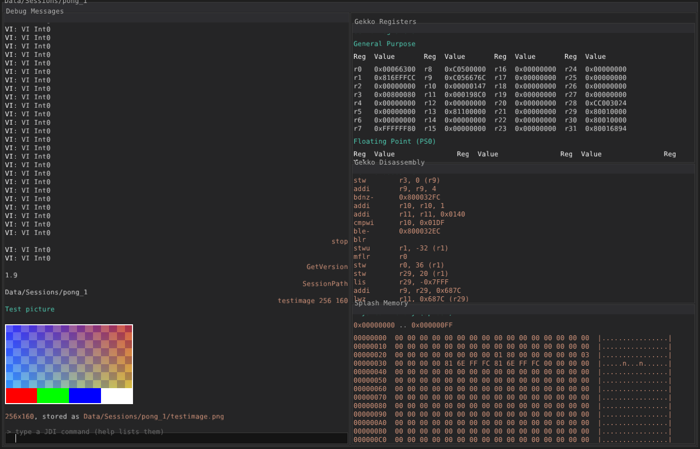
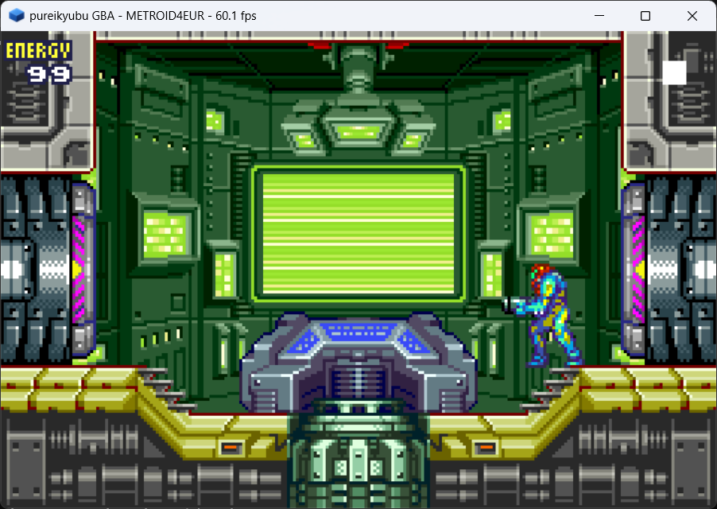
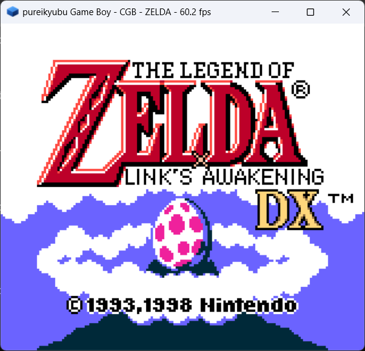
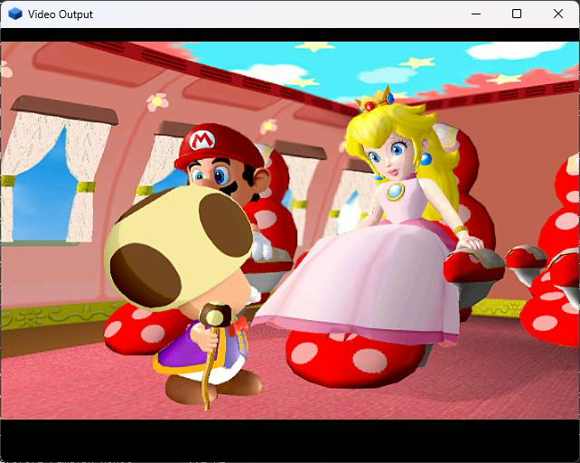
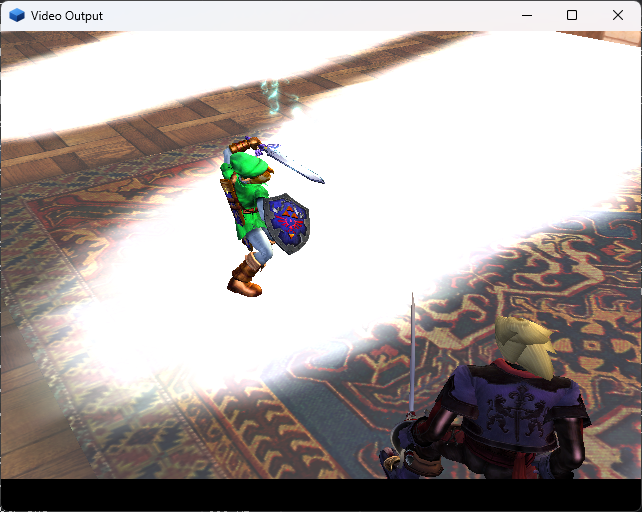

# pureikyubu 1.9

**Release date:** September 2026
**Previous release:** 1.8 (September 2026)

Version 1.9 is the feature release. The emulator gains a second machine — a from-scratch Game Boy
Advance and Game Boy core — a second rendering path — a complete software implementation of the
Flipper graphics blocks — and a new debugger, a local MCP server for LLM agents, a hardware-interface
profiler, a headless build and a DSP recompiler. The whole source tree was audited for the data it
loads and the debug interface speaks UTF-8. On the compatibility side the Metroid Prime intro movie
runs several times faster and the release reaches the game's title screen, Super Mario Sunshine boots
and plays its intro, and titles such as Star Wars Rogue Squadron III, Super Monkey Ball 2, Prince of
Persia and Soul Calibur II get their pictures.









## Highlights

- **An integrated Game Boy Advance and Game Boy.** `src/gba` is a second machine written from the
  public hardware specifications (the ARM Architecture Reference Manual for the ARM7TDMI, GBATEK for the GBA peripherals, the
  Pan Docs for the Game Boy). It has its own free boot ROM whose animation draws the pureikyubu
  logo, its own SDL2 front end and its own test harness; `pureikyubu --gba game.gba` runs a
  cartridge and `pureikyubu game.gbc` runs the Game Boy machine inside it. It exists to be a
  **GBA Link** peer and a **Game Boy Player** stand-in for the GameCube side.
- **A software GFX pipeline.** The Flipper graphics blocks (XF, SU, RAS, TX, TEV and PE) now have a
  CPU implementation next to the OpenGL one. It draws into a real EFB memory array, a real TMEM, and
  the copy engine turns the finished frame into the XFB the video interface scans out — no OpenGL
  context at all. `hardware.GFX_PIPELINE` and the `gxpipeline` command switch pipelines on the fly.
- **A new debugger (DebugUI2).** Its own thread, its own OpenGL 3.3 window and a session folder per
  run; every panel is the Markdown of a JDI command, so the whole Flipper — thirteen tabs from Gekko
  to the profiler — and both portable machines are inspectable in place. `Debug → Test New Debugger`
  opens it, `F2` starts and stops a session.
- **An MCP server.** `pureikyubu --mcp` runs the emulator as a local Model Context Protocol server:
  every command of the debug interface becomes a tool an LLM agent can call (~150 before a machine is
  loaded, ~170 after), over stdin/stdout JSON-RPC.
- **A hardware-interface profiler.** The status bar could say how fast the CPU runs; the profiler
  says whether the data moves at all, and where: the 60x bus, the Flipper/Splash bus, the PI and CP
  FIFOs, the write-gather buffer, every DMA engine, the audio mixer input, the GFX primitives, the VI
  frames — per *emulated* second.
- **A headless build.** `uinull.cpp` and a null GFX layer make the emulator a windowless console
  application for benchmarks, test sweeps and the MCP server; the Visual Studio headless target also
  draws with a real OpenGL context on a hidden window, so frames can still be read back.
- **A DSP recompiler.** The DSP core got a basic-block compiler that shares the common x86-64
  emitter with the Gekko one; it is 1.5–1.8x faster than the interpreter and off by default.
- **A security review and a UTF-8 pass.** About ninety defects reachable from the artifacts the
  emulator loads were found and fixed behind a small verifier layer, `--selftest` reports a startup
  failure instead of disappearing, and the debug interface, the console and both front ends now
  speak UTF-8.
- **Compatibility.** Metroid Prime's intro FMV went from ~3.5 to ~9–11 frames a second and the run
  now reaches the title screen inside 100 seconds; Super Mario Sunshine boots, plays its intro and
  reaches the scene after it; Super Monkey Ball 2 stops spinning before its first frame; Star Wars
  Rogue Squadron III no longer faults while its MMU handler maps the page; Prince of Persia's memory
  card dialog is readable.

## Added

### The integrated Game Boy Advance and Game Boy (issue #388)

- A second machine in `src/gba`, written from the public specifications and independent of the
  GameCube side. The Game Boy Advance core implements the ARM7TDMI (ARM and Thumb, all seven modes,
  the exceptions and `HALT`), the memory map with the open bus and the `WAITCNT` waitstates, the LCD
  (tile modes 0–2, bitmap modes 3–5, sprites, windows, mosaic, blending, forced blank), the four
  timers, the four DMA channels including the sound-FIFO and video-capture timings, the keypad, the
  interrupt controller, the sound (the four legacy channels and the two direct-sound FIFOs), the
  serial port with an emulated link cable, the cartridge (ROM plus SRAM, Flash and EEPROM saves and
  the GPIO/RTC port) and the BIOS service functions in the host.
- A free boot ROM, because the official IPL is copyrighted: the boot animation is emulated ARM code
  assembled at run time by a small emitter (`src/gba/gba_armasm.cpp`). A wireframe hypercube
  collapses into the pureikyubu cube mark while the wordmark scrolls in, and the boot ROM then hands
  the machine to the cartridge the way the real BIOS does. `gba_bench --dump-bootrom bootrom.bin`
  writes the image and its assembly listing out for review.
- The Game Boy machine the GBA carries inside it (`src/gba/gb_*.cpp`): the LR35902, the DMG/CGB LCD
  with the CGB palettes, VRAM banks and attribute map, the four sound channels and the MBC1/2/3/5
  mappers with battery saves, with its own 256-byte boot ROM.
- The modes: `pureikyubu --gba game.gba`, `pureikyubu --gba` (no cartridge — the boot ROM's SIO link
  driver, i.e. the "GBA Link" state), `pureikyubu game.gbc`, `--gba-bios bios.bin` for a real BIOS
  image and `--no-gba-bootrom` to skip the BIOS. The window, the sound and the input come from SDL2,
  and the bindings live in `Data/GBASettings.json`.
- A harness of its own (`testing/gba_bench`), because the core has no SDL, OpenGL or ImGui
  dependency: unit tests, a headless ROM runner with per-frame hashes and PNG dumps, a speed
  measurement and a link test that plugs two instances into each other. The public MIT test ROMs
  (`jsmolka/gba-tests`) run through it — the memory, ARM and Thumb suites report "All tests passed",
  and they are what found the VRAM mirroring, the byte-store rules of the video memory and the
  register-shift-by-zero carry rule. The suite is at 263 tests and all of them pass.
- The GBA and GB cores are debugged from the host like everything else: `gba`, `gbaregs`, `gbacpu`,
  `gbamem`, `gbappu`, `gbadma`, `gbtimers`, `gbsio`, `gbcart` and the `gb*` equivalents are JDI
  commands, and DebugUI2 builds its panels for both machines.

### The software GFX pipeline (issue #384)

- A complete CPU implementation of the Flipper graphics blocks in the same modules as the shader
  backend, with the software methods carrying a `Soft` prefix: the transform unit (the matrix
  multiplies, the projection combine, per-vertex lighting, texture-coordinate generation, the
  guard-band clipper and the divide plus viewport mapping into window space), the setup unit
  (primitive assembly, edge coefficients, interpolation planes, culling, zfreeze), the rasterizers
  (the 2×2-pixel quad grid with a 12-bit coverage mask per quad, the top-left rule, the scissor and
  perspective-correct interpolation), the texture unit (a real TMEM, the load commands, a tag cache,
  the LOD computation and the point, bilinear and trilinear filters over every texel format), the
  TEV (16 combine stages, the Rev-B K constants, alpha compare, the Z-texture environment, fog and
  the final alpha function) and the pixel engine (a real EFB memory array, the Z test, blending,
  logic ops, write masks and the copy engine).
- The pipeline is a configuration variable (`hardware.GFX_PIPELINE`, 0 = shader, 1 = software) and
  can be switched at run time with `gxpipeline soft` / `gxpipeline shader`; the choice is stored in
  the settings. The two paths share no rendering state.
- Indirect (bump) texturing is implemented in the software TEV with the same arithmetic as the
  shader backend, so the two pipelines produce the same picture.
- `testing/gfx_soft_test.cpp` drives the pipeline through the hardware API only — the XF and BP
  register spaces and object-space vertices — and reads the result out of the EFB memory and the
  XFB. The DolphinSDK sweep renders the same 87 demos through it and `report.py` puts the two
  pipelines side by side. The pipeline stays **experimental**: a few titles still have picture
  defects (the anti-aliased framebuffer demos among them), and the default remains the shader
  backend.

### The new debugger — DebugUI2 (issues #371, #397, #407)

- A debugger that runs in its own thread and talks to the emulated machine only through JDI and the
  Debug API; the window is a separate SDL window drawn with OpenGL 3.3 and a glyph atlas rasterized
  out of `Data/DebugUiMono.ttf`.
- A **session** per run (`Data/Sessions/<image>_<ordinal>`, a JDI entity of its own). Every panel is
  the Markdown answer of a command, so the message history, the command line and a snapshot of the
  emulated state can be reviewed offline.
- The GameCube session has thirteen tabs: Gekko, the three processor panels (registers,
  disassembly, memory), the nine Flipper subsystems and the profiler. The subsystem reports are one
  command per block — `airegs`, `viregs`, `piregs`, `miregs`, `diregs`, `siregs`, `exiregs`,
  `cpregs` and `dspstate` — each answering the decoded state of its block.
- A portable session (GBA and Game Boy) is its own front end: `F2` starts and stops it, the panels
  come from the `gba*` / `gb*` commands, and an MCP client that launched `pureikyubu --gba` gets the
  portable commands rather than the GameCube ones.
- Focus, scrollbars and tabs: the panel under the pointer takes the focus, wheels and scrolls, a
  panel whose content does not fit gets a draggable scrollbar, and the tab strip selects between
  stacked sub-panels. Fixed along the way: `DrawText` placed every line an ascent too high, the
  performance counters crashed the debugger when it was opened with no machine loaded, and the
  scroll and tab state now survives the snapshots.

### The MCP server (issue #383)

- `pureikyubu --mcp` publishes the whole debug interface as MCP tools over stdin/stdout (one
  JSON-RPC 2.0 message per line). The client starts the emulator as its own child process, so there
  is no port, no listener and no authentication.
- The tools are not a second interface: `src/mcp.cpp` builds the tool table from the `can` records of
  the registered nodes, so a command added to the emulator appears in the tool list by itself. Every
  tool carries the help text, the usage and the arguments of its command; a failing command is
  reported as a failed tool so the model can correct itself.
- `mcp 0` / `mcp 1` start and stop the server from the debugger console, and `McpRequest <json>`
  drives the whole protocol as one command, which is how it is tested without a transport. The
  answers are capped at 4 MB so a command like `FileLoad` cannot push a binary into the model's
  context.

### The hardware-interface profiler (issue #394)

- `src/hwprof.*` watches the console's information-exchange channels and reports what each one
  carried per emulated second: the 60x bus, the Flipper/Splash bus, the PI interrupt assertions, the
  write-gather buffer, the PI→CP command FIFO, the audio mixer input, the EXI/DI/DSP/AI/ARAM DMA
  engines, the GFX primitives and vertices, the VI frames and the instructions the two cores retired.
- The window is one *emulated* second rather than a wall-clock one, so a channel that moves 4 MB per
  console frame reports the same rate whether the host runs at 0.2x or at 5x. The instruction
  counters are the ones the cores already keep, so nothing is added to the Gekko hot path; a DSP
  paired instruction counts as one.
- Three presentations: the `hwprofile` Markdown table, the `hwprofile image` PNG next to the session
  and the `hwprofile osd` overlay in the emulated picture (`hwsod 1`, stored as `HW_OSD`, off by
  default). The overlay asks the debug interface for the report and hands the rasterized picture to
  whichever back end presents the frame — the OpenGL pipeline draws it after the frame dump, and the
  software pipeline's video blitter puts it into the RGB output buffer.
- DebugUI2 gets a **Profiler** tab next to Registers, Disassembly and Memory.

### The headless build (issue #382)

- `uinull.cpp` (the repurposed `uisimple.cpp`) is the entry point and the whole UI of a console build
  with no window: a bare image or `--ipl` runs until Ctrl+C, `--bench <file> [sec]` is a first-class
  headless mode, and the reports are echoed to the console.
- The measurement loop moved out of the SDL front end into `bench.cpp`/`bench.h`, so both front ends
  measure with the same code and the wall clock is `std::chrono`.
- `gfxnull.*` runs the GFX pipeline against a null GL layer under `GFX_NULL`, so the emulation is
  untouched while nothing is drawn and no driver is needed. The Visual Studio headless target defines
  `GFX_OFFSCREEN` instead and draws with a real OpenGL context on a window that is never shown, into
  a framebuffer of its own, so `GFX_DUMP` / `GFX_EFB_DUMP` / `gxshot` still produce frames; the Linux
  CMake `HEADLESS` target keeps the null backend.
- `scripts/VS2026/pureikyubu_headless.vcxproj` is part of the solution but is not built by "Build
  Solution"; `cmake -DHEADLESS=ON ..` builds the same target on Linux. The null back ends
  (`audionull.cpp`, `cuinull.cpp`, `padnull.cpp`) were brought back to the current interfaces.

### The DSP recompiler (issue #375)

- `src/dspjit.*` compiles straight-line runs of DSP instruction words into x86-64. The semantics are
  not reimplemented: a word becomes one direct call (two for a parallel word) to the very handler the
  interpreter's `Dispatch` calls, so the decoder and the dispatch switch run once per block, at
  compile time. The emitter is shared with the Gekko recompiler (`src/jit_x64.h`).
- Blocks re-check the halfwords they were built from on every entry and leave as soon as the code
  generation changes, an interrupt is pending or a breakpoint is armed; invalidation hooks cover
  `HardReset`, `LoadIrom`/`LoadDrom` and the DSP-DMA paths. `Dsp16::DoDma` copied a 16-bit block size
  blindly and overran the DSP memory arrays (AddressSanitizer found it); the transfer is clipped now.
- The recompiler is 1.5–1.8x faster than the interpreter and off by default: `--dspjit`, or
  `dspjit 1` in the debugger. `testing/dsp_jit_test.cpp` checks it differentially against the
  interpreter, including an exhaustive sweep of all 65536 instruction words (twice), the DSP-DMA
  microcode upload, an interrupt round trip and the block cache being dropped when the stream
  changes.

### The UTF-8 pass (issue #372)

- The narrow string of the project is UTF-8 — the JDI command line and its arguments, the Json
  documents, the reports and both front ends — while the emulator's own text stays `wchar_t`.
  `Util::WstringToString` and `Util::StringToWstring` are real converters now, including the
  surrogate pairs of the code points outside the BMP, and a byte sequence that is not valid UTF-8 is
  carried through instead of being dropped.
- The tokenizer skips the byte order mark a script may start with; Json keeps member names as UTF-8
  (a non-ASCII key used to be truncated to one byte per character); `Util::FileOpen` is `_wfopen_s`
  on Windows and `fopen` of the UTF-8 name elsewhere, so a file name outside the ANSI code page
  travels through the interface in one piece.
- The console reads and writes wide characters (`ReadConsoleInputW` / `WriteConsoleOutputW` on
  Win32, `SDL_TEXTINPUT` in the SDL build), and the command line moves the cursor, the deletion and
  the word search by code point. DebugUI2 decodes a panel's text and the command line into code
  points as well. The sources are UTF-8 without a BOM and the MSVC projects pass `/utf-8`.

### Input verification and the security review (issue #381)

- Every artifact the emulator reads from the outside world was audited — the settings JSON, the
  Bootrom and DSP ROM images, the `.dol`/`.elf` executables, the `.iso`/`.gcm`/`.rvz` disc images,
  the memory card saves, the command line, the guest's device registers and DMA engines, the console
  scripts and the `.map` symbol files — and about ninety defects were found and fixed. The recurring
  shape was a bound that existed only as `assert()`, which the Release configurations compile out.
- The checks that repeat are one layer now (`src/verify.h`): the overflow-safe range test and the
  rules for a main-memory window, an image section, a disc read, an FST entry, a memory card transfer
  and a console script line. The memory interface gained length-aware accessors next to the
  start-only ones, so a block copy can no longer begin inside RAM and end outside it.
- `--selftest` runs the whole startup sequence without a window and exits with the number of failed
  steps, and `testing/startup_cases.sh` runs it against deliberately broken settings files and random
  files renamed to `.dol` and `.rvz`. `testing/security_test.cpp` pins every rule down, including two
  property tests. The full report is in `wiki/security.md` and on the site (`docs/security.html`).

### Tooling: the DolphinSDK demo sweep (issue #385)

- `DVD::MountSdk` builds a whole GameCube disc image in memory from a DolphinSDK folder, so the
  SDK's demos can be read through an FST as if they were on a disc (**File → Mount DolphinSDK as
  DVD…**, or `MountSDK <path>` in `autoexec.cmd`).
- `testing/dolphinsdk` holds the sweep methodology and its scripts: `sweep.ps1` runs a list of demos
  and captures the video window, `summarize.py` turns a sweep folder into a table and `report.py`
  builds an HTML report with both GFX pipelines side by side. The 87 GX demos were run and the bugs
  they exposed were fixed.

## Changed

### Gekko and the command processor

- The recompiler translates the halfword loads (`lhz`/`lhzu`/`lhzx`/`lhzux` and `lha`/`lhau`/`lhax`/
  `lhaux`) through a `JitReadHalf` trampoline. Falling back to the interpreter drops from 13.11% to
  3.89% of the instructions and the same 100-second Metroid Prime run goes from 289 to ~301 seconds
  of emulated time (103.1 to ~107 MIPS). Corrected on the way: the effective address of every indexed
  form is `(RA|0)`, not `RA`.
- A branch condition is emitted inline for the forms a compiler actually emits (a CR test or a CTR
  decrement), and a conditional branch no longer ends the block: the taken path leaves through the
  branch epilogue and the fall-through is compiled with the block, so a block covers the whole loop
  body. Blocks run per second more than halve and the same run reaches 131.8 MIPS and 11.64
  instructions per block (was 103.1 and 4.47).
- Address-translation events no longer drop the block cache. A block bakes in the instruction stream
  it was compiled from, and the lookup already compares the physical address it was compiled for with
  the one the current `MSR`/BAT/`SDR1`/TLB state produces, so `Exception`, `rfi`, `mtmsr` and the
  `mtspr` of `SDR1`/the BATs/`HID0` no longer call `InvalidateAll`. Metroid Prime's intro goes from
  131.8 to 181–191 MIPS, from 26.8M translations in 100 seconds to 17K, and from ~5.7 to ~9–11 frames
  a second; the run now reaches the title screen inside the 100 seconds.
- The CP's read unit follows the emulated time base instead of guessing at the host scheduler's
  progress, and the `WPAR` timeout it never had on the real Gekko is gone. A FIFO repoint
  (`GXSetGPFifo`) keeps the entries the emulated reader has not fetched yet, which removes the
  intermittent boot failure of Metroid Prime's intro. The read unit reports its idle state from the
  ring's current state rather than as a side effect of the last fetch, which is what Super Monkey
  Ball 2 was spinning on. A draw command waits for all of its vertex data (the 16-bit vertex count
  was truncated to eight bits), the stream buffer is sized for the largest command a title can issue,
  and the new `cpfifo` command dumps the CP FIFO registers.

### Timing units

- The time base counts the Gekko clock (486 MHz), so a tick is one instruction and the decrementer
  steps by one; the old two-tick counter was a slow-down hack from the interpreter days.
- The DSP runs at 81 MHz — one instruction per six time base ticks — so its anchor is a plain tick
  count and its batch is measured in instructions. Fixing the units is what removed the Star Wars
  Rogue Squadron III instruction-storage fault raised while its MMU handler was still mapping the
  page.

### Build and layout

- The GBA is a project of its own: a `GBA` static library the emulator links the way it links SDL2,
  plus the `gba_bench` console target. The portable debug interface (`gba_debug.cpp`) sits next to
  the SDL front end, which is the only file of the module that speaks JDI.
- `scripts/VS2026/pureikyubu_headless.vcxproj` and the CMake `HEADLESS` option build the windowless
  target; `src/jdispecs.cpp` holds the JSON specifications of every JDI node in one place.

## Fixed

### Graphics

- **The EFB texture copy (issue #378).** The copy engine's texture copy was missing entirely, so
  every title that renders through the EFB drew from textures that stayed zeroed. The rectangle is
  re-packed into the destination format, the tile rows follow the destination stride, and the copy
  destination's own 4-bit format set (and the alpha plane the single-channel formats need) is used.
- **A copy's clear belongs to the copy.** A texture copy clears the rectangle it read; a display copy
  clears the whole colour buffer at the frame begin. A title that renders its frame in several passes
  through the copy engine (Metroid Prime) used to lose every pass drawn before a clear.
- **TEV texture bindings.** A `RAS1_TREF` word binds a pair of TEV stages and its halves are consumed
  by the enabled stages in order, not by a fixed half per stage parity. This is what turned every
  string of Prince of Persia's memory card dialog into a white bar.
- **Indexed XF block loads.** `GXLoadPosMtxIndx` and friends read guest (big-endian) words out of an
  index array; the bytes were handed to the XF as they sat in memory, so every matrix loaded that way
  was garbage. The cartoon-outline demo's whole model was invisible.
- **Shader pipeline depth.** The GL backend's own frame-begin clear took its depth from
  `PE_COPY_CLEAR_Z`, which is still 0 on the first frame, so the whole first frame failed the depth
  compare and the indirect bump demos lost their light map. The GX clip-space z is now mapped onto
  GL's clip volume (`z' = 2z + w`) instead of being handed over raw, so the programmed viewport depth
  range matches GL and geometry on the near plane is not dropped.
- **Lighting and fog.** The vertex shader negated the light direction in the spotlight attenuation,
  so every lit spot surface came out black (the software pipeline had the same bug). The perspective
  fog now looks up `2^24 / (b_mag - (z >> b_shf))`, the reciprocal of a fraction of the depth range
  rather than `1 / b`, so exponential and linear fog actually fade.
- **PE bounding box (issue #385).** `PE_XBOUND`/`PE_YBOUND` and the CPU-visible read-backs were never
  extended from the drawn geometry; the box is extended once per primitive with the window extent of
  the vertices.
- **Video interface.** The blitter assumed a fixed 640×480 picture instead of decoding
  `VI_VERT_TIMING`, so a title that copies 448 visible lines showed stale memory below them; the
  active lines are scaled over the window now, and interlaced modes carry half the height per field.
  The YUV→RGB conversion put red and blue in the wrong bytes of the output word (the `RGB` the VI
  produces is in (Blue, Green, Red) order, and the XFB chroma of a pixel pair is `Y0 U0 Y1 V0`).
- **The software pipeline's primitives.** The line and point emitters built their quad by moving the
  window X/Y, which the clipper recomputes from the clip position, so lines and points could not be
  drawn at all; the offsets are formed in window space and carried into the clip position, and the
  point size is floored at one pixel. The clipper cut a hair in front of the near plane and threw
  away every primitive that lies exactly on it — the plane is inclusive on the hardware.
- **Other GFX fixes.** The light-map render's scissor rectangle is handled; a draw-sync token is a
  synchronisation marker rather than a frame boundary; `GXSetGPFifo` is atomic with respect to the
  reader so a repoint cannot tear a command; the TEV register file keeps the 11-bit signed stage
  result (the wide alpha); the pixel engine's display copy clears the whole colour buffer while a
  texture copy clears its own rectangle.

### CPU, DSP and interrupts

- **Cache management on direct-store segments (issue #300).** `dcbf`, `dcbst` and `dcbz` took the
  DSI of a direct-store segment, which is for loads and stores, not for cache maintenance. Super
  Mario Sunshine hung in the SDK's `__OSInitMemoryProtection` inside `DCFlushRange`; with the fix it
  boots, plays its intro FMV and reaches the scene after it (~870 finished GX frames and 160M Gekko
  instructions in the first 45 emulated seconds, where the machine used to stop 0.3 s in).
- **The DSP `wait` state.** `wait` left the program counter on the instruction, so an interrupt
  handler's `reti` returned to the same wait and the code after it never ran. A wait now ends when
  the interrupt it waited for arrives. Found with Super Mario Sunshine, whose audio microcode parked
  on a wait after answering the CPU: with the fix the phase after the intro runs at ~0.8x real time
  instead of ~0.1x.
- **The Linux thread port.** `Thread::Suspend()` called from the worker itself deadlocked on the
  non-recursive pthread mutex (the AI thread parks itself exactly that way), `DduCore`'s DVD-audio
  thread looped inside itself and could never be suspended, and the ringleader called
  `pthread_yield()` once per basic block. Super Mario Sunshine ran at 3.7 MIPS with it and 81.9 MIPS
  without; a thread that has to wait now parks on the condition variable or blocks in its device.
- **The DSP-DMA copy** is clipped to the region it starts in, and the AX DirectSound backend runs
  without a sound device instead of asserting.

### Games

- **Metroid Prime.** The intro FMV runs about three times faster than in 1.8 and the run reaches the
  title screen. The remaining gap to full speed is the game's AX audio driver, which is a large
  share of the retired instructions.
- **Super Mario Sunshine.** Boots, plays its intro FMV and reaches the scene after it. The title
  screen that follows is still not drawn; that hang is a separate finding.
- **Super Monkey Ball 2.** Showed no picture at all because it waited for the CP's FIFO read-idle
  bit, which the emulator never set; it now reaches ~371 finished frames in 15 seconds.
- **Star Wars Rogue Squadron III.** No longer faults on an instruction page while its MMU handler
  maps the page.
- **Soul Calibur II.** Renders its scene through the shader pipeline.

## Known issues

- The integrated GBA is not complete: the JOY bus (a GameCube controller on the link port) and the
  Game Boy Player's own boot protocol are not implemented, the official BIOS runs its boot but its
  picture does not appear (the emulator's own boot ROM is what boots cartridges globally), and a real
  Game Boy Color cartridge's picture is still work in progress. The full list is in
  `testing/gba_bench/Readme.md`.
- The software GFX pipeline is experimental: anisotropic filtering, the `round`/`field_predict`
  motion-compensation modes, the anti-aliased EFB, EFB pixel types other than RGB8, the display
  copy's vertical filter and the YUV/4:2:0 modes, and the EFB CPU window (`Cpu2Efb`) are not
  implemented; the default remains the shader backend.
- Bump mapping on the shader backend, the Z-texture environment in some paths, PE dither and a few
  `SU` flag fields are still deliberately unimplemented and documented in `wiki/gfx.md`.
- Full JAudio microcode support (issue #71) is still in progress; the remaining DSP divergences from
  the hardware are recorded in `testing/Readme.md`.
- The DSP recompiler is experimental and off by default. The Gekko recompiler needs a 64-bit x86
  host; 32-bit and non-x86 builds fall back to the interpreter.
- The Linux build still has no sound and no input, and the Linux headless target has no OpenGL
  offscreen backend (the Visual Studio one does).
- RVZ support is read-only: bzip2/LZMA groups and Wii images are not implemented.
- The `CpSpec` group of the native test suite hangs when two of its cases run in one process (each
  passes alone); the native suite is otherwise at 510 tests.
- Some titles still fail to render or hang; compatibility is a work in progress.

## Up next

Release 2.0 will be the next major version, the **peripheral release**: it is aimed at the emulation
of the console's peripheral devices — the EXI bus and the devices on it (memory cards, the Broadband
Adapter, the RTC), the serial interface and the pads, the disk interface and the drive, and the link
port the GBA side already has — and it should **close out many of the emulator's features**, so that
the list of "not implemented yet" above shrinks to what genuinely does not matter.

After that the project moves into its steady state: **planned, methodical improvement** —
performance work and bug fixing release after release, rather than another feature push. The
architecture is in place; what remains is making what is there faster, more exact and more complete.

## Building

**Windows.** Open `scripts/VS2026/pureikyubu.sln` in Visual Studio 2026 and build. SDL and Win32
front ends both have Debug and Release configurations; the `GBA` library, `gba_bench` and the
`pureikyubu_headless` target are part of the solution (the headless target is not built by "Build
Solution").

**Linux.**

```sh
sudo apt install libglew-dev
git clone https://github.com/emu-russia/pureikyubu.git
cd pureikyubu
git submodule update --init
cd build && cmake .. && make
./pureikyubu pong.dol
```

**Tests.**

```
MSBuild scripts/VS2026/pureikyubu_test.slnx -p:Configuration=Release -p:Platform=x64
vstest.console.exe scripts/VS2026/x64/Release/pureikyubu_test.dll /Platform:x64
```

The portable machines have their own harness:

```
testing/gba_bench/check.sh
```

---

*Nintendo GameCube, Game Boy, Game Boy Color and Game Boy Advance are trademarks of Nintendo. This
emulator is not affiliated with Nintendo. No BIOS image and no game is distributed with it.*
