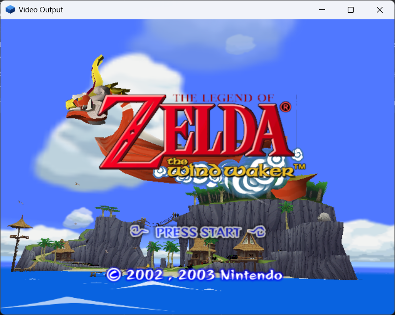
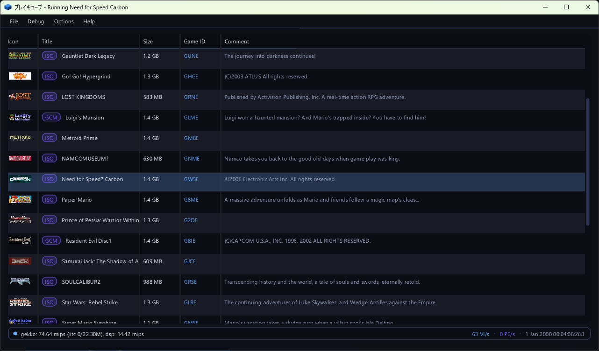

# pureikyubu 2.0

**Release date:** October 2026
**Previous release:** 1.9.1 (September 2026)

Version 2.0 is the **peripheral release** the 1.9.1 notes promised. The console's peripherals are one
subsystem now: every device — a controller, a memory card, a network adapter, a Game Boy Player, a
Game Boy Advance on a link cable — is a model of its own, with its own settings, its own place in the
configuration and one window that edits them all. The Broadband Adapter and the Modem Adapter are
emulated end to end from the console's side, the Game Boy Player is reached through the ARAM window
it really lives in, and the memory card finally mounts: the command decoder, the EXI identity, the
address wrapping and the streaming read were all wrong, and the card's own unlock challenge had to be
implemented before a title could use one. **Save states** arrive for the GameCube side, with the
portable machines keeping theirs and the front end offering ten slots of both. The **software GFX
pipeline leaves its experimental status**: it draws the boot ROM's splash and the movie players, and
the titles it runs agree with the shader backend (the black sky of *The Wind Waker* was the CP's BP
write mask). The interface gets eight themes, the Japanese titles of the selector, text that is one
texel to one pixel at any display scale, a video output window that follows the window it is in, and
a status bar that reports the two clocks of the emulation. *Need for Speed: Carbon*, whose VM abort
started this line of work, boots.





## Highlights

- **One pool of peripheral devices.** The emulation of a peripheral used to be wherever its consumer
  happened to be: `si.cpp` knew the controller's answer bytes, `padsdl.cpp` knew both the SDL side and
  the way a pad is polled, `memcard.cpp` mixed the card format with the EXI lifecycle, and a device's
  settings were kept by whoever used the device. A peripheral is a **device of its own** now
  (`src/peripherals.cpp`): a *model* registered by its module (`cont.cpp`, `memcard.cpp`,
  `gbplayer.cpp`, `gbalink.cpp`, `bba.cpp`, `mdm.cpp`), a *port* of the console's SI, EXI or
  Hi-Speed bus, a *pool* that is the `Devices` list of the configuration, and a *property grid* the
  settings window draws from what the device publishes. A build that does not compile a module simply
  has no such devices, and a new model appears in the settings window without a line of front end
  code.
- **The two network adapters.** The Broadband Adapter (DOL-015) and the Modem Adapter (DOL-012) share
  **serial port 1** (EXI channel 0, chip select 2) and are told apart by their EXI device ID. Both
  speak the console's own **command word, then data** protocol — an EXI shim in front of an
  off-the-shelf Ethernet controller (`bba.cpp`), with the address walking forward with every byte —
  and both answer the bring-up the SDK's ethernet library performs. The Broadband Adapter's frames go
  through a `BbaBackend`, and the backend the builds ship puts them on **UDP** (`bbaudp.cpp`), so two
  emulators play on one emulated segment. **The network support is still a work in progress:** no
  title in the SDK speaks IP, so the top half of the stack (ARP, IP, the sockets) is unproven, the
  challenge/response handshake and the split length field of a received packet are models rather than
  reconstructions, and with an empty peer the adapter is a console whose cable is unplugged.
- **The memory card mounts.** Five things were wrong before a title could use a card, and each was
  invisible until a real program tried: the command decoder came up un-parked, the EXI device ID was
  shifted into the wrong byte, "erase card" was missing its two trailing bytes, an address past the
  part's capacity was refused instead of wrapping, and a read restarted from the command's address on
  every transfer instead of streaming on from where the last one stopped. With those and the card's
  **unlock challenge** (`CARDUnlock`, the bit-serial mixer the library hides in a read's spare
  fields), **all six capacities were verified end to end** — 4, 8, 16, 32, 64 and 128 Mbit — with
  `CARDFormat`, `CARDMount` and `CARDCheck` returning what the hardware returns.
- **The Game Boy Player is reached where it really is.** The Player does not appear on EXI or SI: it
  hangs off the **ARAM (SDRAM) controller**, and the Start-up Disc talks to it by claiming an
  expansion window at `0x0100_0000` and then running a four-round **complement handshake** that a
  plain memory window cannot pass. `gbplayer.cpp` implements the window, the `AMCR` expansion size,
  the 32-byte command channels and PI interrupt bit 13, and once the channels hold their writes (a
  constant answer can never be acknowledged) the disc stops spinning and reaches
  `***Creating GbpSystemObject`. **The GBA support is still a work in progress:** the *Player's own
  firmware* is not implemented, so the disc stops there, no 3840-byte frame block is ever read, and
  the link cable speaks only the JOY protocol a Game Pak runs from its own cartridge — not the
  multi-boot upload that puts a program *into* a Game Boy Advance.
- **Save states.** The GameCube side gets the format the portable machines have had since
  `src/gba/gba_savestate.*`: the whole machine in one file, `F5` to write and `F7` to read the current
  slot, `Shift`+`F5`/`F7` to step it, the same items in the File menu, and `savestate`, `loadstate`
  and `states` in the debug interface. A state is a header, a checksum and one section per subsystem,
  about **45 MB** (51 MB with the software pipeline, which also carries its EFB). The round trip was
  checked byte for byte, and so was the property that matters: a state loaded into a machine that has
  run on resumes the run that never stopped.
- **The software GFX pipeline is no longer experimental.** It renders the **boot ROM's splash** (the
  592-pixel picture the VI fetches with `VI_PICTURE_CFG`'s own width and the horizontal scaler) and
  the **movie players** — the *Wind Waker* title screen above is its work — and the DolphinSDK demo
  sweep agrees with the shader backend. The shader backend remains the default. The fix that let the
  picture out was the CP's **BP write mask** (`0xFE`): every bypass register now merges the mask into
  its own value for the very next write, which is what keeps the GX library's shared payloads from
  clobbering each other — without it the library's blend write took the colour-update bits away and
  the sky of *The Wind Waker*'s title screen came out black.
- **The GFX command dump.** `gfxdump` records what the CP pushes into the XF, keeps the last frames
  of it as a ring, and shows the stream in three ways: the decoded commands, the raw big-endian words
  and the guest-RAM slices of the textures the frame sampled. It is a debugger tab of its own
  (**GFX Dump**), it is available as `gfxdump [...]` over JDI and MCP, and it is self-contained: the
  bytes a draw read from a texture or a TLUT travel in the frame that needed them.
- **The interface has a look of its own.** Eight themes drawn from the site's palette (the default
  "Flipper", the six hues next to it, and "Daylight" for the light one), the **Japanese titles** of
  the selector merged into the font so that a Japanese disc's kana and kanji are drawn instead of
  blanks, text baked at the display scale so that a glyph lands on one pixel at any scaling, the
  video output window resized and titled (`Video Output | shader | 59.9 fps`) with the picture scaled
  into the largest rectangle of its own shape, and a status bar that reports the **two clocks of the
  emulation**: the console's time base and the host's wall clock.
- ***Need for Speed: Carbon* boots.** Its VM abort was a TLB that was not flushed when a DSI/ISI page
  fault was taken, so the guest kept executing through a stale translation; the PTE's **Changed** bit
  is now set through the translation cache as the hardware sets it.

## Added

### The peripheral pool

- **What a device is, in one number.** `DeviceID` names a model: `0x00010001` is the standard
  controller (DOL-003), `0x00020001` a memory card, `0x00030001` the Game Boy Player. A module
  registers its models (`Peripherals::RegisterFactory`), so the subsystem itself does not know what a
  pad or a card is, and a **port** belongs to a bus (SI, EXI or HSP) — a device can only be plugged
  into a socket of its own bus. The ports are the four SI channels, the two card slots, serial port 1
  (the two network adapters) and the Hi-Speed Port (the Game Boy Player).
- **A device publishes its controls and its properties.** An *actuator* is one control
  (`PAD_ACT_*` for a pad, `GBP_ACT_*` for a Game Pak), a *binding* is what drives it (a keyboard key
  and a host controller button or axis), and *properties* are everything else a device shows about
  itself: a checkbox, a read-only line, a file the device owns (a card image, `PERIPH_PROP_FILE`) or
  one it only reads (a Game Pak or a BIOS, `PERIPH_PROP_ROM`). The kind picks the editor and the
  browser, so a device does not know how the dialog draws it.
- **The host side is a back end, not a part of a device.** `HostInput` is implemented by the front
  end (`padsdl.cpp` over SDL2, `padnull.cpp` for the headless build) and by the unit tests; the
  rumble motor of a pad reaches the host controller through it. A device never makes an SDL call and
  the front end never knows what a pad is.
- **The pool is a list, not a table with holes.** A device keeps *its entry of the list* — a handle of
  its own object it reads and writes its settings through — so taking a device out of the pool takes
  its settings with it and the entries that follow are not renumbered. The list is the content; there
  is no fallback in the code for "a slot the configuration does not mention".

  ```json
  "peripherals":
  {
      "Devices":
      [
          { "Type": 65537, "Name": "Controller 1", "Port": 0, "VKEY_FOR_A": 27, "GCKEY_FOR_A": 65536 },
          { "Type": 131073, "Name": "Memory Card A", "File": "Data/card.mci" }
      ]
  }
  ```

  The settings of the builds before the pool (`controllers` with `PluggedIn_<n>`/`VKEY_FOR_*_<n>`,
  `memcards` with `MemcardA_*`, and the `Device3_Name` variables) are dropped from the document when
  the settings are read, so a configuration this build writes does not carry them along.
- **The lifetime.** The pool is opened with the **emulator**, not with the machine — the settings
  window edits it with no game loaded — and the machine only matters to a device that talks to it:
  `MachineOpened` puts the cards into their slots and `MachineClosed` takes them out and flushes the
  files they were writing. A device is never destroyed while the emulator runs: one that is removed is
  detached, taken out of the list, and kept alive until the pool itself is closed in one piece.
- `testing/peripherals_test.cpp` drives a pad the way a user does (bind a control, say the host
  reports it, poll the channel, read the SI registers) and covers the pool, the buses, the motor, the
  origins, and that a device added with its name and bindings is still there after a restart.

### The two network adapters

- **The transport.** Both adapters front an off-the-shelf chip with an EXI **shim**, and a selection
  is a command word followed by the data, most significant byte first, with the address walking
  forward with every byte — which is how the driver reads six MAC bytes or a packet in one burst:

  | access | command word | then |
  |---|---|---|
  | controller read | four bytes: `0x8000` and the address in bits 15:8 | an `n`-byte read |
  | controller write | four bytes: `0xC000` and the address | an `n`-byte write |
  | shim read | two bytes: `reg << 8` | an `n`-byte read |
  | shim write | two bytes: `0x4000 \| reg << 8` | an `n`-byte write |

  The shim's register is six bits and the controller's address sixteen; the register file is page 0
  and the packet memory is the pages above it. The device is told which transfer begins a sequence
  (`Peripherals::TransferEXI` passes the channel's `firstImm` flag), because a two-byte write can be
  either a command or a byte of data.
- **The Broadband Adapter (DOL-015).** The controller's register file, its identification, its MAC
  address and its receive/transmit ring are emulated; the network behind it is a `BbaBackend` the
  front end installs. `bbaudp.cpp` puts frames on **UDP**: the "GCN Hardware" page names the other
  end (`BBA_PEER`, a `host:port`) and the port this emulator listens on (`BBA_PORT`), and the network
  is opened with the emulator. An empty peer is the default and means "no network" — the adapter then
  identifies itself, reports the link down and no frame arrives.
- **The Modem Adapter (DOL-012).** The same command-then-data protocol with a six-bit register number
  of its own page: `0x01` is the status the driver polls, `0x0D` the error status, `0x12` the raw
  status, and `0x06`/`0x07`, `0x0E`/`0x0F`, `0x10`/`0x11` are the divisor and threshold pairs. The
  register file, the identification, the acknowledge commands and the AT interface are emulated; the
  **telephone line is not** — the setup commands are answered `OK`, which is what the driver's
  bring-up waits for, and a dial is answered `NO DIALTONE`.
- **The command word is keyed on the assertion, not on a change.** The flag that marks the first
  transfer after a chip select used to be set only when the *selected device changed*, and a driver
  handed a bus on which the socket is already selected begins its sequence with a select that changes
  nothing — its command word was taken for data. The flag is now set by every write that *asserts* a
  select, which is what the hardware keys on; three runs out of three of the modem replay driver now
  read the identification back.
- **How the two are checked without a game.** No SDK demo speaks IP, so what is checked is the half of
  the driver that lives on the console's side — the bring-up the ethernet library performs before any
  packet moves (`bbadrv.py` / `mdmdrv.py` load that sequence into a booted demo through the debug
  interface). Both adapters answer it, and they answer differently, which is the point:

  | The driver reads | Broadband Adapter | Modem Adapter |
  |---|---|---|
  | the EXI device type | `0x04020200` | `0x02020000` |
  | the controller id at `0x44` | `4D 58` (`"MX"`) | `0x00020000` |
  | the MAC burst | a MAC (`00 09 BF 00 00 01`) | the adapter's own id |
  | the link state at `0x31` | `03` | `00` |
  | MISC2 (`0x50`) written `0x80`, read back | `80` | `00` |
  | the shim revision written `0xD107`, read back | `D1` | `D1` |
  | the challenge burst | `5A 5A A5 A5` | `00 00 00 00` |

### The Game Boy Player and the link cable

- **The Player is an ARAM expansion, not a device on a bus.** `AMCR` carries both the internal and
  the expansion size; the driver claims the largest window (`0x0063`), probes it with a four-round
  handshake that requires **byte 1 of the answer to be the complement of the byte written**, and
  settles on 16 MB (`0x005B`). The window's base is the internal ARAM size — all Player traffic is at
  ARAM `0x0100_0000` and upwards — and it is a window of *registers and mailboxes*, not of memory.
- **The channels hold their writes.** The console's command routine is a read-modify-write: it reads
  a byte, clears the bits it is acknowledging and sets the bits of the command it sends, and writes
  the result back. A device that answered a constant could never be acknowledged, and the disc spent a
  20-second run on ~107 000 reads of `+0x400000` and ~53 000 of `+0xD00000`. With the channels holding
  their writes and the interrupt raised only when the *device* changes state, the same run makes 526
  and 3 reads, and the disc gets on with its bring-up.
- **What the disc does now.** With the port brought up to that point the Start-up Disc prints
  `***Creating GbpSystemObject`, `***Allocating GbpSystemObject`, `***Creating Display object` and
  `GBAPadInit : ClientImageSize = 19464` — the port bring-up is past the point it used to be stuck at.
- **The Game Pak is a property of the device.** The cartridge file is kept in the Player's own entry
  of the pool ("GamePak"), the settings window draws a "Game Pak" row with a file browser on it, and
  the device carries the "BIOS" row as well (a real 16 KB GBA BIOS can be installed). A **"Run Game
  Pak"** switch decides whether the machine inside the Player costs anything at all: a Game Pak that
  is running costs about as much host time as the console it is attached to.
- **Watching the Game Pak run.** A GameCube session publishes no GBA debug interface of its own, so
  the device publishes `gbpshot <file.png>`: the 240x160 LCD of the machine in the Player (or of the
  one on the link cable), written to a file, with the device's name, the size and the machine's frame
  counter in the answer.
- **The link cable** (`gbalink.cpp`) is the same machine behind the DOL-011 JOY command set, and it
  runs only when it has something to do: a Game Pak in the bay, **or** the console driving the port
  as a link — the second case is what a *multi-boot* needs, because a title that streams its program
  into the partner's RAM does it with an **empty** bay. The device says so in the log once:
  `GBA Link: the console drives the port as a link (command 15)`. It does **not** speak the transfer
  that uploads a program into a Game Boy Advance; that gap is what the Game Boy Player Start-up Disc
  runs into.

### Save states

- **The keys and the menu.** `F5` writes the state of the current slot and `F7` reads it back;
  `Shift`+`F5`/`F7` step the slot (0..9, wrapping, shown in the status bar). The File menu carries
  **Quick Save/Load State**, a submenu per slot with the current one marked, and
  **Next/Previous State Slot**.
- **The commands.** The debug interface has `savestate [slot]`, `loadstate [slot]` and `states`, each
  answering Markdown next to the fields a client can use (`file`, `slot`, `result`, `error`/`size`).
  The machine is stopped for the duration of a save or a load and started again the way it was.
- **The files.** A state lives next to the image and is named after it: `Data/game.iso` gives
  `Data/game.st0`..`.st9`, `pong.dol` gives `pong.st0`.., the boot ROM gives `Bootrom.st0`...
- **The format.** A header (the magic `PSAVEST`, the format version, the payload size and its FNV-1a
  64 checksum) and then one section per subsystem: `META`, `FLPR`, `CPU `, `MEM `, `PI  `, `VI  `,
  `AI  `, `DI  `, `SI  `, `EXI `, `CP  `, `DSP `, `DVD `, `GX  `, `PE  `, `XF  `, `SU  `, `RAS `,
  `TEV `, `TX  `, `BP  ` and `HLE `. A section is a tag, a length and the bytes; the reader walks them
  in order and steps over a tag it does not know, and every section has to be consumed exactly to its
  end.
- **What a state does not carry**, and each has its reason. The disc image, the executables, the boot
  ROM and the DSP ROMs (they belong to the settings); the memory cards and the rest of the pool (a
  card lives in its own file, the controllers are the user's hands); the samples already handed to the
  audio device; the EFB of the shader pipeline (it lives in an OpenGL target); the GL objects, the
  window and the host threads; the JIT's compiled blocks; the debugger's breakpoints; and the caches
  (written back and dropped, except the locked L1 data cache, which is scratch-pad memory and travels
  in the state).
- **A state that does not belong is refused by name** — not a state, an unknown format version, a
  checksum that does not match, another game, another amount of memory, another build's section
  layout, the other machine's state, or an empty slot.
- **The checks it was written from.** A headless build driven through the MCP transport wrote a state,
  read it back and wrote it again — byte for byte identical, on `pong.dol` and on the boot ROM with
  the software pipeline live. A machine stepped 20 000 instructions after loading a state produces the
  same bytes as one that never stopped, and the same holds when the state is loaded into a machine
  that ran free for five seconds. The tests found two real asymmetries (the memory interface's
  counters and the DSP recompiler's generation) and one cache problem (a load that left the caches
  holding the run in between) before they passed.
- **The portable machines keep theirs.** Both GBA and Game Boy machines write and read a state with
  `F3`/`F4` and `Shift`+`F3`/`F4` (the slot is shown in the window title), the cartridge's `.sav` is
  still `F5`, and the debug interface has `gbasavestate`/`gbaloadstate`/`gbastates` and the Game Boy's
  `gbsavestate`/`gbloadstate`/`gbstates`. A state is a picture of a machine *running a particular
  cartridge*, so it carries the cartridge's identity and is refused by a machine running another one —
  or by the other machine entirely.

### The GFX command dump

- `src/gfxdump.cpp` records the graphics stream **where the XF starts** (the CP's own VCD/VAT state is
  not part of it), as four kinds of record: an XF register block load, an XF register read, a bypass
  register word with the BP write mask that preceded it, and a draw command with the vertex rows that
  followed it.
- The dump is cut into frames by the frame counter and kept as a ring (`GfxDump::MaxFrames`); a frame
  past the byte limit is cut off and marked truncated. The stream is a self-describing sequence of
  big-endian 32-bit words, so a saved file does not depend on the host's word order or on a struct
  layout.
- **The RAM slices make a dump self-contained.** A draw samples a texture (and, for a paletted one, a
  TLUT) programmed long before it, and the guest overwrites that texture in the next frame; the
  texture engine hands every such read to the dump and the bytes are copied into the frame that needed
  them.
- The commands are `gfxdump [frames]`, `gfxdump commands [id]`, `gfxdump hex [id]`,
  `gfxdump capture [on|off|toggle]`, `gfxdump select <id>`, `gfxdump clear` and `gfxdump save [id]`.
  The debugger has a **GFX Dump** tab next to the whole debugger, with a tab per answer ("Frames",
  "Commands", "Hex"), a capture button and a per-frame listing where every field is printed.
- The CP also handles the `0x69` bypass command now, which is one of the commands a bypass stream can
  carry.

### The interface

- **Eight themes.** The look is a module of its own (`uitheme.cpp`): a palette of ten colours turned
  into the ImGui style, with the hovered and held states derived from the resting one. The default
  theme, "Flipper", is the dark ink of the project's site with the blue of the cube of its logo for
  everything that is selected and the violet of its shaded face as the second accent; six themes next
  to it are hues of the same recipe (Nebula, Emerald, Crimson, Amber, Graphite, Sakura) and "Daylight"
  is the recipe over a light background. A theme is picked in **Options → Settings… → Interface**,
  shown before it is applied, and kept in `ui.THEME`.
- **The interface mark.** The pureikyubu cube of the project's logo is drawn from the palette
  (`UiThemeDrawCube`), so the interface is marked by the project and not only coloured like it.
- **Japanese titles.** The selector's Title and Comment columns came out blank for every Japanese
  disc, because neither ImGui's built-in font nor the proportional faces of the systems have a kana or
  a kanji in them. Japanese is merged into the interface font from the CJK face each system has
  (Meiryo, Yu Gothic, MS Gothic, BIZ UDGothic and Arial Unicode on Windows; Noto CJK, VL Gothic, IPA,
  Takao and Droid Sans Fallback on Linux) over the 2999 ideographs of the Joyo and Jinmeiyo sets; a
  system without such a face shows the titles the way it did before.
- **Sharp text at any scale.** The font atlas is baked at the display's own scale (1.0, 1.25, 1.5)
  while the interface keeps laying itself out at the logical one, so a glyph lands on the framebuffer
  one texel to one pixel instead of being a smaller texture stretched by the renderer.
- **The video output window (issue #458).** It can be resized and maximized now: both presenters
  scale the picture into the largest rectangle of the window that has the picture's shape, centred,
  with the bands around it black — a maximised 16:9 window no longer turns the cubes of a game into
  bricks. The software back end scales on the CPU, one pixel at a time; the GL back end blits with
  the linear filter and clears the bands with the whole colour mask. The software path used to stop
  updating altogether on a resize, because SDL throws the window surface away and it was never asked
  for again.
- **The window titles.** The video output window says which backend draws the picture and how many
  frames a second the emulator outputs (`Video Output | shader | 59.9 fps`); the main window keeps the
  plain name of what runs. Exactly one of the two counts a frame — the GL backend counts full-frame
  EFB→XFB copies, the video back end counts the XFB outputs it presents.
- **The two clocks (issue #458).** The status bar shows the emulated Gekko and DSP throughput and the
  two clocks of the emulation measured from the moment the image was loaded: the console's time base
  (`TBR 5m 09s`) and the host's own clock (`wall 1h 02m 03s`). The emulated clock is a new `OSSeconds`
  command, because `OSTime`/`OSDateTime` roll their hours over at 24 and carry milliseconds.
- **The settings window.** Every setting of the emulator is in one window with a strip of tabs on the
  left — General (the game selector), GCN Hardware (the console version and the firmware),
  Controllers, Memory Cards, Network, High-Speed Port and Interface — and a property grid on the
  right.
- **The stand-alone GBA settings.** The portable machine is configured in a window of its own,
  **Options → Stand-alone GBA…** (`uisettingsgba.cpp`), because the machine it configures is a
  different one from the console the rest of the menu belongs to. It edits the file the first time it
  is opened, writes it back when "Save" is asked for, and edits the keys as well.
- The selector's menu is disabled, and veiled with the reason, while the emulation runs, so a stray
  key or click can no longer load another image over the running one. **Hardware → Graphics backend**
  picks the shader or the software pipeline (the same switch as `gxpipeline`), and
  **Debug → HW Profiler Overlay** switches the profiler's overlay, which now follows the picture into
  the rectangle the picture took in the window.

## Changed

### The memory card, reviewed

- **The command decoder has to start idle** (`0xFF`). The device came up with the field zeroed, read
  every byte of its first write as an extra, never decoded a command and answered nothing — which the
  console's library sees as "no card in this slot". `MCConnect` now parks the decoder.
- **The EXI device ID is not the card ID.** The 32-bit type (`EXI_MEMORY_CARD_59` = `0x00000004` and so
  on) is read with a four-byte immediate transfer, most significant byte first, so the capacity code
  lives in the *low* byte; the module shifted it into the top byte. The two-byte card ID and the
  one-byte status *are* shifted, which is what hid the mistake.
- **"Erase card" is three bytes** (`0xF4 0x00 0x00`). The table gave it no trailing bytes, so the two
  zeros were refused as extras — and the refusal used `Halt`, which raised a front-end report on every
  retry and cost about 80x on the demo that does it.
- **The card wraps its addresses.** A flash part is smaller than the address its controller can put on
  the bus, so a transfer at an address the part does not have is the same bytes as the wrapped
  address. The library reads at addresses that only exist on larger parts while it identifies the
  card. Reads, writes and sector erases now wrap.
- **A read streams from an internal address.** The four offset bytes a read carries are where the
  block *starts*, and every transfer continues where the last one stopped; only a new command word
  resets the counter. The module re-read the command's address on every transfer, so the library's
  mount read the card's first four bytes nine times.
- **The unlock challenge.** An original card does not hand its code over to anyone who asks: the
  library hides a challenge in the read command's spare fields (a 20-bit value and a length of 4..32
  from a generator seeded by the tick counter), works out the answer with a bit-serial mixing step,
  reads the card's code with the answer walking on between the words, and requires bit 6 of the status
  byte. `memcard.cpp` implements the whole exchange; the four details that make it work are that the
  code read comes from the controller and not the flash, that bit `0x40` is set only by a challenge,
  that a challenge is an immediate transfer and never a page read, and that a challenge can be exactly
  four bytes long.

### The settings window is one window

- The dialogs the pool replaced — `Options → Controllers → Port n`, `Options → Memcards → Slot A` and
  the settings that had no dialog at all — are gone from the menu, which carries a single
  **Options → Settings…** item.
- **A page follows the device, not the bus it hangs from.** The cards and the two network adapters are
  all EXI devices of the pool, so a page that took its devices from the bus showed the adapters under
  "Memory Cards".
- A setting takes effect as it is edited (a binding is used by the next poll, a card file is opened at
  once) and the pool writes the device back itself, so the window has neither an OK nor a Cancel.
- The GBA's own page is separate: **Options → Stand-alone GBA…** edits `GBASettings.json`, including
  the eleven bindings of the machine. The default keys follow the hardware: a GBA has **A to the right
  of B**, so `A` is `X` and `B` is `Z`.

### The software pipeline

- **The boot ROM's splash is drawn.** The number of active lines comes from `VI_VERT_TIMING` and the
  geometry of a line from `VI_PICTURE_CFG` — its `WPL` field is the width of the picture in 16-pixel
  words and its `STD` field is the stride a field's lines are fetched with. The splash is 592 pixels
  wide (37 words, 1184 bytes to a line) and the picture came out skewed while the scanout assumed the
  640 pixels of the render target. `VI_HSCALE` then decides whether the horizontal scaler spreads the
  picture over the whole line (the boot ROM enables it) or leaves it one pixel to one pixel.
- **The movie players run.** The software pipeline draws the movie players' output, which is what put
  the *Wind Waker* title screen on the screen above.
- **The BP write mask (`0xFE`)** limits which bits of the very next BP register write are updated and
  then clears itself. Every bypass register honours it now, and the CP hands it down the bypass chain
  with the write. Without it the library's blend write took the colour and alpha update bits of
  `CMODE0` away, and everything drawn after it wrote no colour at all — the black sky of *The Wind
  Waker*.
- **The software EFB is cleared with the first primitive of its frame**, which is what a frame that
  begins with a full-screen primitive needs. A side effect of the same work is that a bypass register
  that honours the write mask no longer clobbers the bits another feature owns.

### Gekko, the command processor and the serial interface

- **TLB flush on a page fault.** The cache-management instructions that fill the TLB can leave a stale
  translation behind, and the guest kept executing through it after a DSI/ISI page fault —
  *Need for Speed: Carbon*'s VM abort. The TLB is flushed when such a fault is taken.
- **The PTE's Changed bit is set through the translation cache**, as the hardware sets it. Before,
  the bit was only written when the TLB entry was filled, so a page that was written through a cached
  translation never reported that it had been changed.
- **`WPAR[BNE]`** is reported only when half of the write gather buffer is occupied, which is the
  condition the hardware reports it under (an experiment that the benchmarks now measure).
- The CP handles the `0x69` bypass command.
- **Issue #416: deterministic stepping.** The `step` command, the IPL's "no disc" path (`--no-disc`)
  and the display XFB reporting were made deterministic and repeatable, so a run can be stopped at an
  exact instruction and compared.
- The serial interface answers a **COM transfer to an empty socket** the way the hardware does, and
  latches `NOREP` — a channel that answered a communication transfer with no reply must keep saying
  so.

### The portable core

- **A parked DMA keeps its place in the block it is repeating.** GBATEK reloads `CNT_L` and
  optionally `DAD` on a repeat, not `SAD`, so the source pointer carries on; a sound DMA is always
  repeating, and the old code restarted the stream at the same address on every FIFO refill.
- **A byte store to `DISPSTAT` keeps the half it does not address**, which is what a game that writes
  one byte of the register expects.
- The GBA settings get a window of their own (see above), the BIOS row's buttons have their room and
  the file is a user file rather than a shipped one.
- The two Game Boy devices share the controls and the settings and differ only in which bus the
  console reaches them by.

## Fixed

- **The black sky of *The Legend of Zelda: The Wind Waker*'s title screen** — the CP's BP write mask
  (see Changed), which is also what made the picture of a title that begins with a blend-mode write
  go dark.
- ***Need for Speed: Carbon*** — the stale TLB translation after a DSI/ISI page fault and the PTE
  Changed bit (see Changed). The title boots and runs.
- **The memory card could not be mounted** — five separate defects (see Changed), each of which made
  the console's own card library refuse the card.
- **A JSON list is replaced as a whole** instead of merged member by member; the elements of a list
  have no name, so a merge could only go by position and folded every entry of the file into the
  first one. The bug was reachable as soon as the pool became a list.
- **The Game Boy Player's status byte had no return on its default path**, so every status read the
  Start-up Disc made was whatever the return register happened to hold; the whole status block is
  decided now.
- **The ARAM DMA engine logged every block it moved**, unconditionally. A Player disc that polls its
  window moves tens of thousands of blocks a second and every one of them cost two lines of text; the
  block honours an `AR_LOG` setting now, off by default. That one change is worth about 4x on a run of
  the Start-up Disc.
- **The GFX dump's frame counter** and the presented-frame counter of the copy engine are pinned by
  tests: a texture copy and a partial display copy do not count, a full-frame display copy does.

## Known issues

- **The network support is a work in progress.** The adapter's own half is emulated (the transport,
  the registers, the identification, the MAC and the rings), but the **network behind it is a
  backend**, and no title in the SDK speaks IP: ARP, IP and the sockets the SDK's library builds on
  them are unproven. The challenge/response handshake and the split length field of a received
  packet's descriptor are **models rather than reconstructions**, and they are marked as such in the
  source. The **Modem Adapter's telephone line is not emulated** — the setup commands are answered
  `OK` and a dial is answered `NO DIALTONE`, which is the result code a modem with nothing in its
  socket reports. With an empty `BBA_PEER` the adapter is a console whose cable is unplugged.
- **The GBA support is a work in progress.** The **Game Boy Player's own firmware is not
  implemented**: the port's window, the handshake, the channels and the interrupt are there and the
  Start-up Disc is past its bring-up, but every command the console sends is answered by the Player's
  firmware and nothing implements it, so no frame stream is ever read and the frame buffer the VI
  scans out stays empty. The **link cable** speaks only the JOY protocol a Game Pak runs from its own
  cartridge; it does not speak the multi-boot transfer that uploads a program *into* a Game Boy
  Advance, which is what the Start-up Disc's own 19 464-byte client image needs. A Game Pak running
  inside a Player or a link device is **not part of a GameCube save state** either: a state loaded
  with a Game Boy game in progress resumes with that machine at its reset.
- **The portable machines keep the issues of 1.9.1.** The Game Boy Color's picture is still work in
  progress (a line is composed at once rather than dot by dot); the GBA's per-line OBJ cycle budget
  and `DISPCNT` bit 5 are not modelled and the video-memory contention cycle is missing; the sound
  output stage (`SOUNDBIAS`, the PWM amplitude) is not modelled; the HLE sound driver's reverb is not
  modelled; Nintendo's aging cartridge is not fully green (the remaining checks are in the
  waitstate/prefetch area); and **rewind** (running the machine backwards through a ring of states)
  is not implemented.
- **Save states.** There is no unit test for the GameCube side yet — it was checked with a headless
  build driven through the MCP transport, and the portable harness covers the GBA and Game Boy
  states. The EFB of the shader pipeline does not travel, so a state of a machine running the shader
  pipeline resumes with whatever the title draws next; the JIT's compiled blocks are dropped; and a
  state that fails half way leaves the machine half loaded (the checks that can be made without
  touching the machine are all made first). Nothing is compressed: a state is 45 MB or so.
- **The software pipeline** still does not do the per-vertex "emboss" bump texgen, the anisotropic
  filtering and the `diag_lod`/`lodclamp` refinements, the `round`/`field_predict` motion-compensation
  modes, the 16-bit R5G6B5 colour and Z formats of the anti-aliased EFB, the `PE_COPY_VFILTER`
  coefficients, the YUV/4:2:0 copy modes, the EFB CPU window (`Cpu2Efb`) and the Rev-B `PE_CHICKEN`
  behaviours. The shader backend remains the default, and a title that needs one of those is the
  reason to switch back to it.
- **The dump** holds the last frames of the stream, not a whole session, and a frame past its byte
  limit is truncated; a texture read that the texturing unit does not perform (an unused stage, for
  instance) is not in the frame.
- The Linux build still has no sound and no input for the GameCube side, and the Linux headless
  target has no OpenGL offscreen backend (the Visual Studio one does). The `Settings` tests that
  compare `build/Data/GBASettings.json` with the defaults byte for byte need that file to have LF
  endings.
- The emulator's own unit suite is at **531 tests with three failures** (`Pe_ZWriteMaskControlsTheDepthUpdate`,
  `Pe_ZFreezeDisablesTheDepthWrites` and `Report_TevFog`), and the same three fail on a build made
  before this work — they are the harness' own, and the two depth ones pass when they are run on
  their own.

## Up next

The peripherals are not finished, and the next release is where they are finished. The two **network
adapters** need the top half of the stack (a title that speaks IP, or a host-side bridge), the **Game
Boy Player** needs the Player's own firmware — the command set, the video and audio format of the
frame stream — and the **link cable** needs the multi-boot transfer. The Game Boy Advance a Player or
a link device owns should also travel in a GameCube save state, which is what would close the one
hole in the state format that is machine state rather than settings.

With that, the project moves into its steady state: **planned, methodical improvement** — performance
work and bug fixing release after release, rather than another feature push. The architecture is in
place; what remains is making what is there faster, more exact and more complete.

## Building

**Windows.** Open `scripts/VS2026/pureikyubu.sln` in Visual Studio 2026 and build. The emulator is the
SDL2 front end in every configuration, the solution holds `pureikyubu`, `SDL2` (a static library) and
the portable targets, both x64 and x86 (Win32) build, the recompilers follow the host, and the
projects target Windows 7. The `pureikyubu_headless` target is part of the solution but is not built
by "Build Solution". `EMU_VERSION` is **2.0**, which is what the title of the main window, the About
box, the JDI `GetVersion` and the MCP handshake report.

**Linux.**

```sh
sudo apt install libglew-dev libsdl2-dev
git clone https://github.com/emu-russia/pureikyubu.git
cd pureikyubu
git submodule update --init
cd build && cmake .. && make
./pureikyubu pong.dol
cmake -DHEADLESS=ON .. && make          # the windowless target
```

**Tests.**

```
MSBuild scripts/VS2026/pureikyubu_test.slnx -p:Configuration=Release -p:Platform=x64
vstest.console.exe scripts/VS2026/x64/Release/pureikyubu_test.dll /Platform:x64
```

The portable machines have their own harness — **380 of 380 tests pass**:

```
testing/gba_bench/check.sh
testing/gba_bench/get_test_roms.sh     # the public test ROMs and the two Acid2 pictures
```

The previous releases are still available: [Release Notes 1.9.1](release_notes_1.9.1.html) ·
[Заметки о релизе 1.9.1](release_notes_1.9.1_ru.html) · [Release Notes 1.9](release_notes_1.9.html) ·
[Release Notes 1.8](release_notes_1.8.html) · [Release Notes 1.7](release_notes_1.7.html). The long
story of the work after release 1.6 is in the [digest](digest.html).

---

*Nintendo GameCube, Game Boy, Game Boy Color and Game Boy Advance are trademarks of Nintendo. This
emulator is not affiliated with Nintendo. No BIOS image and no game is distributed with it.*
